## Анализ кода `hypotez/src/endpoints/bots/telegram/digital_market/bot/user/utils.py`

### <алгоритм>
1. **Начало:** Функция `successful_payment_logic` принимает данные об успешной оплате.
    *   Пример: `successful_payment_logic(session, {"product_id": 1, "price": 100, "payment_type": "card", "payment_id": "some_payment_id", "user_id": 123}, "USD", 456, bot)`.

2.  **Извлечение данных:** Извлекаются `product_id`, `price`, `payment_type`, `payment_id` и `user_id` из `payment_data`.
    *   Пример: `product_id` = 1, `price` = 100, `payment_type` = "card", `payment_id` = "some_payment_id", `user_id` = 123.

3.  **Сохранение данных:** Данные об оплате сохраняются в БД с помощью `PurchaseDao.add()`.
    *   Пример: Запись в таблицу `purchases` с данными `PaymentData(product_id=1, price=100, payment_type="card", payment_id="some_payment_id", user_id=123)`.

4.  **Получение данных продукта:** Получаются данные о продукте из БД с помощью `ProductDao.find_one_or_none_by_id()`.
    *   Пример: `product_data` содержит `Product(id=1, name="Test Product", description="Test description", price=100, file_id="file123", hidden_content="secret content")`.

5.  **Уведомление администраторов:** Отправляется уведомление об успешной покупке всем администраторам.
    *   Пример: Отправка сообщения админам через `bot.send_message` с текстом: "Пользователь c ID 123 купил товар Test Product (ID: 1) за 100 USD".

6.  **Формирование текста для пользователя:** Формируется сообщение для пользователя, включающее информацию о продукте и его параметрах.
    *   Пример: Формирование текста с информацией о товаре "Test Product", его описанием, ценой, закрытым контентом и наличии файла.

7.  **Отправка сообщения пользователю:** Отправляется сообщение пользователю.
    *   Если у продукта есть `file_id`, то отправляется документ.
    *   Если `file_id` нет, отправляется обычное сообщение.
    *   Пример 1 (с файлом): отправка файла с `product_data.file_id` пользователю `user_tg_id`.
    *   Пример 2 (без файла): отправка текстового сообщения пользователю `user_tg_id`.

8.  **Возврат звезд:** Если тип оплаты - `stars`, происходит автоматический возврат звезд за покупку.
    *   Пример: Если `payment_type` равен "stars", вызывается `bot.refund_star_payment` для возврата звезд пользователю.
9.  **Конец:** Завершение работы функции.

```mermaid
flowchart TD
    subgraph successful_payment_logic
        A[Start] --> B{Extract Payment Data}
        B --> C[Save Payment Data to DB: <br><code>PurchaseDao.add</code>]
        C --> D[Get Product Data from DB:<br><code>ProductDao.find_one_or_none_by_id</code>]
        D --> E{Notify Admins}
        E --> F[Compose User Message]
         F --> G{Check File ID}
         G -- Yes --> H[Send Document to User:<br><code>bot.send_document</code>]
        G -- No --> I[Send Text Message to User:<br><code>bot.send_message</code>]
        H --> J{Payment type is stars?}
        I --> J
        J -- Yes --> K[Refund Stars:<br><code>bot.refund_star_payment</code>]
        J -- No --> L[End]
        K --> L
        L[End]
        
    end

   
   subgraph bot.config
        Start_bot_config --> Admin_IDS[Admin IDs]
     end
    
    style successful_payment_logic fill:#f9f,stroke:#333,stroke-width:2px
    style bot.config fill:#ccf,stroke:#333,stroke-width:2px
    linkStyle 0,1,2,3,4,5,6,7,8,9,10,11,12 stroke:#333,stroke-width:1px

```

### <mermaid>

### <объяснение>
1.  **Импорты:**
    *   `from aiogram import Bot`: Импортирует класс `Bot` из библиотеки `aiogram` для работы с Telegram Bot API. Это позволяет отправлять сообщения, документы и выполнять другие действия через Telegram Bot.
    *   `from loguru import logger`: Импортирует `logger` из библиотеки `loguru` для логирования событий. Это позволяет отслеживать ошибки и другие важные события в работе бота.
    *   `from sqlalchemy.ext.asyncio import AsyncSession`: Импортирует `AsyncSession` из `sqlalchemy` для асинхронной работы с базой данных. Это позволяет выполнять запросы к БД не блокируя основной поток программы.
    *   `from bot.config import settings`: Импортирует настройки проекта из `bot/config.py`, включая `ADMIN_IDS` для списка id администраторов.
    *   `from bot.dao.dao import PurchaseDao, ProductDao`: Импортирует классы `PurchaseDao` и `ProductDao` для взаимодействия с таблицами покупок и продуктов в БД. Они реализуют CRUD операции.
    *   `from bot.user.kbs import main_user_kb`: Импортирует функцию `main_user_kb` для создания основной клавиатуры пользователя.
    *    `from bot.user.schemas import PaymentData`: Импортирует класс `PaymentData` для валидации и типизации данных об оплате.

2.  **Функция `successful_payment_logic`:**
    *   **Аргументы**:
        *   `session: AsyncSession`: Асинхронная сессия SQLAlchemy для работы с БД.
        *   `payment_data`: Словарь с данными об оплате. Ожидается, что он будет содержать ключи: `product_id`, `price`, `payment_type`, `payment_id`, `user_id`.
        *   `currency`: Валюта оплаты.
        *   `user_tg_id`: Telegram ID пользователя, совершившего покупку.
        *   `bot: Bot`: Экземпляр класса `Bot` из `aiogram` для взаимодействия с Telegram.
    *   **Возвращаемое значение:** `None` (функция не возвращает явно никаких значений).
    *   **Назначение**: Обрабатывает успешную оплату, сохраняет данные в БД, отправляет уведомления администраторам и пользователю, а также возвращает звезды если тип оплаты `stars`.
    *   **Примеры:**
        1.  Сохранение данных о покупке в БД, извлечение данных о продукте из БД, отправка уведомления администраторам, отправка сообщения пользователю о покупке с файлом, если `file_id` у продукта не null, возврат звезд если `payment_type` является `stars`.
        2.  Сохранение данных о покупке в БД, извлечение данных о продукте из БД, отправка уведомления администраторам, отправка сообщения пользователю о покупке без файла, если `file_id` у продукта null, и `payment_type` не `stars`.

3. **Переменные:**
   *  `product_id: int`: Идентификатор продукта, тип int, извлеченный из словаря `payment_data`.
   *  `price`: Цена товара, извлеченная из словаря `payment_data`.
   *   `payment_type: str`: Тип оплаты, извлеченный из словаря `payment_data`.
   *  `payment_id: str`: Идентификатор платежа, извлеченный из словаря `payment_data`.
   *  `user_id: int`: Идентификатор пользователя, извлеченный из словаря `payment_data`.
   *  `product_data`: Экземпляр класса `Product`, полученный из БД.
   *   `admin_id: int`: Идентификатор админа, для которого отправляется уведомление.
   *   `file_text: str`: Строка для формирования сообщения пользователю, в зависимости от наличия файла.
   *   `product_text: str`: Строка для формирования сообщения пользователю, с информацией о продукте.

4.  **Объяснение связей:**
    *   Функция `successful_payment_logic` использует классы `PurchaseDao` и `ProductDao` для взаимодействия с БД.
    *   Использует `Bot` из `aiogram` для отправки сообщений пользователю и администраторам.
    *   Использует `PaymentData` для валидации и типизации данных об оплате.
    *   Использует функцию `main_user_kb` для отображения главной клавиатуры после покупки.
    *   Использует настройки проекта из `bot.config`, в частности `ADMIN_IDS`.

5.  **Потенциальные ошибки и области для улучшения:**
    *   Не обрабатываются ошибки при получении данных из БД, что может привести к падению функции.
    *   Уведомления админам не обрабатывают случаи, когда сообщение не отправляется по другим причинам.
    *   Возможность добавления логики для обработки ошибок при отправке сообщений пользователю.
    *   `product_data` может быть `None`, в случае если продукт не был найден.
    *   Отсутствует обработка ошибок при обращении к `bot.refund_star_payment`.

6. **Дополнительно:**
    *  Функция является частью логики обработки покупок в телеграм-боте, взаимодействует с БД, Telegram API и другими частями проекта.
    *   Файл `header.py` не импортируется в данном коде.