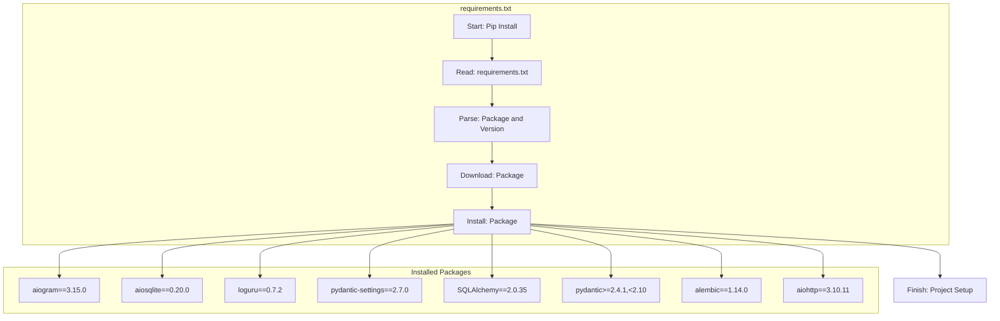

# Анализ файла `requirements.txt`

## <алгоритм>

Файл `requirements.txt` не содержит исполняемого кода, а является списком зависимостей для Python-проекта. Процесс его использования выглядит следующим образом:

1. **Чтение файла:** Инструмент, такой как `pip`, читает содержимое `requirements.txt`.
   * Пример: `pip install -r requirements.txt`
2. **Анализ зависимостей:** Каждая строка файла анализируется, выделяется имя пакета и его версия (если указана).
   * Пример: `aiogram==3.15.0` - пакет `aiogram` версии `3.15.0`.
3. **Установка пакетов:** `pip` загружает и устанавливает указанные пакеты и их зависимости.
   * Если указана конкретная версия, то устанавливается именно она.
   * Если версия не указана, устанавливается последняя доступная версия.
4. **Завершение:** После установки всех зависимостей проект готов к запуску.

## <mermaid>

**Объяснение:**

*   **requirements.txt:** Представляет собой файл, который содержит список необходимых библиотек и их версий.
*   **Start, Read, Parse, Download, Install:**  Это этапы обработки файла `requirements.txt` инструментом `pip`.
*  **Installed Packages**: Указывает на список пакетов и их версий, которые будут установлены.
*  **aiogram, aiosqlite, loguru, pydantic_settings, SQLAlchemy, pydantic, alembic, aiohttp**: Перечислены названия пакетов и их версии, которые требуются для работы проекта.
*   **Finish**: Обозначает завершение установки и готовность проекта к запуску.

## <объяснение>

Файл `requirements.txt` перечисляет Python-пакеты и их версии, которые необходимы для работы проекта.  Рассмотрим каждый пакет:

**Импорты:**

*   `aiogram==3.15.0`:  Основной фреймворк для создания Telegram-ботов. Обеспечивает асинхронное взаимодействие с API Telegram.
*   `aiosqlite==0.20.0`: Асинхронная библиотека для работы с SQLite. Позволяет выполнять запросы к базе данных без блокировки основного потока.
*   `loguru==0.7.2`: Библиотека для удобного логирования, обеспечивающая более читабельные и настраиваемые логи, чем стандартный модуль `logging`.
*   `pydantic-settings==2.7.0`: Расширение для Pydantic, позволяющее управлять настройками приложения на основе моделей Pydantic.
*   `SQLAlchemy==2.0.35`: Мощная ORM (Object-Relational Mapper) библиотека для взаимодействия с базами данных. Позволяет работать с данными, используя объектно-ориентированный подход.
*    `pydantic>=2.4.1,<2.10`: Библиотека для валидации данных и создания моделей. Используется для определения структуры данных и их проверки.
*   `alembic==1.14.0`: Инструмент для управления миграциями баз данных. Позволяет отслеживать изменения в схеме базы данных и применять их при необходимости.
*   `aiohttp==3.10.11`: Асинхронная HTTP-библиотека для выполнения сетевых запросов. Позволяет взаимодействовать с веб-сервисами, например, для получения данных из API.

**Взаимосвязь пакетов:**

*   `aiogram` может использовать `aiohttp` для отправки HTTP-запросов к API Telegram и `aiosqlite` или `SQLAlchemy` для хранения данных бота.
*  `pydantic-settings` использует `pydantic` для валидации настроек, которые могут быть считаны из файлов или переменных окружения.
*  `SQLAlchemy` может использоваться совместно с `alembic` для управления миграциями базы данных.
*  `loguru` используется для логирования событий в любом из пакетов.

**Потенциальные области для улучшения:**

*   **Версии пакетов:**  Слишком строгая привязка к версиям может усложнить обновление зависимостей. Возможно, использование более гибких спецификаций версий (например, `aiogram>=3.15.0`).
*   **Конфликты зависимостей:** Необходимо следить за совместимостью версий разных библиотек. `pip` обычно разрешает конфликты, но может потребоваться ручная проверка.
* **Обновление:** Необходимо регулярно проверять доступность более новых версий пакетов для исправления багов и повышения производительности.

**Цепочка взаимосвязей с другими частями проекта:**

Файл `requirements.txt` является центральным для определения зависимостей проекта. Все части проекта, будь то модули `src.endpoints.bots.telegram.digital_market` или другие, не могут быть запущены без установки зависимостей, перечисленных в этом файле. Файл позволяет изолировать среду проекта и обеспечить его воспроизводимость в разных окружениях.

В заключение, `requirements.txt` – важная часть проекта, определяющая его зависимости и обеспечивающая возможность воспроизведения проекта на разных машинах. Он является отправной точкой для установки всех необходимых библиотек.