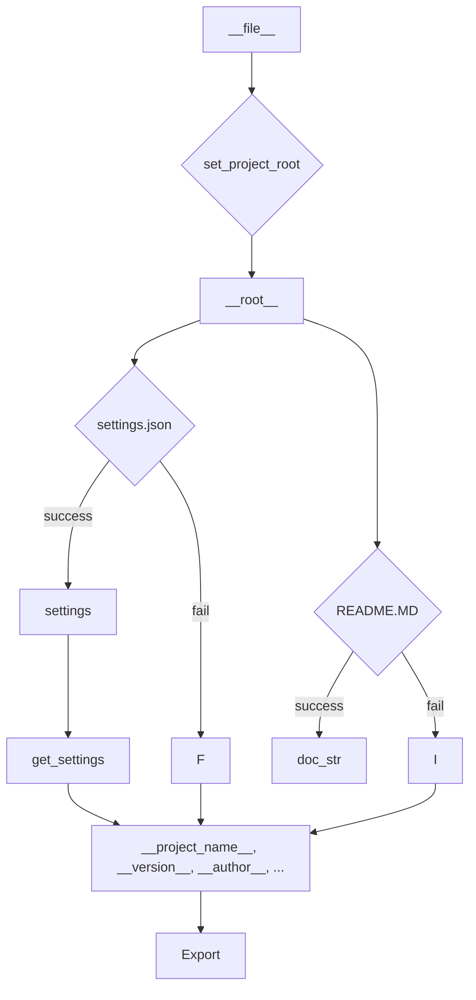

# <input code>

```python
## \file hypotez/src/logger/header.py
# -*- coding: utf-8 -*-
#! venv/Scripts/python.exe
#! venv/bin/python/python3.12

"""
module: src.logger 
	:platform: Windows, Unix
	:synopsis: Модуль определяющий корневой путь к проекту. Все импорты строятся относительно этого пути.
    :TODO: В дальнейшем перенести в системную переменную"""
MODE = 'dev'

import sys
import json
from packaging.version import Version

from pathlib import Path
def set_project_root(marker_files=('pyproject.toml', 'requirements.txt', '.git')) -> Path:
    """
    Finds the root directory of the project starting from the current file's directory,
    searching upwards and stopping at the first directory containing any of the marker files.

    Args:
        marker_files (tuple): Filenames or directory names to identify the project root.
    
    Returns:
        Path: Path to the root directory if found, otherwise the directory where the script is located.
    """
    __root__:Path
    current_path:Path = Path(__file__).resolve().parent
    __root__ = current_path
    for parent in [current_path] + list(current_path.parents):
        if any((parent / marker).exists() for marker in marker_files):
            __root__ = parent
            break
    if __root__ not in sys.path:
        sys.path.insert(0, str(__root__))
    return __root__


# Get the root directory of the project
__root__ = set_project_root()
"""__root__ (Path): Path to the root directory of the project"""

from src import gs

settings:dict = None
try:
    with open(gs.path.root / 'src' /  'settings.json', 'r') as settings_file:
        settings = json.load(settings_file)
except (FileNotFoundError, json.JSONDecodeError):
    ...

doc_str:str = None
try:
    with open(gs.path.root / 'src' /  'README.MD', 'r') as settings_file:
        doc_str = settings_file.read()
except (FileNotFoundError, json.JSONDecodeError):
    ...


__project_name__ = settings.get("project_name", 'hypotez') if settings  else 'hypotez'
__version__: str = settings.get("version", '')  if settings  else ''
__doc__: str = doc_str if doc_str else ''
__details__: str = ''
__author__: str = settings.get("author", '')  if settings  else ''
__copyright__: str = settings.get("copyrihgnt", '')  if settings  else ''
__cofee__: str = settings.get("cofee", "Treat the developer to a cup of coffee for boosting enthusiasm in development: https://boosty.to/hypo69")  if settings  else "Treat the developer to a cup of coffee for boosting enthusiasm in development: https://boosty.to/hypo69"
```

# <algorithm>

**Шаг 1:** Определение корневого каталога проекта (`set_project_root`).
* Вход: кортеж `marker_files` — список файлов или каталогов, указывающих на корень проекта.
* Выход: объект `Path` указывающий на корневой каталог проекта.
* Алгоритм:
    * Начинает поиск от текущего каталога файла.
    * Итеративно поднимается по иерархии каталогов (родительские каталоги).
    * Проверяет наличие файлов или каталогов из `marker_files` в каждом родительском каталоге.
    * Если один из файлов или каталогов найден, возвращает путь к этому родительскому каталогу.
    * Если ни один из файлов или каталогов не найден, возвращает путь к текущему каталогу.
    * Добавляет корневой каталог в `sys.path`, чтобы импорты работали корректно.

**Шаг 2:** Чтение настроек из файла `settings.json`.
* Вход: корневой путь к файлу `settings.json`.
* Выход: словарь `settings` с настройками или `None` при ошибке.
* Алгоритм:
    * Пытается открыть `settings.json`.
    * Если файл найден, загружает данные в виде JSON в словарь `settings`.
    * Если файл не найден или произошла ошибка декодирования JSON, устанавливает `settings` в `None`.

**Шаг 3:** Чтение файла документации `README.MD`.
* Вход: корневой путь к файлу `README.MD`.
* Выход: строка `doc_str` с содержимым файла или `None` при ошибке.
* Алгоритм:
    * Пытается открыть `README.MD`.
    * Если файл найден, считывает содержимое в строку `doc_str`.
    * Если файл не найден или произошла ошибка, устанавливает `doc_str` в `None`.

**Шаг 4:** Получение данных из настроек.
* Вход: словарь `settings` и значения по умолчанию.
* Выход: различные переменные с данными из файла настроек или значениями по умолчанию.
* Алгоритм:
    * Извлекает значения из словаря `settings` используя метод `.get`.
    * Если `settings` равен `None`, возвращает значения по умолчанию.
    * Заполняет переменные `__project_name__`, `__version__`, `__doc__`, `__author__`, `__copyright__`, `__cofee__`.


# <mermaid>



**Описание диаграммы:**

* **A[__file__]:** Точка входа — исполняемый файл.
* **B{set_project_root}:** Функция нахождения корневого каталога проекта. Зависит от `Path` и `sys`.
* **C[__root__]:** Полученный корневой каталог.
* **D{settings.json}:** Файл настроек.
* **E[settings]:** Полученный словарь настроек.
* **F:** Обработка ошибки при чтении `settings.json`.
* **G{README.MD}:** Файл документации.
* **H[doc_str]:** Содержимое файла документации.
* **I:** Обработка ошибки при чтении `README.MD`.
* **J[get_settings]:** Функция извлечения данных из `settings`.
* **K[__project_name__, __version__, __author__, ...]:** Переменные, заполненные данными.
* **L[Export]:** Вывод переменных, скорее всего для использования в последующих модулях.

**Зависимости:**

* `pathlib` — для работы с путями к файлам.
* `json` — для работы с файлом настроек.
* `packaging.version` — не используется непосредственно в этом коде, но импортируется, вероятно, для работы с версиями.
* `src.gs`:  Ключевая зависимость для получения корневого пути. Вероятно, содержит классы или функции для работы с файловой системой.

# <explanation>

**Импорты:**

* `sys`: Предоставляет доступ к системным переменным, в частности, `sys.path` для управления импортом модулей.
* `json`: Используется для работы с файлом `settings.json`.
* `packaging.version`: Используется для работы с версиями, но не используется в текущем коде.
* `pathlib`:  Для удобной работы с файловыми путями.
* `src.gs`:  Предположительно, это модуль из этой же структуры проекта, предоставляющий инструменты для работы с путями, вероятно, содержит классы или функции, работающие с файлами.

**Классы:**

Нет классов.

**Функции:**

* `set_project_root(marker_files)`:  Находит корневой каталог проекта. Принимает кортеж `marker_files`, содержащий файлы, которые должны быть в корне проекта, для поиска корня. Возвращает объект `Path`.

**Переменные:**

* `__root__`: Путь к корневому каталогу проекта.
* `settings`: Словарь, содержащий настройки из файла `settings.json`.
* `doc_str`: Содержимое файла `README.MD`.
* `__project_name__`, `__version__`, `__author__`, `__copyright__`, `__cofee__`, `__doc__`, `__details__`: Переменные, содержащие данные из `settings` или значения по умолчанию.

**Возможные ошибки/улучшения:**

* Обработка ошибок:  Используется `try...except` для обработки `FileNotFoundError` и `json.JSONDecodeError`. Это хорошо, но может быть полезно добавить более подробную информацию об ошибке, например, вывести сообщение в `sys.stderr` или логгер.
* Более гибкий поиск корневого каталога:  Можно добавить возможность указывать несколько маркеров поиска корневого каталога.
* Использование логгера:  Добавление логгирования в коде позволит следить за ходом выполнения и отлаживать возможные ошибки.

**Взаимосвязи с другими частями проекта:**

Код из файла `header.py` имеет сильную зависимость от модуля `gs`, так как он использует его функцию/свойства для определения корневого пути.