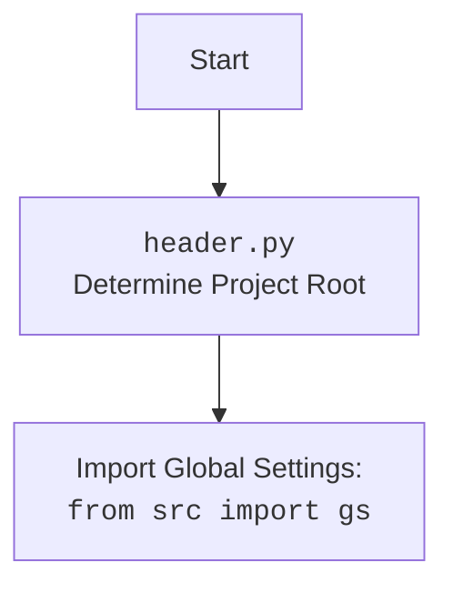

## АНАЛИЗ КОДА: `hypotez/src/endpoints/bots/telegram/header.py`

### <алгоритм>

1.  **Инициализация:**
    *   Устанавливается ``. (Пример: Переменная `MODE` инициализируется строкой `'dev'`).
    *   Импортируются необходимые библиотеки: `sys`, `json`, `packaging.version.Version`, `pathlib.Path`. (Пример: `import sys` - импорт модуля для работы с системными параметрами и функциями).

2.  **Определение корневого каталога проекта `set_project_root(marker_files)`:**
    *   Начальная точка - каталог текущего файла (`__file__`). (Пример: `Path(__file__).resolve().parent` - получение родительского каталога).
    *   Проверяются родительские каталоги на наличие файлов-маркеров (`__root__`). (Пример: Проверка наличия файла `'__root__'` в каждом родительском каталоге)
    *   Если маркер найден, то текущий родительский каталог назначается корневым.
    *   Корневой путь добавляется в `sys.path`, если его там нет. (Пример: `sys.path.insert(0, str(__root__))` - добавление корневого пути в начало списка путей поиска модулей)
    *   Возвращается путь к корневому каталогу.

3.  **Получение корневого каталога:**
    *   Вызывается функция `set_project_root()` для получения корневого каталога проекта, и результат сохраняется в переменную `__root__`.

4.  **Загрузка настроек из `settings.json`:**
    *   Импортируется глобальный объект настроек `gs` из `src`.
    *   Пытается открыть файл `settings.json` в каталоге `src`. (Пример: `gs.path.root / 'src' /  'settings.json'` -  формирование пути к файлу settings.json)
    *   При успешном открытии и загрузке JSON в переменную `settings`.
    *   Если возникает `FileNotFoundError` или `json.JSONDecodeError`, то переменная `settings` остается `None`.

5.  **Загрузка документации из `README.MD`:**
    *   Пытается открыть файл `README.MD` в каталоге `src`.
    *   При успешном открытии содержимое сохраняется в переменную `doc_str`.
    *   Если возникает `FileNotFoundError` или `json.JSONDecodeError`, то переменная `doc_str` остается `None`.

6.  **Инициализация переменных проекта:**
    *   `__project_name__` устанавливается из `settings['project_name']` или `'hypotez'`. (Пример: `settings.get("project_name", 'hypotez')` - получение значения 'project_name' из настроек или использование 'hypotez' по умолчанию)
    *   `__version__` устанавливается из `settings['version']` или `''`.
    *   `__doc__` устанавливается из `doc_str` или `''`.
    *   `__details__` устанавливается как `''`.
    *   `__author__` устанавливается из `settings['author']` или `''`.
    *   `__copyright__` устанавливается из `settings['copyright']` или `''`.
    *   `__cofee__` устанавливается из `settings['cofee']` или строкой по умолчанию.

### <mermaid>

```mermaid
flowchart TD
    subgraph header.py
        Start --> setProjectRoot[set_project_root()]
        setProjectRoot --> findRoot[Find Root Directory]
        findRoot --> checkMarkers[Check for marker files]
        checkMarkers -- Marker Found --> setRoot[Set Root Path]
        checkMarkers -- No Marker Found --> nextParent[Check Next Parent Directory]
        nextParent --> checkMarkers
        setRoot --> addSysPath[Add Root to sys.path]
        addSysPath --> returnRoot[Return Root Path]
        returnRoot --> setGlobalRoot[Set Global __root__]
        setGlobalRoot --> importSettings[Import Global Settings from src.gs]
        importSettings --> loadSettings[Load settings.json]
        loadSettings --> loadReadme[Load README.MD]
        loadReadme --> initProjectVars[Initialize project variables]
        initProjectVars --> End
    end
    
    subgraph src.gs
        style src.gs fill:#f9f,stroke:#333,stroke-width:2px
        rootPath[gs.path.root]
    end
    
    setGlobalRoot --> rootPath
    
```



### <объяснение>

**Импорты:**

*   `sys`: Предоставляет доступ к некоторым переменным и функциям, взаимодействующим с интерпретатором Python. Используется для добавления корневого пути проекта в список путей поиска модулей (`sys.path`), что позволяет импортировать модули из проекта независимо от текущей директории.
*   `json`: Модуль для работы с данными в формате JSON. Используется для чтения данных из файла `settings.json`.
*   `packaging.version.Version`: Используется для работы с версиями проекта, но в данном коде не используется напрямую, возможно для дальнейшего использования.
*   `pathlib.Path`: Модуль для работы с файловыми путями в объектно-ориентированном стиле, упрощает работу с путями и директориями. Используется для определения корневого каталога проекта и путей к файлам настроек и документации.

**Функции:**

*   `set_project_root(marker_files: tuple) -> Path`:
    *   **Аргументы**: `marker_files` - кортеж имен файлов/каталогов, используемых для определения корневого каталога. По умолчанию используется `('__root__')`.
    *   **Возвращаемое значение**: `Path` - объект `pathlib.Path`, представляющий корневой каталог проекта.
    *   **Назначение**: Функция ищет корневой каталог проекта, начиная с каталога, в котором расположен текущий файл, и переходя вверх по дереву каталогов. Поиск останавливается, когда обнаруживается каталог, содержащий один из маркеров (`marker_files`).
    *   **Пример**: Если файл находится в `project/src/module/file.py`, и маркер '__root__' находится в `project`, функция вернет путь `project`.
        *   `current_path:Path = Path(__file__).resolve().parent` - получение абсолютного пути к каталогу в котором находится текущий файл.
        *   `for parent in [current_path] + list(current_path.parents):` -  итерация по всем родительским каталогам.
        *   `if any((parent / marker).exists() for marker in marker_files):` - проверка наличия маркера в текущем родительском каталоге.
        *   `sys.path.insert(0, str(__root__))` - добавление корневого пути к системным путям.

**Переменные:**

*   `MODE`: Указывает на текущий режим работы (в данном случае `'dev'`).
*   `__root__`:  `Path` - хранит корневой путь к проекту, устанавливаемый через `set_project_root`.
*   `settings`:  `dict` - хранит настройки проекта, загруженные из файла `settings.json`. Может быть `None`, если файл не найден или содержит ошибки.
*   `doc_str`: `str` - хранит документацию из файла `README.MD`. Может быть `None`, если файл не найден или не может быть прочитан.
*   `__project_name__`: `str` - название проекта.
*   `__version__`: `str` - версия проекта.
*   `__doc__`: `str` -  документация проекта.
*   `__details__`: `str` - детали проекта.
*   `__author__`: `str` - автор проекта.
*  `__copyright__`: `str` - авторское право проекта.
*   `__cofee__`: `str` -  строка с призывом угостить разработчика кофе.

**Взаимосвязи с другими частями проекта:**

*   `src.gs`: Объект, содержащий глобальные настройки проекта, включая `gs.path.root` (корневой путь), который используется для формирования полных путей к файлам `settings.json` и `README.MD`.
*   `settings.json`: Файл, содержащий настройки проекта в формате JSON. Загружается в переменную `settings`.
*   `README.MD`: Файл, содержащий документацию к проекту. Загружается в переменную `doc_str`.

**Потенциальные ошибки и области для улучшения:**

*   **Обработка ошибок:** Обработка ошибок при загрузке `settings.json` и `README.MD` достаточно простая (пропуск ошибки). Возможно, стоит добавить логирование или более подробное информирование пользователя об этих ошибках.
*   **Зависимость от `__root__`:** Код полагается на наличие маркера `__root__` в корневом каталоге, что может быть неочевидно для новых пользователей. Можно добавить механизм автоматического создания этого файла при первом запуске или иную альтернативу.
*   **Жестко заданные пути:** Пути к `settings.json` и `README.MD` заданы жестко (`'src' /  'settings.json'`, `'src' /  'README.MD'`). Это может вызвать проблемы, если структура проекта изменится. Можно вынести эти пути в переменные или константы.
*   **Использование `packaging.version.Version`**:  Модуль импортирован, но не используется. Удалить или использовать.

**Дополнительные замечания:**
*   Использование `__` для переменных, обозначает что это  "приватные" переменные
*   Код выполняет инициализацию глобальных переменных проекта, которые используются в других модулях.
*   Функция `set_project_root` помогает динамически определить путь к корневому каталогу проекта, что делает проект переносимым и позволяет запускать его из разных мест.
*   Глобальные переменные, полученные из настроек, доступны для импорта и использования в других файлах.