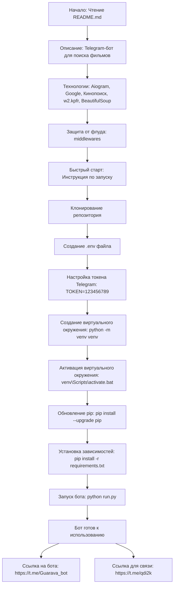

## Анализ кода README.md

### <алгоритм>

1.  **Начало**: Пользователь читает файл `README.md`.
2.  **Описание**: Пользователь узнаёт, что это Telegram-бот для поиска бесплатных ссылок на фильмы и сериалы.
3.  **Технологии**: Пользователь понимает, что бот использует `Aiogram`, Google Search, Кинопоиск API, `w2.kpfr/wiki` и `BeautifulSoup`.
4.  **Защита от флуда**: Пользователь узнает о наличии защиты от флуда с помощью `middlewares`.
5.  **Быстрый старт**: Пользователь переходит к инструкции по запуску проекта.
6.  **Клонирование**: Пользователь клонирует репозиторий на свой компьютер.
7.  **Настройка .env**: Пользователь создаёт файл `.env` и добавляет токен Telegram-бота.
    *   Пример: `TOKEN=123456789`
8.  **Виртуальное окружение**: Пользователь создаёт и активирует виртуальное окружение, если оно не создано.
    *   Пример: `python -m venv venv` и `venv\Scripts\activate.bat`.
9.  **Обновление pip**: Пользователь обновляет `pip`.
    *   Пример: `pip install --upgrade pip`.
10. **Установка зависимостей**: Пользователь устанавливает все необходимые зависимости из `requirements.txt`.
    *   Пример: `pip install -r requirements.txt`.
11. **Запуск**: Пользователь запускает `run.py`.
    *   Пример: `python run.py`.
12. **Готово**: Бот готов к использованию.
13. **Ссылки**: Пользователь получает ссылки на бота и контакт для связи.

### <mermaid>

### <объяснение>

**Общее описание:**

Файл `README.md` представляет собой вводный документ для проекта "Movie Bot". Он предназначен для предоставления пользователю общей информации о боте, его функциях, используемых технологиях и пошаговой инструкции по запуску проекта.

**Разделы файла:**

*   **Заголовок "Movie Bot"**: Указывает на назначение проекта.
*   **Описание**: Дает краткое описание функциональности бота: поиск бесплатных ссылок на фильмы и сериалы.
*   **Технологии**: Перечисляет основные технологии и библиотеки, которые используются в проекте:
    *   **Aiogram**: Библиотека для создания Telegram-ботов на Python.
    *   **Google Search**: Используется для поиска релевантной информации.
    *   **Кинопоиск API**: Используется для получения информации о фильмах и сериалах.
    *   **w2.kpfr/wiki**: Веб-ресурс, откуда бот получает ссылки на просмотр.
    *   **BeautifulSoup**: Библиотека для парсинга HTML и XML.
*   **Защита от флуда**: Указывает, что в боте реализована защита от флуда через `middlewares`.
*   **Быстрый старт**: Раздел, который предоставляет пошаговые инструкции по запуску бота:
    1.  **Клонирование**: Инструкция по клонированию проекта с репозитория.
    2.  **Настройка `.env`**: Описание необходимости создания файла `.env` для хранения токена Telegram-бота.
        *   `TOKEN=123456789`: Пример формата для сохранения токена.
    3.  **Виртуальное окружение**: Инструкции по созданию и активации виртуального окружения, что необходимо для изоляции проекта от других Python-проектов.
        *   `python -m venv venv`: Создание виртуального окружения.
        *   `venv\Scripts\activate.bat`: Активация виртуального окружения (для Windows).
    4.  **Обновление pip**: Рекомендация по обновлению менеджера пакетов `pip`.
        *   `pip install --upgrade pip`: Команда для обновления `pip`.
    5.  **Установка зависимостей**: Инструкция по установке необходимых пакетов из файла `requirements.txt`.
        *   `pip install -r requirements.txt`: Команда для установки зависимостей.
    6.  **Запуск**: Инструкция по запуску основного файла бота `run.py`.
        *   `python run.py`: Команда для запуска бота.
*   **Ссылки**: Предоставлены ссылки на бота в Telegram и контакт для связи с разработчиком.

**Взаимосвязь с другими частями проекта:**

*   `requirements.txt`: Этот файл содержит список всех Python-пакетов, необходимых для работы бота, таких как `aiogram`, `beautifulsoup4` и др.
*   `run.py`: Этот файл является точкой входа в приложение. Он отвечает за запуск бота и настройку его основных параметров.
*   `.env`: Этот файл хранит важные параметры (токен бота) и не должен быть включен в систему контроля версий.
*   `middlewares`: Модули, обеспечивающие защиту от флуда, обрабатывают входящие сообщения.

**Потенциальные ошибки и области для улучшения:**

*   **Отсутствует описание файла `requirements.txt`**: Не указано где находится и как используется `requirements.txt`.
*   **Не указана ОС**: Не указано, что команда `venv\Scripts\activate.bat` для Windows.
*   **Отсутствие детальной инструкции по работе с ботом**: Пользователь не получит никаких инструкций по пользованию ботом.
*   **Отсутствие примера .env**: Было бы хорошо привести пример содержимого `.env` файла с настоящим токеном бота или объяснить, как его получить.

**Дополнительно:**
Этот `README.md` файл играет важную роль для новых пользователей, предоставляя им необходимую информацию для установки и запуска Telegram-бота.