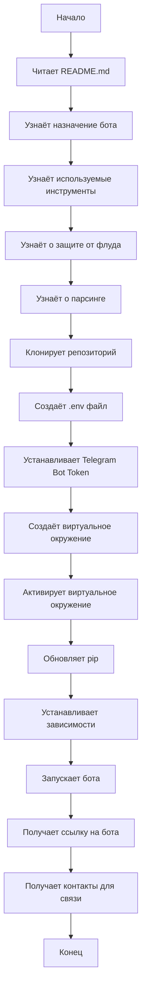

## АНАЛИЗ README.md

### <алгоритм>

1.  **Начало**: Пользователь читает README.md, чтобы понять назначение и способ запуска Movie Bot.
2.  **Ознакомление**: Пользователь узнает, что бот ищет ссылки на бесплатный просмотр фильмов и сериалов в Telegram.
3.  **Инструменты**: Пользователь узнает, что бот использует Aiogram, Google Search, Kinopoisk API и w2.kpfr/wiki.
4.  **Защита от флуда**: Упоминание, что реализована защита от флуда с помощью middleware.
5.  **Парсинг**: Информация, что для парсинга страниц используется BeautifulSoup.
6.  **Клонирование**: Пользователь клонирует проект с GitHub.
7.  **Конфигурация**: Пользователь создает `.env` файл и устанавливает Telegram Bot token.
    *   *Пример*: `TOKEN=123456789`
8.  **Виртуальное окружение**: Пользователь создает и активирует виртуальное окружение.
    *   *Пример*: `python -m venv venv`, `venv\Scripts\activate.bat`.
9.  **Обновление PIP и установка зависимостей**: Пользователь обновляет pip и устанавливает необходимые зависимости из `requirements.txt`.
    *   *Пример*: `pip install --upgrade pip`, `pip install -r requirements.txt`.
10. **Запуск бота**: Пользователь запускает бота с помощью `run.py`.
    *   *Пример*: `python run.py`
11. **Ссылки**: Пользователь получает ссылку на бота в Telegram и контакты для связи.

### <mermaid>

### <объяснение>

**Общее описание:**

Этот README.md файл представляет собой инструкцию по запуску и использованию Telegram-бота для поиска ссылок на бесплатный просмотр фильмов и сериалов. Бот использует различные инструменты и библиотеки для достижения своей функциональности.

**Детали:**

*   **Назначение:**  Бот позволяет пользователям Telegram находить ссылки на бесплатный просмотр фильмов и сериалов, что является его основной целью.

*   **Используемые технологии:**
    *   `Aiogram`: Библиотека для создания Telegram-ботов, обеспечивающая взаимодействие с API Telegram.
    *   `Google Search`: Используется для поиска информации в интернете, вероятно, для поиска сайтов с бесплатным просмотром фильмов.
    *   `Kinopoisk API`: API для получения информации о фильмах и сериалах из базы данных Кинопоиска.
    *   `w2.kpfr/wiki`: Веб-сервис, вероятно, используемый для поиска ссылок на просмотр.
    *   `BeautifulSoup`: Библиотека для парсинга HTML и XML-страниц, используемая для извлечения информации с веб-страниц.

*   **Защита от флуда:**
    *   Middleware: Механизм, который обрабатывает входящие запросы и может предотвращать повторные запросы от одного пользователя, чтобы избежать перегрузки бота.

*   **Файл `.env`:**
    *   TOKEN: Содержит токен для доступа к Telegram Bot API. Этот токен необходим для управления ботом.

*   **Виртуальное окружение:**
    *   `venv`: Создание виртуального окружения изолирует зависимости проекта от глобальных зависимостей системы.

*   **Зависимости:**
    *   `requirements.txt`: Файл, содержащий список всех необходимых библиотек, которые нужно установить для работы проекта.

*   **Запуск бота:**
    *   `run.py`: Основной файл, который запускает бота, инициализируя все необходимые компоненты и обработчики.

*   **Ссылки и контакты:**
    *   Предоставляет ссылку на Telegram бота и контакты для обратной связи.

**Потенциальные улучшения и ошибки:**

*   **Отсутствует описание требований к API Кинопоиска**: В файле не сказано, что может потребоваться ключ для API Кинопоиска.
*   **Обработка ошибок**: В README не упоминается обработка ошибок при работе с API или парсинге страниц, что является важным аспектом для обеспечения надежности работы бота.
*   **Описание процесса поиска**: Не описан процесс поиска фильмов/сериалов и логика выбора сайтов.
*   **Более подробная информация**: Можно было бы добавить более подробное описание конфигурации, например, как получить Telegram Bot token и как использовать API Кинопоиска, если это требуется.

**Взаимосвязь с другими частями проекта:**

*   `run.py`: Является точкой входа в проект, где, вероятно, импортируются модули из пакета `src`, содержащие основную логику бота (обработчики сообщений, парсеры и т.д.).
*   `.env`: Файл с переменными окружения, используется для хранения конфиденциальных данных, таких как токен бота.
*   `requirements.txt`: Определяет зависимости, необходимые для работы проекта, включая библиотеки `aiogram`, `BeautifulSoup`, возможно, другие.

Этот файл README.md является отправной точкой для пользователей, которые хотят запустить и использовать данного бота. Он описывает основные шаги для установки и запуска, а также предоставляет необходимую информацию о функциональности и используемых инструментах.