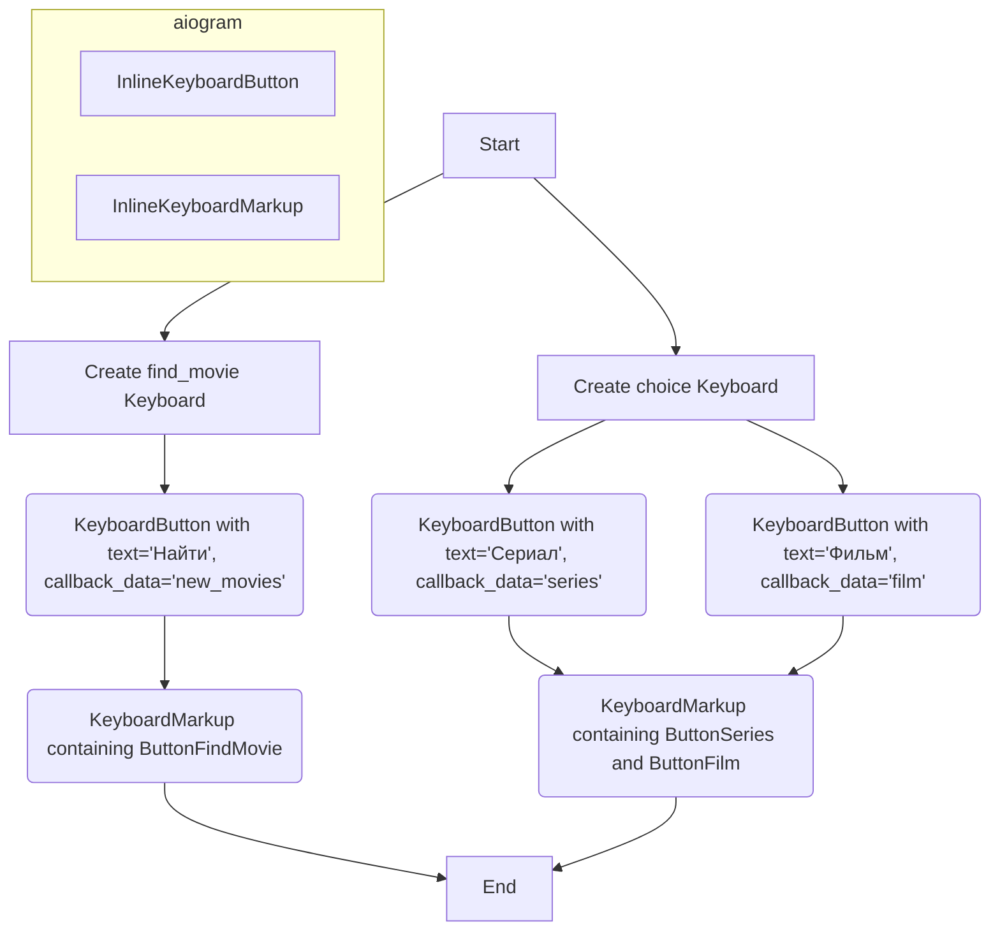

## Анализ кода `hypotez/src/endpoints/bots/telegram/movie_bot-main/apps/keyboard.py`

### 1. <алгоритм>

**Блок-схема:**

1. **Инициализация:**
   - Создание двух экземпляров `InlineKeyboardMarkup` из библиотеки `aiogram`. Эти экземпляры представляют собой наборы кнопок для встраивания в сообщения Telegram.
   - Первый экземпляр, `find_movie`, содержит одну кнопку "Найти".
   - Второй экземпляр, `choice`, содержит две кнопки: "Сериал" и "Фильм".

2. **`find_movie`:**
   - Этот объект `InlineKeyboardMarkup` создается с одной строкой (списком) кнопок.
   - В этой строке создается один объект `InlineKeyboardButton` с текстом "Найти" и callback_data равным 'new_movies'.
   - Этот объект предназначен для использования в сообщении Telegram, где при нажатии кнопки сработает callback 'new_movies'.

3. **`choice`:**
   - Этот объект `InlineKeyboardMarkup` создается с одной строкой (списком) кнопок.
   - В этой строке создаются два объекта `InlineKeyboardButton`:
     - Первая с текстом "Сериал" и callback_data равным 'series'.
     - Вторая с текстом "Фильм" и callback_data равным 'film'.
   - Этот объект используется для предоставления пользователю выбора между сериалами и фильмами.

**Примеры:**

- **`find_movie`:** Когда пользователь видит сообщение с `find_movie` клавиатурой, нажатие на кнопку "Найти" отправит callback 'new_movies' боту. Бот, в свою очередь, обработает это событие, вызвав связанную с этим callback функцию.
- **`choice`:** Когда пользователь видит сообщение с `choice` клавиатурой, нажатие на кнопку "Сериал" отправит callback 'series', а нажатие на кнопку "Фильм" отправит callback 'film'. Бот обработает эти события, вызывая функции, предназначенные для работы с сериалами или фильмами, соответственно.

**Поток данных:**

`aiogram.types` --> `InlineKeyboardButton` --> `InlineKeyboardMarkup` --> `find_movie`, `choice`

### 2. <mermaid>

**Объяснение диаграммы:**

1. **`aiogram` subgraph**: Обозначает элементы, импортированные из библиотеки `aiogram`.
   - **`KeyboardButton`**: Представляет собой кнопку, которую можно добавить в клавиатуру, имеет текст и callback_data.
   - **`KeyboardMarkup`**: Представляет собой контейнер для кнопок, является классом `InlineKeyboardMarkup`.

2. **`Start`**: Начало процесса создания клавиатур.

3. **`CreateFindMovie`**: Представляет процесс создания клавиатуры `find_movie`.
   - **`ButtonFindMovie`**: Кнопка с текстом "Найти" и callback_data 'new_movies'.
   - **`FindMovieKeyboard`**: `InlineKeyboardMarkup`, содержащий кнопку `ButtonFindMovie`.

4. **`CreateChoiceKeyboard`**: Представляет процесс создания клавиатуры `choice`.
   - **`ButtonSeries`**: Кнопка с текстом "Сериал" и callback_data 'series'.
   - **`ButtonFilm`**: Кнопка с текстом "Фильм" и callback_data 'film'.
   - **`ChoiceKeyboard`**: `InlineKeyboardMarkup`, содержащий кнопки `ButtonSeries` и `ButtonFilm`.

5. **`End`**: Конец процесса создания клавиатур, результаты присвоены переменным `find_movie` и `choice`.

**Импортированные зависимости:**

-   `aiogram.types`: Этот модуль содержит типы данных для работы с API Telegram, включая типы для представления кнопок (`InlineKeyboardButton`) и клавиатур (`InlineKeyboardMarkup`).

### 3. <объяснение>

**Импорты:**

-   `from aiogram.types import InlineKeyboardButton, InlineKeyboardMarkup`:
    -   `InlineKeyboardButton`: Класс для создания кнопок, которые встраиваются в сообщения Telegram. Кнопки могут иметь текст и `callback_data`, которые отправляются боту при нажатии.
    -   `InlineKeyboardMarkup`: Класс для создания клавиатур из набора `InlineKeyboardButton`. Клавиатуры используются для добавления интерактивных элементов в сообщения Telegram.
    -   Импорт из `aiogram.types` обеспечивает доступ к необходимым классам для создания интерактивных клавиатур в Telegram-боте.

**Классы:**

-   `InlineKeyboardMarkup`:
    -   Роль: Создание интерактивной клавиатуры, которая прикрепляется к сообщениям Telegram.
    -   Атрибуты:  `inline_keyboard` - список списков кнопок.
    -   Методы: Конструктор `__init__`, принимающий `inline_keyboard` в качестве аргумента.
    -   Взаимодействие: Используется для создания объектов `find_movie` и `choice`, которые потом передаются в сообщения Telegram для отображения клавиатуры пользователю.

-   `InlineKeyboardButton`:
    -   Роль: Создание отдельных кнопок для `InlineKeyboardMarkup`.
    -   Атрибуты: `text` (текст кнопки), `callback_data` (данные, отправляемые боту при нажатии).
    -   Методы: Конструктор `__init__`, принимающий `text` и `callback_data` в качестве аргументов.
    -   Взаимодействие: Используется внутри `InlineKeyboardMarkup` для определения кнопок на клавиатуре.

**Функции:**

-   В данном коде нет пользовательских функций, только использование конструкторов классов `InlineKeyboardMarkup` и `InlineKeyboardButton`.
    -   Пример использования конструкторов:
        -   `InlineKeyboardButton(text='Найти', callback_data='new_movies')` создает кнопку с текстом "Найти" и callback `new_movies`.
        -  `InlineKeyboardMarkup(inline_keyboard=[[кнопка1, кнопка2]])` создаёт клавиатуру из списка кнопок.

**Переменные:**

-   `find_movie`:
    -   Тип: `InlineKeyboardMarkup`
    -   Использование: Объект клавиатуры с кнопкой "Найти". Предназначен для использования в сообщении Telegram для запуска процесса поиска фильма.
-   `choice`:
    -   Тип: `InlineKeyboardMarkup`
    -   Использование: Объект клавиатуры с кнопками "Сериал" и "Фильм". Предназначен для использования в сообщении Telegram для выбора типа контента пользователем.

**Цепочка взаимосвязей:**

- Код `keyboard.py` зависит от `aiogram`.
- Код `keyboard.py` создаёт объекты `InlineKeyboardMarkup`, которые используются в других частях проекта (например, в обработчиках сообщений или callback-запросов) для отправки пользователям интерактивных клавиатур.
- При нажатии на кнопки клавиатуры, генерируются callback_data, которые обрабатываются в других частях проекта.
- Данные, которые содержатся в `callback_data` будут обрабатываться в другом месте, в функции-обработчике.

**Потенциальные ошибки или области для улучшения:**

-   **Жестко заданные данные:** Строки с текстом кнопок и `callback_data` жестко прописаны в коде. Было бы лучше вынести их в конфигурационный файл, что упростило бы процесс изменения текста кнопок и `callback_data` без необходимости изменения кода.
-   **Локализация:** Текст кнопок не поддерживает локализацию.
-   **Обработка callback:** Код не обрабатывает callback-запросы.