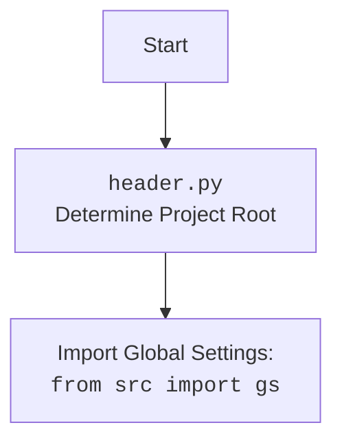

## АНАЛИЗ КОДА

### <алгоритм>

1.  **Начало**: Запускается функция `search_query` с входными параметрами `query` (строка поискового запроса) и `type_movie` (тип контента, по умолчанию 'series').
    *   Пример: `query = "теория большого взрыва"`, `type_movie = "series"`.
2.  **Формирование поискового запроса**: Создается поисковый запрос `term` для Google, включающий `site:www.kinopoisk.ru/{type_movie}` и пользовательский `query`.
    *   Пример: `term = "site:www.kinopoisk.ru/series теория большого взрыва"`.
3.  **HTTP-запрос к Google**: Отправляется GET запрос на `https://www.google.com/search` с:
    *   `User-Agent`: динамически полученный через `get_useragent()` (из `apps.useragent`).
    *   Параметр `q`: поисковый запрос `term`.
    *   Параметр `hl`: язык поиска `ru`.
    *   `timeout`: 5 секунд.
4.  **Обработка ответа**: Полученный HTML ответ парсится с использованием `BeautifulSoup`.
5.  **Поиск блоков с результатами**: Поиск всех `div` с `class="g"`, которые содержат результаты поиска.
6.  **Перебор результатов**: Если найдены результаты (блоки `result_block`):
    *   Для каждого результата `result` в `result_block`:
        *   Поиск ссылки `a` (с `href=True`), заголовка `h3` и описания `div` (с нужным стилем).
        *   Проверка, что все элементы (`link`, `title`, `description`) найдены.
        *   Извлечение идентификатора фильма из `link["href"]` (последний сегмент перед последним `/`, если он цифровой).
            *   Пример: `link["href"] = "https://www.kinopoisk.ru/series/1234567/"`. Идентификатор будет `1234567`.
        *   Формирование и возврат словаря с:
            *   `link`: ссылка на страницу фильма на `w2.kpfr.wiki`.
            *   `title`: текст заголовка.
            *   `description`: текст описания (обрезан до `...`).
    *   Если ни один результат не подошел, переходим к следующему шагу.
7.  **Возврат `None`**: Если ни один из результатов не соответствует критериям, возвращается `None`.
8.  **Вывод**: В режиме `if __name__ == '__main__':` вызывается `search_query` с тестовым запросом и результат выводится на экран.
    *   Пример: Выводится словарь с информацией о сериале "теория большого взрыва", либо `None`.

### <mermaid>
```mermaid
flowchart TD
    Start[Начало: Вызов search_query(query, type_movie)] --> FormQuery[Формирование запроса term];
    FormQuery --> GetUserAgent[Получение User-Agent через get_useragent()];
    GetUserAgent --> HttpRequest[HTTP GET запрос к Google];
    HttpRequest --> ParseHtml[Парсинг HTML с BeautifulSoup];
    ParseHtml --> FindResults[Поиск блоков div class="g"];
    FindResults -- Результаты найдены --> LoopResults[Перебор результатов];
    FindResults -- Результаты не найдены --> ReturnNone[Возврат None];
    LoopResults --> FindLinkTitleDescription[Поиск link, h3, div с описанием];
    FindLinkTitleDescription -- Элементы найдены --> ExtractMovieId[Извлечение movie_id из ссылки];
    FindLinkTitleDescription -- Элементы не найдены --> LoopResults;
    ExtractMovieId -- movie_id цифровой --> BuildResultDictionary[Формирование словаря с link, title, description];
    ExtractMovieId -- movie_id не цифровой --> LoopResults;
    BuildResultDictionary --> ReturnDictionary[Возврат словаря];
     ReturnDictionary --> End;
    ReturnNone --> End;
    End[Конец];

    style Start fill:#f9f,stroke:#333,stroke-width:2px
     style End fill:#f9f,stroke:#333,stroke-width:2px

```



### <объяснение>

**Импорты:**

*   `os`: Используется для взаимодействия с операционной системой, хотя в данном коде напрямую не применяется. Возможно, используется в `load_dotenv` или `src.gs`.
*   `bs4.BeautifulSoup`: Используется для парсинга HTML-документов. В коде применяется для анализа HTML-ответа, полученного от Google.
*   `dotenv.load_dotenv`: Загружает переменные окружения из файла `.env`. Это полезно для хранения конфиденциальных данных (например, API ключи).
*   `requests.get`: Используется для отправки HTTP-запросов. В коде применяется для отправки запроса к поисковику Google.
*   `apps.useragent.get_useragent`: Функция, которая возвращает случайный user-agent, для имитации запроса от браузера. Это важно, чтобы избежать блокировки со стороны Google. (Поскольку эта функция из `src`, нужно посмотреть реализацию в `src/apps/useragent.py`.)

**Функции:**

*   `search_query(query, type_movie='series')`:
    *   **Аргументы**:
        *   `query` (str): Строка поискового запроса.
        *   `type_movie` (str, optional): Тип контента (например, 'series', 'film'). По умолчанию 'series'.
    *   **Возвращаемое значение**: Словарь с ключами `link`, `title`, `description`, если найдено соответствие; в противном случае `None`.
    *   **Назначение**: Выполняет поисковый запрос к Google, парсит результаты и возвращает информацию о фильме/сериале (ссылку, заголовок и описание).
    *   **Примеры**:
        *   `search_query("Игра престолов")` вернет словарь с информацией о сериале "Игра престолов".
        *   `search_query("Зеленая книга", type_movie="film")` вернет словарь с информацией о фильме "Зеленая книга".
        *   `search_query("невeрный запрос")` вернет `None`

**Переменные:**

*   `term` (str): Строка поискового запроса, сформированная для Google, включая тип контента и запрос пользователя.
*   `resp` (requests.Response): Объект ответа на HTTP-запрос к Google.
*   `soup` (bs4.BeautifulSoup): Объект, содержащий разобранный HTML-код.
*   `result_block` (list): Список `div` элементов, содержащих результаты поиска от Google.
*    `result`(bs4.element.Tag): Один элемент `div` из списка `result_block`, представляющий один результат поиска.
*   `link` (bs4.element.Tag): Элемент `a`, представляющий ссылку на странице поиска.
*   `title` (bs4.element.Tag): Элемент `h3`, представляющий заголовок результата поиска.
*   `description` (bs4.element.Tag): Элемент `div`, содержащий описание результата поиска.
*   `type_movie` (str): Переменная, указывающая тип контента для поиска (сериал или фильм).
*    `query` (str): Пользовательский поисковый запрос.
* `__name__`: Встроенная переменная, проверяющая, запущен ли скрипт напрямую или импортирован как модуль.

**Объяснение работы кода:**

Код предназначен для поиска информации о фильмах и сериалах на сайте kinopoisk.ru с использованием Google. Он отправляет поисковый запрос в Google, анализирует результаты и возвращает структурированную информацию (ссылку на страницу фильма/сериала на `w2.kpfr.wiki`, заголовок и описание).

**Цепочка взаимосвязей:**

1.  Скрипт `search.py` использует `requests` для отправки HTTP-запроса к Google.
2.  `BeautifulSoup` используется для парсинга HTML ответа.
3.  Функция `get_useragent` из модуля `apps.useragent` используется для получения user-agent.
4.  `.env` используется для хранения переменных окружения, через библиотеку `dotenv`.
5.  Ссылка формируется на основе `w2.kpfr.wiki` с использованием id фильма/сериала, полученного из ссылки kinopoisk.ru.
6.  В конце, в режиме `if __name__ == '__main__':` функция вызывается для демонстрации.

**Потенциальные ошибки и улучшения:**

*   **Обработка ошибок:** Код не обрабатывает возможные ошибки при выполнении запроса к Google (например, `requests.exceptions.RequestException`).
*   **Более надежный парсинг:** Парсинг HTML с `BeautifulSoup` может быть подвержен поломке, если структура HTML на странице Google изменится.
*   **Поиск альтернативных источников:** Если Google заблокирует запросы, нужно будет предусмотреть другие способы получения информации (например, использование API).
*   **Асинхронность**: Для увеличения производительности можно использовать асинхронный код для HTTP-запросов.
*   **Улучшенное обрезание описания**: Обрезание описания до `...` может быть не совсем корректным, лучше использовать более надежный способ.
*   **Логирование:**  Добавить логирование для отслеживания проблем и ошибок.
*   **Тестирование**: Написать unit-тесты для проверки корректности работы.