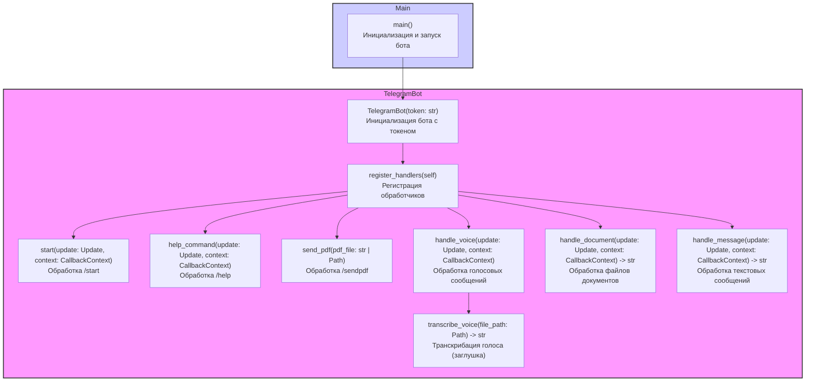

## Анализ кода Telegram-бота

### 1. <алгоритм>

**Общая схема работы бота:**

1.  **Инициализация:**
    *   Бот инициализируется с использованием токена Telegram API.
    *   Устанавливаются обработчики команд и сообщений.
2.  **Обработка входящих сообщений:**
    *   При получении сообщения от пользователя бот определяет его тип (команда, текст, голос, документ).
    *   **Пример:**
        *   Сообщение `/start` вызывает функцию `start()`.
        *   Текстовое сообщение `Привет!` вызывает функцию `handle_message()`.
        *   Голосовое сообщение вызывает функцию `handle_voice()`.
        *   Файл документа вызывает функцию `handle_document()`.
3.  **Обработка команд:**
    *   `/start`: Отправляет приветственное сообщение.
        *   **Пример:** Бот отвечает: "Привет! Я бот, который может обрабатывать голосовые сообщения и документы."
    *   `/help`: Отправляет список доступных команд.
        *   **Пример:** Бот отвечает: "Доступные команды: /start, /help, /sendpdf."
    *   `/sendpdf`: Отправляет PDF-файл.
        *   **Пример:** Пользователь вызывает `/sendpdf`. Бот отправляет заранее определенный PDF-файл пользователю.
4.  **Обработка текстовых сообщений:**
    *   Бот возвращает текст, отправленный пользователем.
        *   **Пример:** Пользователь отправляет: "Как дела?". Бот возвращает: "Как дела?"
5.  **Обработка голосовых сообщений:**
    *   Бот загружает голосовой файл.
    *   Сохраняет его локально.
    *   Пытается транскрибировать его (в настоящее время это заглушка).
        *   **Пример:** Пользователь отправляет голосовое сообщение. Бот сохраняет файл, выводит сообщение "Голос получен" и выполняет заглушку транскрибации.
6.  **Обработка документов:**
    *   Бот загружает файл документа.
    *   Сохраняет его локально.
    *   Читает содержимое текстового документа.
        *   **Пример:** Пользователь отправляет текстовый документ. Бот сохраняет файл, читает его содержимое и возвращает в ответ.

**Блок-схема:**

```mermaid
graph LR
    A[Начало: Инициализация бота] --> B{Получение сообщения};
    B -- Команда (/start) --> C[start()];
    B -- Команда (/help) --> D[help_command()];
    B -- Команда (/sendpdf) --> E[send_pdf()];
    B -- Текст --> F[handle_message()];
    B -- Голос --> G[handle_voice()];
    B -- Документ --> H[handle_document()];
    C --> I[Отправка приветствия];
    D --> J[Отправка списка команд];
    E --> K[Отправка PDF файла];
    F --> L[Отправка текста сообщения];
    G --> M[Загрузка и сохранение голоса];
    M --> N[Транскрибация голоса (заглушка)];
    N --> O[Отправка результата транскрибации];
    H --> P[Загрузка и сохранение документа];
    P --> Q[Чтение содержимого документа];
    Q --> R[Отправка содержимого документа];
    I --> S[Завершение];
    J --> S;
    K --> S;
    L --> S;
    O --> S;
    R --> S;
    S[Завершение];
```

### 2. <mermaid>



**Анализ зависимостей:**

*   **TelegramBot:** Основной класс, содержащий всю логику работы бота.
*   **Методы TelegramBot:**
    *   `__init__`: Инициализация бота и регистрация обработчиков.
    *   `register_handlers`: Настройка обработчиков для разных типов сообщений.
    *   `start`, `help_command`, `send_pdf`, `handle_voice`, `handle_document`, `handle_message`: Обработчики для конкретных типов сообщений и команд.
    *   `transcribe_voice`: Заглушка для транскрибации голоса.
*   **Main:** Точка входа в программу, где создаётся экземпляр бота и запускается его работа.
*   **Связи:** Метод `main` создает экземпляр `TelegramBot`, а `TelegramBot` инициализирует обработчики внутри себя. Каждый метод обработки вызывается в ответ на сообщение от пользователя в Telegram.

### 3. <объяснение>

**Импорты:**

*   `python-telegram-bot`: (не импортируется явно в предоставленном тексте, но используется) Основная библиотека для создания Telegram-ботов, предоставляет классы и функции для взаимодействия с Telegram API.
*   `pathlib`: Стандартная библиотека Python для работы с путями файлов и директорий.
*   `tempfile`: Стандартная библиотека Python для создания временных файлов и директорий.
*   `asyncio`: Стандартная библиотека Python для асинхронного программирования.
*   `requests`: Библиотека для отправки HTTP-запросов, используется для загрузки файлов из Telegram.
*   `src.utils.convertors.tts`:  Модуль, предположительно, содержащий функциональность для распознавания речи (транскрибации) и преобразования текста в речь (не используется явно, но упоминается в описании).
*   `src.utils.file`: Модуль, содержащий функциональность для работы с файлами, включая чтение текстовых файлов.

**Классы:**

*   **`TelegramBot`**:
    *   **Роль**: Центральный класс, управляющий всеми операциями бота.
    *   **Атрибуты**:
        *   `token` (str): Токен Telegram API для аутентификации.
        *   `updater` (объект `Updater` из `python-telegram-bot`): Объект для получения обновлений от Telegram.
        *   `dispatcher` (объект `Dispatcher` из `python-telegram-bot`): Объект для распределения обновлений между обработчиками.
    *   **Методы:**
        *   `__init__(self, token: str)`: Инициализирует бота, сохраняя токен, создает `Updater` и `Dispatcher`, вызывает `register_handlers`.
        *   `register_handlers(self)`: Регистрирует обработчики для команд и сообщений.
        *   `start(self, update: Update, context: CallbackContext)`: Обрабатывает команду `/start`, отправляя приветственное сообщение.
        *   `help_command(self, update: Update, context: CallbackContext)`: Обрабатывает команду `/help`, предоставляя список команд.
        *   `send_pdf(self, pdf_file: str | Path)`: Отправляет PDF-файл пользователю.
        *   `handle_voice(self, update: Update, context: CallbackContext)`: Обрабатывает голосовые сообщения, загружает их и вызывает `transcribe_voice`.
        *   `transcribe_voice(self, file_path: Path) -> str`: Выполняет транскрибацию голосового сообщения. В текущей реализации это заглушка, возвращающая текст "Голос получен".
        *   `handle_document(self, update: Update, context: CallbackContext) -> str`: Обрабатывает загруженные документы, загружает их и вызывает `read_file_content` из `src.utils.file`.
        *   `handle_message(self, update: Update, context: CallbackContext) -> str`: Обрабатывает текстовые сообщения, возвращая текст сообщения.

**Функции:**

*   `main()`:
    *   **Назначение**: Основная функция, точка входа в программу.
    *   **Действия**: Инициализирует бота, запускает его с помощью `run_polling()`.

**Переменные:**

*   `token` (str): Токен для Telegram API, используется для аутентификации бота. Передается как аргумент конструктору класса `TelegramBot`.
*   `pdf_file` (str или `Path`): Путь к PDF файлу, который отправляется командой `/sendpdf`.
*   `update`: Объект `Update` из `python-telegram-bot`, содержит информацию о полученном обновлении (сообщении, команде и т.д.).
*   `context`: Объект `CallbackContext` из `python-telegram-bot`, используется для передачи контекста между обработчиками.
*   `file_path`: (Path) Путь к файлу голосового сообщения или документа.

**Цепочка взаимосвязей:**

1.  **Инициализация:** `main()` создает экземпляр `TelegramBot`, передавая токен.
2.  **Регистрация обработчиков:** `TelegramBot.__init__()` вызывает `register_handlers()`, который настраивает обработчики для разных типов сообщений.
3.  **Получение сообщения:** При получении сообщения от пользователя Telegram, `python-telegram-bot` вызывает соответствующий обработчик в `TelegramBot`.
4.  **Обработка сообщения:** Обработчики (`start`, `help_command`, `handle_message`, `handle_voice`, `handle_document`) выполняют нужные операции, используя другие функции и модули.

**Потенциальные ошибки и области для улучшения:**

*   **Заглушка транскрибации:** Функция `transcribe_voice` является заглушкой. Ее необходимо заменить на реальную реализацию распознавания речи.
*   **Обработка ошибок:** В коде отсутствуют обработки исключений. Необходимо добавить обработку ошибок при работе с файлами, API Telegram, и т.д.
*   **Конфигурация:** Токен и путь к PDF-файлу жестко заданы в коде. Лучше использовать переменные окружения или конфигурационные файлы.
*   **Масштабируемость:**  Код не масштабируется на данный момент, т.к. все функции находятся в одном классе. Лучше разбить код на несколько модулей.
*  **Отсутствие логирования:** Нет логирования для отслеживания состояния бота и потенциальных ошибок.
*   **Отсутствие тестирования:** Нет тестов.

Этот анализ предоставляет полное представление о работе Telegram-бота, его структуре, логике и зависимостях.