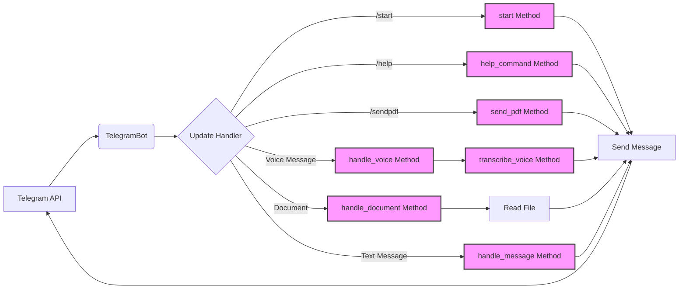

## Анализ кода Telegram-бота

### <алгоритм>

1.  **Инициализация бота:**
    *   Бот создается с использованием предоставленного токена.
    *   Пример: `telegram_bot = TelegramBot(token="YOUR_TELEGRAM_BOT_TOKEN")`
2.  **Регистрация обработчиков:**
    *   Регистрируются обработчики для команд `/start`, `/help`, `/sendpdf` и для разных типов сообщений.
    *   Примеры обработчиков:
        *   Команда `/start` → функция `start(update, context)`
        *   Голосовое сообщение → функция `handle_voice(update, context)`
        *   Документ → функция `handle_document(update, context)`
        *   Текстовое сообщение → функция `handle_message(update, context)`
3.  **Обработка команд:**
    *   `/start`: Бот отправляет приветственное сообщение.
        *   Пример: "Привет! Я бот. Используй /help для списка команд."
    *   `/help`: Бот отправляет список доступных команд.
        *   Пример: "/start - Приветствие, /help - Список команд, /sendpdf - Отправка PDF"
    *   `/sendpdf`: Бот отправляет PDF файл.
        *   Пример: `send_pdf(pdf_file="example.pdf")`
4.  **Обработка сообщений:**
    *   **Голосовые сообщения:**
        *   Загрузка файла голосового сообщения.
            *   Пример: Загрузка файла `voice.ogg`
        *   Сохранение файла локально во временную директорию.
            *   Пример: Сохранение как `tmp/voice_123.ogg`
        *   Попытка транскрибировать голосовое сообщение (сейчас это заглушка).
        *   Функция `transcribe_voice(file_path: Path)` используется.
            *   Пример: `transcribe_voice(file_path=Path("tmp/voice_123.ogg"))`
    *   **Файлы документов:**
        *   Загрузка файла документа.
            *   Пример: Загрузка `document.txt`
        *   Сохранение файла локально во временную директорию.
            *   Пример: Сохранение как `tmp/document_123.txt`
        *   Чтение содержимого текстового документа.
        *   Пример: `read_file_content(file_path=Path("tmp/document_123.txt"))`
        *   Отправка прочитанного текста пользователю.
    *   **Текстовые сообщения:**
        *   Бот возвращает текст, полученный от пользователя.
            *   Пример: Пользователь отправил "Привет". Бот возвращает "Привет".
5. **Запуск бота:**
    *   Запуск бота в режиме опроса (polling).
        *   Пример: `telegram_bot.run_polling()`

### <mermaid>

**Описание зависимостей `mermaid`:**

*   **Telegram API:** Внешний API, с которым взаимодействует бот.
*   **TelegramBot:** Основной класс бота, обрабатывающий взаимодействия.
*   **Update Handler:** Компонент, распределяющий входящие сообщения к соответсвующим обработчикам.
*   **Методы `start`, `help_command`, `send_pdf`, `handle_voice`, `handle_document`, `handle_message`:** Методы класса `TelegramBot`, обрабатывающие разные виды входящих данных или команды.
*   **Метод `transcribe_voice`:** Метод для транскрибирования аудио (в текущей реализации заглушка).
*   **`Read File`**: Операция чтения файла.
*    **`Send Message`**: Функция отправки ответа обратно в Telegram API.

### <объяснение>

**Импорты:**

*   `python-telegram-bot`: Основная библиотека для создания Telegram-ботов. Она предоставляет классы и методы для взаимодействия с Telegram API, такие как `Updater`, `Dispatcher`, `Bot`, `Update`, `CallbackContext`.
*   `pathlib`: Используется для работы с путями к файлам и директориями в более объектно-ориентированном стиле, чем стандартные строковые пути.  Взаимодействует с файловой системой для создания, чтения и манипулирования файлами и директориями.
*   `tempfile`: Модуль для создания временных файлов и директорий, которые могут автоматически удаляться после завершения их использования.
*   `asyncio`: Библиотека для написания конкурентного кода с использованием асинхронности. Используется для асинхронных операций, таких как запросы к API и обработка файлов.
*   `requests`: Библиотека для выполнения HTTP-запросов. Используется для загрузки файлов из Telegram API.
*   `src.utils.convertors.tts`: (Предполагается) Модуль для преобразования текста в речь и для распознавания речи.
*   `src.utils.file`: (Предполагается) Модуль для работы с файлами, например, для чтения содержимого текстовых файлов.

**Классы:**

*   **`TelegramBot`**:
    *   **Роль**: Основной класс, который инкапсулирует всю логику работы Telegram-бота.
    *   **Атрибуты**:
        *   `token`: Токен Telegram-бота для аутентификации в Telegram API.
        *   `updater`: Объект `Updater` из `python-telegram-bot` для получения обновлений.
        *   `dispatcher`: Объект `Dispatcher` для распределения обновлений по обработчикам.
    *   **Методы**:
        *   `__init__(self, token: str)`: Инициализация бота с токеном, создание объектов `Updater` и `Dispatcher`, регистрация обработчиков.
        *   `register_handlers(self)`: Регистрация обработчиков команд и сообщений.
        *   `start(self, update: Update, context: CallbackContext)`: Обработчик команды `/start`.
        *   `help_command(self, update: Update, context: CallbackContext)`: Обработчик команды `/help`.
        *   `send_pdf(self, pdf_file: str | Path)`: Обработчик команды `/sendpdf` для отправки PDF файла.
        *   `handle_voice(self, update: Update, context: CallbackContext)`: Обработчик голосовых сообщений, загрузка файла, попытка транскрибирования.
        *   `transcribe_voice(self, file_path: Path) -> str`: Метод для транскрибирования голосового сообщения (заглушка).
        *   `handle_document(self, update: Update, context: CallbackContext) -> str`: Обработчик файлов документов, загрузка файла, чтение содержимого.
        *   `handle_message(self, update: Update, context: CallbackContext) -> str`: Обработчик текстовых сообщений, возвращает полученный текст.
        *   `run_polling(self)`: Запуск бота в режиме опроса.

**Функции:**

*   `main()`:
    *   **Назначение**: Точка входа для запуска бота. Инициализирует объект `TelegramBot`, регистрирует обработчики и запускает бота.
    *   **Аргументы**: Нет.
    *   **Возвращаемое значение**: Нет.

**Переменные:**

*   `token`: Строка, содержащая токен Telegram-бота.
*   `updater`: Объект класса `Updater` из `python-telegram-bot`.
*   `dispatcher`: Объект класса `Dispatcher` из `python-telegram-bot`.
*   `pdf_file`: Строка или объект `Path` с путём к файлу PDF для отправки.
*   `update`: Объект класса `Update` из `python-telegram-bot`, содержащий информацию об обновлении.
*   `context`: Объект класса `CallbackContext` из `python-telegram-bot`, содержащий контекст обработки обновления.
*   `file_path`: Объект класса `Path`, представляющий путь к файлу.
*   `text`: Строка, представляющая текст сообщения.
*   `message`: Объект класса `Message` из `python-telegram-bot`, представляющий сообщение.

**Потенциальные ошибки и области для улучшения:**

*   **Заглушка `transcribe_voice`**: Необходимо реализовать реальное распознавание речи.
*   **Обработка ошибок**:  Отсутствует обработка исключений при загрузке файлов, их обработке и при вызове API. Следует добавить `try-except` блоки.
*   **Безопасность**: Необходимо убедиться, что токен бота не хранится в открытом виде в коде, использовать переменные окружения или другие секретные хранилища.
*   **Сохранение файлов:** Можно использовать более надежный механизм временных файлов, например, `NamedTemporaryFile` вместо `tempfile.mkdtemp()`
*   **Масштабируемость**: Бот может быть расширен для поддержки других команд, типов сообщений и интеграции с другими сервисами.
*   **Модульность**: Разделение на отдельные модули для каждого типа обработчика может повысить читаемость и поддерживаемость кода.

**Взаимосвязь с другими частями проекта:**

*   Модуль `src.utils.convertors.tts` используется для преобразования текста в речь и, предположительно, для распознавания речи, что демонстрирует взаимодействие с другими компонентами проекта, отвечающими за обработку мультимедийных данных.
*  Модуль `src.utils.file` используется для чтения файлов, показывая взаимодействие с компонентами для файловых операций.

Этот анализ предоставляет исчерпывающее понимание функциональности Telegram-бота, его архитектуры и потенциальных улучшений.