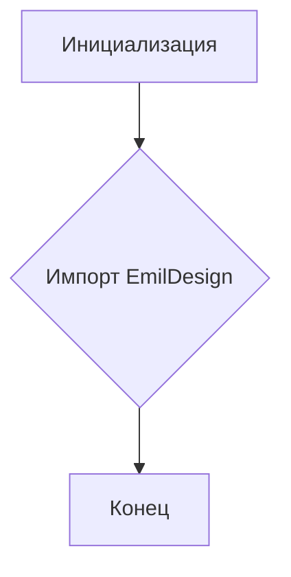
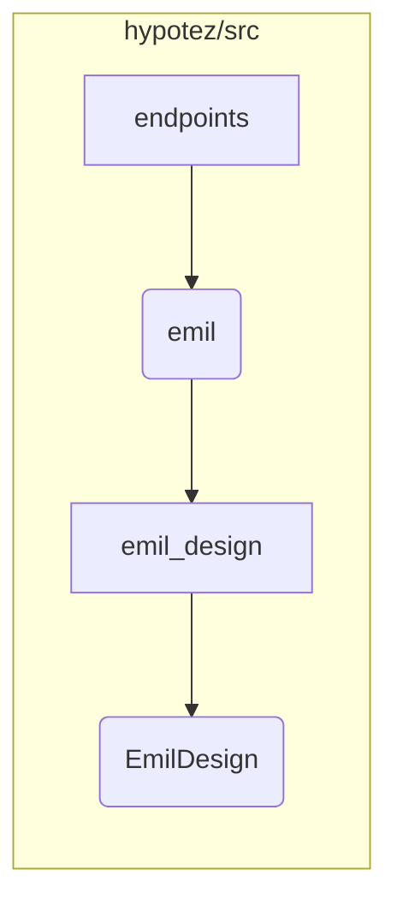

```MD
# Анализ файла hypotez/src/endpoints/emil/__init__.py

1. **<input code>**

```python
## \file hypotez/src/endpoints/emil/__init__.py
# -*- coding: utf-8 -*-\
#! venv/Scripts/python.exe
#! venv/bin/python/python3.12

"""
.. module: src.endpoints.emil 
	:platform: Windows, Unix
	:synopsis:

"""
MODE = 'dev'


from .emil_design import EmilDesign
```

2. **<algorithm>**

Этот файл является инициализатором для пакета `emil` в модуле `endpoints`. Алгоритм работы прост: он импортирует класс `EmilDesign` из модуля `emil_design`.  Дополнительного алгоритмического процесса нет.

**Блок-схема:**



**Пример:**

При импорте модуля `emil` (например, из другого модуля) будет доступен класс `EmilDesign` для использования.

3. **<mermaid>**



**Объяснение диаграммы:**

Диаграмма отображает иерархию модулей.  Модуль `endpoints` содержит подмодуль `emil`, который, в свою очередь, импортирует класс `EmilDesign` из модуля `emil_design`.  Все элементы находятся в иерархии пакета `hypotez/src`.

4. **<explanation>**

* **Импорты:**
    - `from .emil_design import EmilDesign`: Импортирует класс `EmilDesign` из модуля `emil_design`, который предположительно находится в той же директории (`./emil_design`).  Это стандартная импортная конструкция для импорта модулей из текущей папки.

* **Классы:**
    - `EmilDesign`:  Этот класс, вероятно, определяет различные аспекты взаимодействия, связанные с "Emil". Подробное описание структуры класса будет содержаться в файле `emil_design.py`, который должен быть проанализирован отдельно.

* **Функции:** Нет функций в данном файле.

* **Переменные:**
    - `MODE = 'dev'`: Переменная, вероятно, определяет режим работы, в данном случае, режим разработки ('dev'). Возможно, значения для других режимов (например, 'prod') хранятся в других частях проекта.


* **Возможные ошибки или улучшения:**

    - Отсутствие документации. В `emil_design.py` необходимо включить полную документацию для всех классов и функций.
    - Сложность понимания назначения.  Без контекста использования модуля `emil` трудно определить, как он взаимодействует с другими частями проекта.  Дополнительные комментарии могли бы прояснить назначение переменной `MODE`.
    - Проверка пути импорта.  Если `emil_design.py` находится не в текущей директории, то нужно будет указать полный путь к нему.


**Цепочка взаимосвязей с другими частями проекта:**

Файл `__init__.py` в папке `emil` отвечает за инициализацию и экспорт элементов (в данном случае - класса `EmilDesign`)  для использования в других модулях или приложениях, которые импортируют `hypotez/src/endpoints/emil`.  Дальнейшие взаимосвязи будут зависеть от того, как `EmilDesign` используется в других частях приложения.