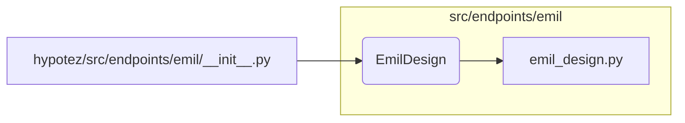

# <input code>

```python
## \file hypotez/src/endpoints/emil/__init__.py
# -*- coding: utf-8 -*-
#! venv/Scripts/python.exe
#! venv/bin/python/python3.12

"""
.. module: src.endpoints.emil 
	:platform: Windows, Unix
	:synopsis:

"""
MODE = 'dev'


from .emil_design import EmilDesign
```

# <algorithm>

Пошаговая блок-схема отсутствует, так как код состоит всего из одного импорта и константной переменной.  Учитывая формат, код просто импортирует класс `EmilDesign` из модуля `emil_design.py` в текущем каталоге (`hypotez/src/endpoints/emil`).

# <mermaid>



# <explanation>

**Импорты**:

* `from .emil_design import EmilDesign`:  Импортирует класс `EmilDesign` из файла `emil_design.py`, который находится в том же каталоге, что и `__init__.py`. Символ `.` указывает на поиск модуля в текущем пакете (`src.endpoints.emil`).  Это типичная практика для импорта связанных элементов.

**Переменные**:

* `MODE = 'dev'`:  Это константная строковая переменная, хранящая режим работы. В данном контексте она скорее всего используется для настройки поведения других частей приложения.  Значение `'dev'` предполагает что код находится в режиме разработки (development).

**Классы**:

* `EmilDesign`: Этот класс импортируется, но его определение отсутствует в текущем файле. Он должен быть определен в файле `emil_design.py` в том же каталоге (`hypotez/src/endpoints/emil`). Это указывает на структуру пакета - отдельные файлы для отдельных частей логики.

**Функции**:

Код не содержит функций.

**Возможные ошибки или улучшения**:

* **Документация:** Недостаточно подробная документация в строке `"""..."""`.  Рекомендуется описывать назначение переменной `MODE`, а также назначение класса `EmilDesign`.  

* **Использование `MODE`:**  Непонятно, как переменная `MODE` используется в дальнейшем.  Она должна быть использована где-то в коде для управления поведением или настройкой.


**Цепочка взаимосвязей с другими частями проекта**:

Предполагается, что `EmilDesign` и его методы взаимодействуют с другими классами и функциями, используя различные интерфейсы или данные.  Связь будет зависеть от того, как `EmilDesign` реализован.  Возможно, он взаимодействует с базами данных, API-интерфейсами или другими компонентами проекта.  В этом случае `__init__.py` служит точкой входа для доступа к объектам класса `EmilDesign`.