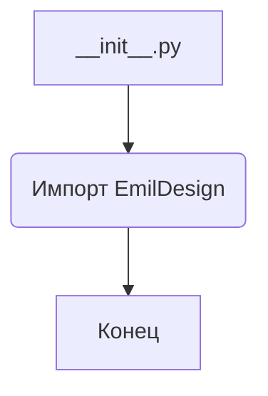
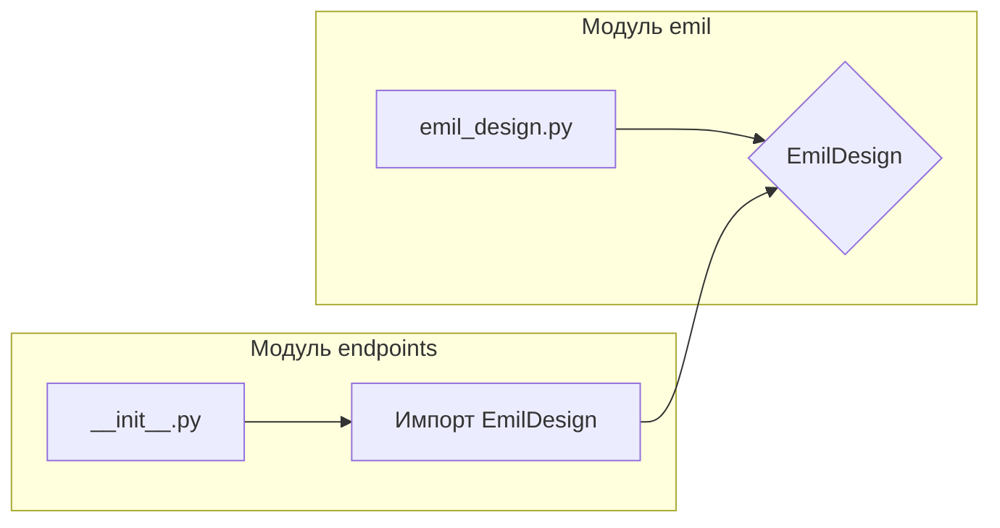

```MD
# <input code>

```python
## \file hypotez/src/endpoints/emil/__init__.py
# -*- coding: utf-8 -*-
#! venv/Scripts/python.exe
#! venv/bin/python/python3.12

"""
.. module: src.endpoints.emil 
	:platform: Windows, Unix
	:synopsis:

"""
MODE = 'dev'


from .emil_design import EmilDesign
```

# <algorithm>

В данном файле `__init__.py` модуля `src.endpoints.emil` происходит импорт класса `EmilDesign` из модуля `emil_design`.  Нет прямого взаимодействия с другими модулями или классами, представленными в коде. Алгоритм работы сводится к импорту, без вызова функций или инициализации.  

**Блок-схема:**



**Пример:**

Предполагается, что в файле `emil_design.py` определен класс `EmilDesign`.  Этот класс,  скорее всего, содержит атрибуты и методы, относящиеся к работе с данными для `Emil`.


# <mermaid>



**Объяснение диаграммы:**

Диаграмма отображает импорт класса `EmilDesign` из модуля `emil_design.py` в модуль `__init__.py` внутри пакета `endpoints`. Стрелка показывает зависимость `__init__.py` от `emil_design.py`. Это стандартная структура импорта модулей в Python.


# <explanation>

* **Импорты:**
    * `from .emil_design import EmilDesign`: Импортирует класс `EmilDesign` из модуля `emil_design.py`, который находится в той же директории (`endpoints/emil/emil_design.py`).  `.` означает, что Python ищет модуль внутри текущей директории. Это важно для организации проекта и модулей.

* **Классы:**
    * `EmilDesign`:  Этот класс определен в файле `emil_design.py`.  Без просмотра  `emil_design.py`  невозможно точно сказать, какие атрибуты и методы содержит `EmilDesign`.  Предположительно, этот класс содержит данные и логику, относящиеся к модели `Emil`.

* **Функции:**
    * Нет определенных функций в данном файле `__init__.py`. Все операции сводятся к импорту.

* **Переменные:**
    * `MODE = 'dev'`: Переменная, вероятно, содержит константу, определяющую режим работы (например, 'dev', 'prod').  Это позволяет легко менять параметры приложения. Тип - строка.

* **Возможные ошибки или улучшения:**
    * **Недостающая документация:**  Не хватает подробной документации в коде. Комментарии внутри кода и документация для класса `EmilDesign` (в файле `emil_design.py`) существенно повысят читаемость и понимание кода.
    * **Проверка существования модуля:** В некоторых случаях полезно добавлять проверки существования импортируемого модуля,  чтобы предотвратить ошибки при запуске, если `emil_design.py` отсутствует или некорректно расположен.


**Цепочка взаимосвязей:**

Файл `__init__.py` в папке `endpoints/emil` зависит от файла `emil_design.py`.  Код в `__init__.py`  использует класс, определённый в `emil_design.py`.   Дальнейшее использование класса `EmilDesign` в других частях проекта будет зависеть от того, как он  используется в других `__init__.py` или `*.py` файлах.  В зависимости от проекта, этот класс может быть использован для создания экземпляров, вызова методов и работы с данными.