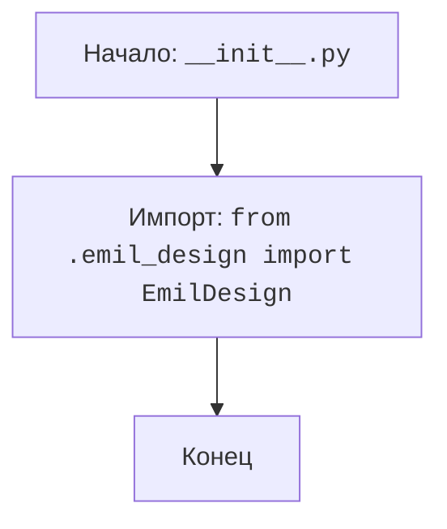

## Анализ кода `hypotez/src/endpoints/emil/__init__.py`

### <алгоритм>
1.  **Начало**: Запускается файл `__init__.py`. Этот файл, как правило, используется для инициализации пакета в Python.
2.  **Импорт**: Из модуля `emil_design.py`, находящегося в той же директории, импортируется класс `EmilDesign`.

Пример:
    - **Импорт**: `from .emil_design import EmilDesign`
        -  В файле `__init__.py` будет доступен класс `EmilDesign` из модуля `emil_design`. Этот класс предположительно используется для работы с "дизайном Эмиля" (исходя из названия модуля и класса).

### <mermaid>

**Зависимости в `mermaid`:**
-   `Start`: Обозначает начало выполнения скрипта `__init__.py`.
-   `ImportEmilDesign`: Указывает на импорт класса `EmilDesign` из модуля `emil_design.py`.
-  `End`: Обозначает завершение обработки файла `__init__.py`.

### <объяснение>

**Импорты:**

-   `from .emil_design import EmilDesign`:
    -   Импортирует класс `EmilDesign` из модуля `emil_design.py`, который находится в той же директории, что и `__init__.py`.
    -   Использование `.` означает, что `emil_design` является модулем в том же пакете (`src.endpoints.emil`).
    -   Это позволяет использовать класс `EmilDesign` внутри пакета `src.endpoints.emil`.

**Классы:**

-   `EmilDesign`:
    -   Исходя из имени, этот класс, вероятно, содержит логику для работы с дизайном (возможно, интерфейсом или шаблонами), связанным с "Эмилем".
    -   Без дополнительного кода из `emil_design.py` трудно сказать точно о его атрибутах, методах и взаимодействии. Но можно предположить, что он может:
         - Хранить данные, относящиеся к дизайну, такие как настройки внешнего вида, шаблоны страниц и т.д.
         - Предоставлять методы для создания, модификации или генерации элементов дизайна.

**Функции:**

-   В файле `__init__.py` нет явно определённых функций. Однако этот файл делает класс `EmilDesign` доступным для импорта из других модулей внутри пакета или за его пределами.

**Переменные:**

-   В файле не используются переменные.

**Общее:**
- Файл `__init__.py` является файлом инициализации пакета `src.endpoints.emil`, что позволяет python интерпретировать эту директорию как пакет.
- Основная цель данного файла - импортировать `EmilDesign` класс и сделать его доступным для использования в других частях приложения.
- Потенциальные ошибки и области для улучшения:
    - Поскольку сам `__init__.py` не содержит никакой логики, его главная проблема - это зависимость от корректной работы `emil_design.py`.
    - Если `emil_design.py` будет иметь ошибки, то это косвенно повлияет на все модули, импортирующие `EmilDesign`.
    - Для улучшения, можно было бы добавить проверку доступности `emil_design.py`, если это критично для работы.
    - Добавление документации для класса `EmilDesign` и всех его методов было бы полезным для поддержки кода.

**Взаимосвязи с другими частями проекта:**

-  Файл `__init__.py` используется для организации модулей в пакет и может импортироваться из других модулей, которые используют класс `EmilDesign`.
-  Если другие части проекта зависят от `EmilDesign`, то файл `src/endpoints/emil/__init__.py` будет точкой доступа к этому классу.