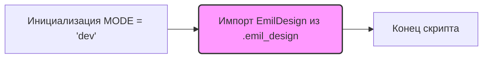

## Анализ кода `hypotez/src/endpoints/emil/__init__.py`

### <алгоритм>

1.  **Инициализация:**
    *   Устанавливается переменная `MODE` в значение `'dev'`. Это может указывать на режим разработки, влияющий на поведение других частей системы.

2.  **Импорт `EmilDesign`:**
    *   Из модуля `.emil_design` импортируется класс `EmilDesign`. Это предполагает, что в файле `emil_design.py`, находящемся в той же директории, определен класс, представляющий собой некую сущность, отвечающую за дизайн или другие связанные вещи.
    *   Пример: Предположим, что `EmilDesign` может быть классом, который управляет созданием и обновлением HTML-шаблонов или настройками интерфейса.
        ```python
        # src/endpoints/emil/emil_design.py
        class EmilDesign:
            def __init__(self, theme="light"):
                self.theme = theme
                # ...
        ```

3.  **Конец скрипта:** На этом этапе скрипт завершается, но класс `EmilDesign` становится доступным для использования в других модулях проекта.

### <mermaid>



### <объяснение>

#### Импорты:

*   `.emil_design`: Это относительный импорт, указывающий на то, что модуль `emil_design` находится в той же директории, что и текущий файл (`__init__.py`). Импортируется класс `EmilDesign`, который, скорее всего, предоставляет функциональность, связанную с настройкой или обработкой дизайна для какой-то части приложения.

    *   **Взаимосвязь с другими пакетами `src`:** `__init__.py`  внутри  `src.endpoints.emil`  может использоваться для структурирования и организации модулей внутри пакета `emil`. Это позволяет другим частям проекта импортировать `EmilDesign` и другие связанные сущности, используя `from src.endpoints.emil import EmilDesign`.

#### Классы:

*   `EmilDesign`: Класс, импортированный из `emil_design.py`. Его конкретные атрибуты и методы не определены в предоставленном коде, но, исходя из названия, можно предположить, что он отвечает за дизайн или представление данных в некоем контексте, возможно связанном с электронными письмами или веб-интерфейсом.

#### Функции:

*   В данном коде нет функций, но при импорте класса `EmilDesign` подразумевается, что этот класс может содержать методы, которые предоставляют функционал для работы с дизайном.

#### Переменные:

*   `MODE`: Строковая переменная, которая устанавливается в значение `'dev'`. Это часто используется для определения текущего режима работы приложения (разработка, тестирование, продакшн). В зависимости от значения `MODE` можно включать или отключать различные функции, например, отладку, логирование или специфические настройки.

#### Потенциальные ошибки и области для улучшения:

1.  **Отсутствие документации:**
    *   Хотя есть docstring для модуля в целом, отсутствует более детальная документация о том, что делает `EmilDesign`. Комментарии или docstring  в `emil_design.py` были бы полезны.
2.  **Неопределенная функциональность `EmilDesign`:**
    *   Код  `__init__.py`  только импортирует класс  `EmilDesign`, но ничего не говорит о том, как он используется в данном контексте.  Нужно анализировать код `emil_design.py`.
3.  **Магические константы:**
    *   Значение  `'dev'`  для  `MODE`  является  "магической константой", так как не ясно, какие еще варианты могут быть и почему. Лучше бы использовать `enum`, чтобы сделать возможные значения более явными.
4. **Зависимость от режима:**
    *   Переменная `MODE` влияет на логику работы приложения. Отсутствие явного описания, как именно используется переменная `MODE`, может привести к проблемам при сопровождении кода.

#### Цепочка взаимосвязей с другими частями проекта:

*   Этот модуль, вероятно, будет импортироваться в других модулях проекта `src` для использования класса `EmilDesign`, например, в модулях, отвечающих за создание или отправку писем, или в модулях, отвечающих за рендеринг веб-интерфейса. Модули, которые импортируют этот модуль, могут использовать переменные `MODE`, для условного выполнения различных блоков кода.
*   Например, если есть модуль `src.email_service`, то в нем может быть импортирован класс `EmilDesign`, и затем в зависимости от `MODE`, будут применяться разные темы для писем:
    ```python
    # src/email_service.py
    from src.endpoints.emil import EmilDesign, MODE

    def send_email(recipient, body):
        if MODE == 'dev':
            design = EmilDesign(theme='dark')
        else:
            design = EmilDesign(theme='light')
        # ...
    ```