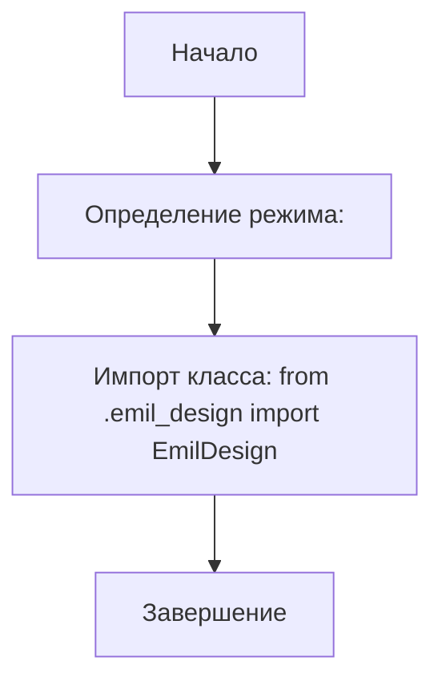
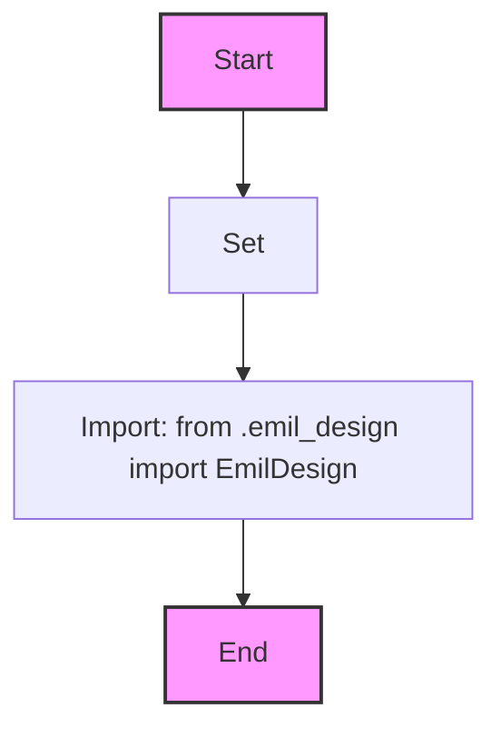

## Анализ кода `hypotez/src/endpoints/emil/__init__.py`

### 1. <алгоритм>

1.  **Начало**: Инициализация модуля `emil`.
2.  **Определение режима**: Задается переменная `MODE` со значением `'dev'`.
    *   *Пример*: ``.
3.  **Импорт класса**: Импортируется класс `EmilDesign` из модуля `emil_design`.
    *   *Пример*: `from .emil_design import EmilDesign` означает, что класс `EmilDesign` теперь доступен в текущем модуле.
4.  **Завершение**: Инициализация модуля `emil` завершена, и класс `EmilDesign` готов к использованию.

### 2. <mermaid>

**Объяснение:**
   - Диаграмма начинается с узла `Start`, который представляет собой начало процесса инициализации модуля.
   - Затем идет узел `ModeDef`, который показывает, что переменная `MODE` установлена в значение `'dev'`.
   - Далее импортируется класс `EmilDesign` из модуля `.emil_design` через узел `ImportEmilDesign`.
   -  Наконец, процесс завершается узлом `End`.
   -  `classDef internal`  используется для стилизации начального и конечного узлов.
    

### 3. <объяснение>

#### Импорты:

*   `from .emil_design import EmilDesign`:
    *   Импортирует класс `EmilDesign` из модуля `emil_design`, который находится в той же директории, что и данный файл `__init__.py`. Точка (`.`) в начале пути указывает на относительный импорт. Это означает, что модуль `emil_design` должен находиться в том же пакете (директории), что и текущий файл. `EmilDesign` предположительно отвечает за какую-то логику, связанную с дизайном или представлением данных.

#### Переменные:

*   ``:
    *   Глобальная переменная `MODE`, используемая для определения режима работы приложения. Установка в значение `'dev'` говорит о том, что приложение сейчас работает в режиме разработки. Это может влиять на поведение, например, на вывод отладочной информации или выбор конфигурации.

#### Функции:
*  В этом файле нет функций, он выступает как точка входа для пакета и включает определение режима работы и импорт классов.

#### Классы:
*   `EmilDesign`:
    *   Класс `EmilDesign` импортируется и будет использоваться в пакете `emil`.

#### Общее:
*   Этот `__init__.py` файл является точкой входа для модуля `emil`. Он инициализирует модуль, задавая режим работы (`MODE`) и импортируя необходимый класс `EmilDesign` для дальнейшего использования внутри пакета.
*   **Потенциальные ошибки:**
    *   Отсутствие обработки импорта `emil_design`. Если файл `emil_design.py` или класс `EmilDesign` отсутствует, это вызовет ошибку.
    *   Жесткое задание режима работы через переменную `` может быть не гибким для продакшена, обычно требуется использовать переменные окружения.
*   **Области для улучшения:**
    *   Можно добавить проверку импорта `emil_design` для повышения надежности.
    *   Режим `MODE` можно получать из конфигурации или переменных окружения для гибкости.

#### Взаимосвязи с другими частями проекта:
*   Модуль `emil` является частью пакета `endpoints`. Другие модули в `endpoints` могут использовать класс `EmilDesign` через импорт `from src.endpoints.emil import EmilDesign`.

Этот анализ охватывает все аспекты предоставленного кода, включая импорты, классы, переменные, потенциальные проблемы и взаимосвязи с другими частями проекта.