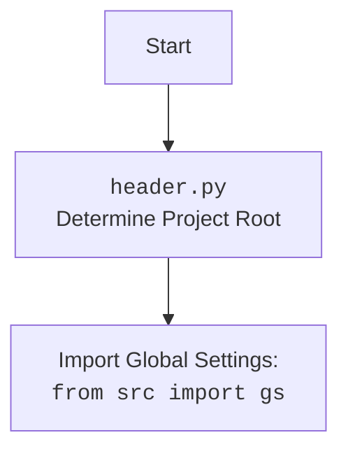

## <алгоритм>

1.  **Инициализация `BotHandler`**:
    *   Создается экземпляр класса `BotHandler` с указанием имени веб-драйвера (`webdriver_name`). Например, `handler = BotHandler(webdriver_name='firefox')`.
    *   В конструкторе создается экземпляр веб-драйвера `Firefox` с опциями `--kiosk` и `--headless`.

2.  **Обработка сообщений (`handle_message`)**:
    *   При получении сообщения от пользователя в Telegram, вызывается метод `handle_message`.
    *   Проверяется, если сообщение `q` является `?`:
        *   Отправляется фотография `user_flowchart.png` в ответ.
    *   Извлекается `user_id` из сообщения.
    *   Проверяется, является ли текст сообщения `q` URL:
        *   Если да, вызывается метод `handle_url` для обработки URL.
            * После обработки URL добавляется логика (заглушка `...`)
            * Выполняется возврат из функции.
    *   Если сообщение `q` является одной из команд `--next`, `-next`, `__next`, `-n`, `-q`:
        *   Вызывается метод `handle_next_command`.
    *   Если ни одно из условий не выполнено, текст сообщения передается в чат-модель `self.model.chat()`, и ответ отправляется пользователю.

3.  **Обработка URL (`handle_url`)**:
    *   Извлекается текст сообщения `response` от пользователя.
    *   Проверяется, начинается ли сообщение с  `https://one-tab.com` или `http://one-tab.com`:
        *   Если да, вызывается метод `fetch_target_urls_onetab`, который извлекает URL-адреса из OneTab.
        *   Если `fetch_target_urls_onetab` возвращает пустой список или `None`, пользователю отправляется сообщение об ошибке.
    *   Вызывается функция `get_graber_by_supplier_url` для получения грабера по URL.

4.  **Обработка команды `next` (`handle_next_command`)**:
    *   Выбирается случайный вопрос из списка `self.questions_list`.
    *   Задается вопрос чат-модели `self.model.ask()`, и получается ответ.
    *   Отправляется пользователю вопрос и ответ в виде двух сообщений (параллельно) с использованием `asyncio.gather()`.
    *   Если возникает ошибка при чтении вопросов, записывается отладочное сообщение в лог и пользователю отправляется сообщение об ошибке.

5.  **Извлечение URL из OneTab (`fetch_target_urls_onetab`)**:
    *   Выполняется GET-запрос к URL OneTab.
    *   Проверяется статус код ответа: если он не 200, то в лог записывается сообщение об ошибке и функция завершается.
    *   Парсится HTML-контент с помощью `BeautifulSoup`.
    *   Извлекаются все URL-адреса из тегов `<a>` с классом `tabLink`.
    *   Возвращается список URL-адресов.
    *   В случае ошибки при выполнении запроса, сообщение об ошибке записывается в лог, и функция завершается.

## <mermaid>

```mermaid
flowchart TD
    Start[Начало обработки сообщения] --> CheckMessage[Проверка текста сообщения]
    
    CheckMessage -- "?" --> SendFlowchart[Отправить user_flowchart.png]
    CheckMessage -- Is URL? --> HandleURL[Вызвать handle_url]
    CheckMessage -- Is next command? --> HandleNextCommand[Вызвать handle_next_command]
    CheckMessage -- Default --> SendToChatModel[Отправить сообщение в чат-модель]

    HandleURL --> ExtractURL[Извлечь URL]
    ExtractURL -- Is OneTab? --> FetchOneTabUrls[Извлечь URL-ы из OneTab]
    FetchOneTabUrls -- Success --> GetGraber[Вызвать get_graber_by_supplier_url]
    FetchOneTabUrls -- Failure --> SendErrorMessage[Отправить сообщение об ошибке]
    GetGraber --> End[Завершение обработки]

    HandleNextCommand --> ChooseQuestion[Выбрать случайный вопрос]
    ChooseQuestion --> AskChatModel[Спросить чат-модель]
    AskChatModel --> SendQuestionAndAnswer[Отправить вопрос и ответ]

    SendToChatModel --> SendResponse[Отправить ответ чат-модели]
    
    SendFlowchart --> End
    SendErrorMessage --> End
    SendQuestionAndAnswer --> End
    SendResponse --> End

    classDef process fill:#f9f,stroke:#333,stroke-width:2px
    class CheckMessage,HandleURL,HandleNextCommand,SendToChatModel, ExtractURL, FetchOneTabUrls, GetGraber,ChooseQuestion, AskChatModel,SendQuestionAndAnswer,SendResponse,SendFlowchart, SendErrorMessage process
```



## <объяснение>

### Импорты:

*   `import header`: Импортирует модуль `header.py`, который, вероятно, определяет корень проекта и настраивает глобальные переменные.
*   `import random`: Используется для выбора случайного вопроса из списка в функции `handle_next_command`.
*   `import asyncio`: Используется для асинхронного выполнения нескольких задач одновременно (например, отправки вопроса и ответа).
*   `import requests`: Используется для выполнения HTTP-запросов, например, при получении контента с OneTab.
*   `from typing import Optional, Any`:  Используется для аннотации типов, `Optional` указывает на возможность использования `None` , `Any` - любой тип.
*   `from bs4 import BeautifulSoup`: Используется для парсинга HTML-кода, например, при извлечении URL-адресов из OneTab.
*   `from telegram import Update`: Класс, представляющий обновление от Telegram.
*   `from telegram.ext import CallbackContext`: Класс, представляющий контекст выполнения обработчика в Telegram.
*   `from src import gs`: Импортирует глобальные настройки из модуля `gs` в пакете `src`.
*   `from src.webdriver.driver import Driver`: Импортирует базовый класс `Driver` для веб-драйверов.
*   `from src.webdriver.chrome import Chrome`: Импортирует класс `Chrome` для управления браузером Chrome.
*   `from src.webdriver.firefox import Firefox`: Импортирует класс `Firefox` для управления браузером Firefox.
*   `from src.webdriver.edge import Edge`: Импортирует класс `Edge` для управления браузером Edge.
*    `from src.ai.gemini import GoogleGenerativeAI`: Импортирует класс `GoogleGenerativeAI` для работы с моделью Gemini.
*   `from src.suppliers.get_graber_by_supplier import get_graber_by_supplier_url`: Импортирует функцию для получения грабера на основе URL поставщика.
*   `from src.utils.url import is_url`: Импортирует функцию для проверки, является ли строка URL-адресом.
*   `from src.utils.printer import pprint`: Импортирует функцию `pprint` для красивого вывода данных.
*   `from src.logger.logger import logger`: Импортирует объект логгера для записи сообщений.

### Классы:

*   `BotHandler`:
    *   **Роль**: Класс `BotHandler` предназначен для обработки сообщений, поступающих от Telegram-бота.
    *   **Атрибуты**:
        *   `webdriver_name` - (str) Название веб-драйвера.
        *   `model` - экземпляр модели `GoogleGenerativeAI`, используемый для ответов на текстовые запросы.
        *   `questions_list` - список вопросов, используемых для ответа на команду --next
        *   `firefox` - экземпляр браузера Firefox.
    *   **Методы**:
        *   `__init__(self, webdriver_name: str)`: Конструктор, инициализирует веб-драйвер и модель,
        *   `async handle_message(self, update: Update, context: CallbackContext)`: Обрабатывает текстовые сообщения, определяя, является ли сообщение URL, командой, или текстом, который нужно передать чат-модели.
        *   `async handle_url(self, update: Update, context: CallbackContext)`: Обрабатывает сообщения, которые являются URL, извлекая ссылки OneTab.
        *  `async handle_next_command(self, update: Update) `: Обрабатывает команду `--next`, выбирает случайный вопрос и запрашивает ответ у чат-модели.
        *   `fetch_target_urls_onetab(self, one_tab_url: str) -> list[str] | bool`: Извлекает целевые URL из URL OneTab.

### Функции:

*   `__init__(self, webdriver_name: str)`:
    *   **Аргументы**: `webdriver_name` (str).
    *   **Назначение**: Инициализирует обработчик, создавая экземпляр веб-драйвера.
    *   **Возвращаемое значение**: `None`.
    *   **Пример**: `handler = BotHandler(webdriver_name='firefox')`.

*   `async handle_message(self, update: Update, context: CallbackContext) -> None`:
    *   **Аргументы**: `update` (Update), `context` (CallbackContext).
    *   **Назначение**: Обрабатывает текстовые сообщения, полученные от Telegram. Маршрутизирует сообщения в зависимости от того, является ли оно URL, командой или обычным текстом.
    *   **Возвращаемое значение**: `None`.
    *   **Пример**: Если сообщение `q` - URL, то вызывается функция `handle_url`, если одна из команд `next`, то `handle_next_command`.

*    `async handle_url(self, update: Update, context: CallbackContext) -> Any`:
    *    **Аргументы**: `update` (Update), `context` (CallbackContext).
    *   **Назначение**: Обрабатывает URL-адреса, в частности URL-адреса OneTab, извлекая из них целевые ссылки.
    *   **Возвращаемое значение**: `Any`.
    *   **Пример**: Вызывается из `handle_message` если сообщение является ссылкой.

*   `async handle_next_command(self, update: Update) -> None`:
    *   **Аргументы**: `update` (Update).
    *   **Назначение**: Обрабатывает команду `--next`, выбирая случайный вопрос и отправляя вопрос и ответ пользователю.
    *   **Возвращаемое значение**: `None`.
    *   **Пример**: Вызывается из `handle_message` если сообщение это одна из команд: `--next`, `-next`, `__next`, `-n`, `-q`

*   `fetch_target_urls_onetab(self, one_tab_url: str) -> list[str] | bool`:
    *   **Аргументы**: `one_tab_url` (str).
    *   **Назначение**: Извлекает URL-адреса из страницы OneTab по переданному URL.
    *   **Возвращаемое значение**: `list[str]` или `False` в случае ошибки.
    *   **Пример**: `urls = fetch_target_urls_onetab('https://one-tab.com/xxxxxx')`.

### Переменные:

*   `webdriver_name`:  Имя используемого веб-драйвера (например, `'firefox'`).
*   `response`: HTTP-ответ, полученный от сервера.
*   `soup`: Объект `BeautifulSoup`, содержащий распарсенный HTML-код.
*   `urls`: Список URL-адресов, извлеченных из HTML.
*    `q`: Текст сообщения пользователя.
*   `user_id`: Идентификатор пользователя в Telegram.
*   `answer`: Ответ от модели.
*   `question`:  Случайный вопрос из списка.
*  `graber`: Экземпляр грабера на основе URL

### Потенциальные ошибки и области для улучшения:

*   **Обработка ошибок**: В коде есть блоки `try...except`, но они часто содержат заглушку `...`.  Следует добавить более детальную обработку ошибок.
*   **Управление веб-драйвером**:  Класс `BotHandler` инициализирует веб-драйвер, но не управляет его жизненным циклом (не закрывает).  Нужно добавить механизм для корректного завершения работы веб-драйвера.
*   **Логирование**: Заглушка `...` в блоках `try/catch` может привести к потере информации об ошибках, требуется добавить запись ошибок.
*   **Расширяемость `handle_url`**: Логика обработки URL ограничена OneTab. Необходимо предусмотреть возможность добавления новых типов URL для обработки.
*   **Зависимость от `self.model` и `self.questions_list`**: Эти атрибуты не инициализируются в конструкторе, следует добавить инициализацию этих переменных.

### Взаимосвязи с другими частями проекта:

*   **`header.py`**: Определяет корень проекта, что влияет на загрузку других модулей и ресурсов.
*   `src.webdriver`: Используется для управления браузерами, в частности `Firefox`.
*   `src.ai.gemini`: Используется для обработки текстовых запросов с помощью модели Gemini.
*   `src.suppliers.get_graber_by_supplier`: Используется для получения нужного грабера на основе ссылки.
*   `src.utils`:  Содержит утилиты для работы с URL и форматирования вывода (`is_url`, `pprint`).
*    `src.logger.logger`:  Используется для логирования событий и ошибок.
*   `src.gs`: Используется для получения глобальных настроек, таких как путь к файлам.

Этот анализ предоставляет полное представление о функциональности кода, его зависимостях и потенциальных областях для улучшения.