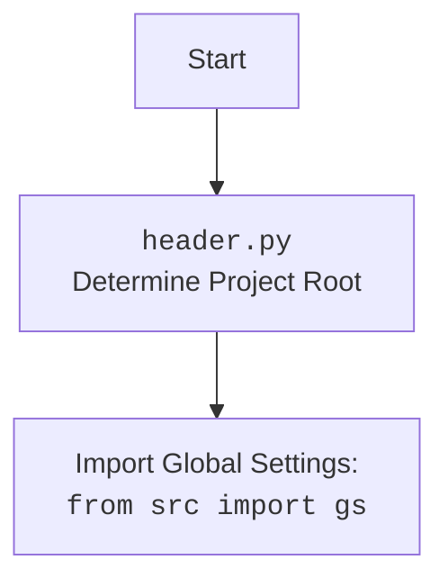

## <алгоритм>

1.  **Инициализация:**
    *   Запускается скрипт `emil_bot.py`.
    *   Импортируются необходимые модули и библиотеки, включая `header`, `src.gs`, и другие.
    *   Определяется класс `EmilTelegramBot`, который наследуется от `TelegramBot`.
    *   Загружается конфигурация бота из файла `emil.json` с помощью `j_loads_ns`.
    *   Инициализируется модель `GoogleGenerativeAI` для диалога.
    *   Создается экземпляр `BotHandler`.

2.  **Конфигурация бота (метод `__init__`)**:
    *   Определяется режим работы бота (`test` или `production`), который по умолчанию берется из конфигурационного файла.
    *   Выбирается токен бота Telegram в зависимости от режима.
    *   Создается экземпляр `BotHandler` для обработки сообщений.
    *   Вызывается конструктор родительского класса `TelegramBot`.

3.  **Обработка сообщений**:
    *   Метод `handle_message` перенаправляет обработку любого текстового сообщения в `BotHandler`.
        *   *Пример:* Пользователь отправляет сообщение "Привет". Метод `handle_message` передает это сообщение в `BotHandler`.
    *   Метод `handle_log` обрабатывает сообщения, предназначенные для логирования.
        *   *Пример:* Пользователь отправляет сообщение "/log Test message". Метод `handle_log` выводит сообщение в лог и отправляет ответ пользователю.
    *   Метод `handle_voice` обрабатывает голосовые сообщения.
        *   *Пример:* Пользователь отправляет голосовое сообщение. Метод `handle_voice` запускает процесс распознавания голоса.
    *   Метод `transcribe_voice` - это заглушка для распознавания голоса, который возвращает текст "Распознавание голоса ещё не реализовано.".
        *   *Пример:* Метод `handle_voice` вызывает `transcribe_voice`, который возвращает заглушку.

4.  **Запуск бота (функция `main`)**:
    *   Создается экземпляр `EmilTelegramBot`.
    *   Создается `aiohttp` приложение с помощью `create_app`.
    *   Запускается веб-сервер `aiohttp` для обработки webhook'ов.

5.  **Условный запуск (if `__name__ == '__main__'`)**:
    *   Проверяется, запущен ли скрипт напрямую. Если да, то вызывается функция `main`, которая запускает бота.

## <mermaid>

```mermaid
flowchart TD
    subgraph EmilTelegramBot
        A[EmilTelegramBot]
        A --> B(constructor: __init__)
        B --> C{Mode Check}
        C -- test --> D(Set test token)
        C -- production --> E(Set production token)
        D --> F(Initialize BotHandler)
        E --> F
        F --> G(TelegramBot __init__)
        G --> H(handle_message)
        H --> I[BotHandler handle_message]
        G --> J(handle_log)
        J --> K(Log message)
        G --> L(handle_voice)
        L --> M(transcribe_voice)
    end

    subgraph main
        O(main())
        O --> P[EmilTelegramBot()]
        P --> Q(create_app)
        Q --> R(web.run_app)
    end
    
    classDef class_box fill:#f9f,stroke:#333,stroke-width:2px;
    class EmilTelegramBot class_box
    class BotHandler class_box
    
    style A fill:#ccf,stroke:#333,stroke-width:2px;
    style O fill:#ccf,stroke:#333,stroke-width:2px;
```
    


## <объяснение>

### Импорты

*   `from __future__ import annotations`: Позволяет использовать аннотации типов (например, `List[str]`) без необходимости импортировать модуль `typing`.
*   `import asyncio`: Библиотека для асинхронного программирования.
*   `from pathlib import Path`: Модуль для работы с путями к файлам и директориям.
*   `from typing import List, Optional, Dict, Self`: Модуль для аннотаций типов. `List`, `Optional`, `Dict` для коллекций, опциональных значений и словарей; `Self` для аннотаций методов класса, возвращающих экземпляр этого же класса.
*   `from types import SimpleNamespace`: Модуль для создания простых объектов с произвольными атрибутами.
*   `from telegram import Update`: Класс, представляющий обновление от Telegram.
*   `from telegram.ext import Application, CommandHandler, MessageHandler, filters, CallbackContext`: Классы и функции для работы с ботами Telegram. `Application` для запуска бота, `CommandHandler` для обработки команд, `MessageHandler` для текстовых сообщений, `filters` для фильтрации сообщений, `CallbackContext` для хранения контекста обработки сообщений.
*   `import header`: Пользовательский модуль, определяющий корень проекта и загружающий глобальные настройки (см. диаграмму `header.py` выше).
*   `from src import gs`: Импортирует глобальные настройки проекта, включая пути к файлам и настройки API.
*   `from src.endpoints.bots.telegram.bot_web_hooks import TelegramBot`: Импортирует базовый класс для Telegram-бота, работающего через webhook.
*   `from src.endpoints.emil.bot_handlers import BotHandler`: Импортирует класс для обработки логики бота.
*   `from src.ai.openai import OpenAIModel`: (не используется) Импортирует класс для работы с моделью OpenAI (может использоваться в `BotHandler`).
*   `from src.ai.gemini import GoogleGenerativeAI`: Импортирует класс для работы с моделью Gemini.
*   `from src.utils.file import recursively_read_text_files, save_text_file`: Функции для работы с файлами (чтение, сохранение).
*   `from src.utils.url import is_url`: Функция для проверки URL.
*   `from src.utils.jjson import j_loads, j_loads_ns, j_dumps`: Функции для работы с JSON (загрузка, сохранение).
*   `from src.logger.logger import logger`:  Импортирует модуль для логирования.
*   `import argparse`: Модуль для парсинга аргументов командной строки.
*   `from aiohttp import web`: Модуль для создания веб-сервисов (в данном случае для webhook).
*   `from src.endpoints.bots.telegram.bot_web_hooks import create_app`:  Функция для создания aiohttp приложения для Telegram ботов.

### Классы

*   `EmilTelegramBot(TelegramBot)`:
    *   **Назначение**: Представляет Telegram-бота с пользовательской логикой для проекта emil-design.
    *   **Атрибуты**:
        *   `token: str`: Токен для доступа к Telegram API.
        *   `config: SimpleNamespace`: Конфигурация бота, загруженная из файла.
        *   `model: GoogleGenerativeAI`: Модель для диалога с пользователем.
        *   `bot_handler: BotHandler`: Экземпляр класса для обработки логики бота.
    *   **Методы**:
        *   `__init__(self, mode: Optional[str] = None, webdriver_name: Optional[str] = 'firefox')`: Конструктор класса, инициализирует токен бота, `BotHandler` и вызывает конструктор родительского класса `TelegramBot`.
        *   `handle_message(self, update: Update, context: CallbackContext) -> None`: Обрабатывает текстовые сообщения, перенаправляя их в `BotHandler`.
        *   `handle_log(self, update: Update, context: CallbackContext) -> None`: Обрабатывает логи, которые отправляются боту.
        *   `handle_voice(self, update: Update, context: CallbackContext) -> None`: Обрабатывает голосовые сообщения.
        *   `transcribe_voice(self, file_path: Path) -> str`: Транскрибирует голосовое сообщение. В текущей реализации - заглушка.
    *   **Взаимодействие**:
        *   Наследует функциональность из `TelegramBot`.
        *   Использует `BotHandler` для обработки сообщений.
        *   Использует `GoogleGenerativeAI` для диалога.
*   `TelegramBot` : Базовый класс для работы с Telegram ботом.

### Функции

*   `main() -> None`:
    *   **Назначение**: Основная функция для запуска бота.
    *   **Аргументы**: Нет.
    *   **Возвращаемое значение**: Нет.
    *   **Функциональность**: Создает экземпляр `EmilTelegramBot`, создает `aiohttp` приложение и запускает веб-сервер для обработки webhook.
*   `transcribe_voice(self, file_path: Path) -> str`:
    *  **Назначение:** Транскрибирует голосовое сообщение.
    *  **Аргументы:** `file_path`: Путь к аудиофайлу.
    *  **Возвращаемое значение:** `str`: Текст распознанного сообщения.
    *  **Функциональность:** В текущей реализации возвращает заглушку 'Распознавание голоса ещё не реализовано.'.

### Переменные

*   `token: str`: Токен бота Telegram. Определяется в методе `__init__` в зависимости от режима работы.
*   `config: SimpleNamespace`: Загруженная конфигурация бота из `emil.json`.
*   `model: GoogleGenerativeAI`: Модель для диалога.
*   `bot_handler: BotHandler`: Экземпляр `BotHandler` для обработки сообщений.
*   `mode: str`: Режим работы бота ("test" или "production"). Определяется при инициализации `EmilTelegramBot`.
*    `app`: Экземпляр `aiohttp` приложения для обработки webhook.

### Потенциальные ошибки и области для улучшения

*   **Отсутствие реальной реализации распознавания голоса**: Метод `transcribe_voice` является заглушкой. Необходимо добавить реальную логику распознавания речи.
*   **Обработка ошибок**: В коде не предусмотрена обработка исключений, которые могут возникнуть при работе с Telegram API, загрузке конфигурации или вызовах других сервисов. Необходимо добавить обработку ошибок.
*   **Конфигурация**: Конфигурация загружается из файла, но нет механизма для валидации или обновления конфигурации в рантайме.
*  **`OpenAIModel` импортируется, но не используется**: Возможно, планируется его использование в будущем или он остался от предыдущей реализации.
* **Зависимость от `header.py`**: Привязка к  `header.py` для определения корня проекта и глобальных настроек.

### Взаимосвязи с другими частями проекта

*   **`header.py`**: Определяет корень проекта и загружает глобальные настройки из `src/gs.py`, включая пути к файлам и учетные данные.
*   **`src.endpoints.bots.telegram.bot_web_hooks.py`**: Содержит базовый класс `TelegramBot` и функции для работы с Telegram API через webhook.
*   **`src.endpoints.emil.bot_handlers.py`**: Содержит класс `BotHandler`, который обрабатывает логику бота, в том числе взаимодействие с моделями ИИ и браузером.
*   **`src.ai.gemini.py`**: Содержит класс `GoogleGenerativeAI` для взаимодействия с моделью Gemini.
*   **`src.utils.jjson.py`**: Содержит функции для работы с JSON файлами.
*   **`src.utils.file.py`**: Содержит функции для работы с файлами.
*  **`src.utils.url.py`**: Содержит функции для работы с url адресами.
*   **`src.logger.logger.py`**: Модуль для логирования событий.

Этот анализ предоставляет подробное понимание кода `emil_bot.py` и его связей с другими компонентами проекта.