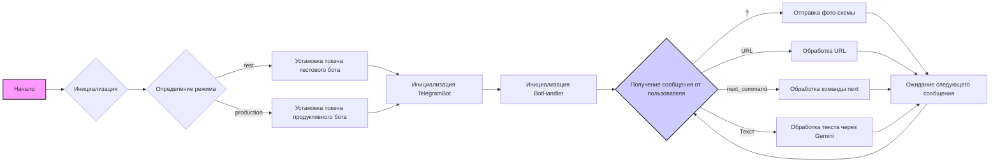
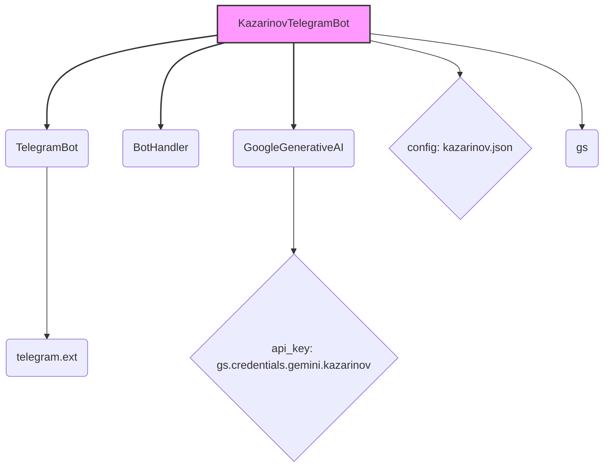
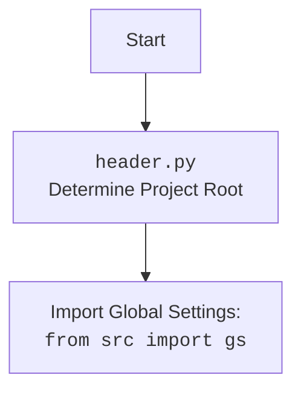

## АНАЛИЗ КОДА: `kazarinov_bot.py`

### 1. <алгоритм>

**Блок-схема работы `KazarinovTelegramBot`:**

1.  **Начало:** Программа запускается.
2.  **Инициализация:** Создается экземпляр класса `KazarinovTelegramBot`.
    *   Определяется конфигурация из `kazarinov.json`.
    *   Инициализируется модель Google Generative AI.
3.  **Определение режима:** Режим работы (`test` или `production`) определяется из аргументов командной строки или конфигурации. Если `hostname` равен `Vostro-3888`, то режим принудительно меняется на `prod`.
4.  **Установка токена:** В зависимости от режима устанавливается токен для тестового или продуктивного Telegram-бота.
5.  **Инициализация `TelegramBot`:** Инициализируется родительский класс `TelegramBot` с полученным токеном.
6.  **Инициализация `BotHandler`:** Инициализируется родительский класс `BotHandler` для обработки сценариев.
7.  **Получение сообщения от пользователя:** Бот получает сообщение от пользователя через Telegram API.
8.  **Проверка сообщения:**
    *   Если сообщение равно `?`, бот отправляет пользователю изображение `user_flowchart.png`.
    *   Если сообщение является URL, то вызывается метод `handle_url`.
    *   Если сообщение является командой `next_command` (`--next`, `-next`, `__next`, `-n`, `-q`), то вызывается метод `handle_next_command`.
    *   Если сообщение является текстом, то оно обрабатывается с помощью `self.model.chat()`, и пользователю возвращается ответ.
9.  **Ожидание следующего сообщения:** Бот ждет следующего сообщения от пользователя.
    
**Примеры:**
*   **Инициализация**:
    -   `mode = 'test'` - устанавливается токен тестового бота.
    -   `mode = 'production'` - устанавливается токен продуктивного бота.
*   **Получение сообщения**:
    -   `q = '?'` - бот отвечает картинкой со схемой.
    -   `q = 'https://example.com'` - бот вызывает обработку URL.
    -   `q = '-next'` - бот вызывает обработку команды next.
    -    `q = 'Привет, как дела?'` - бот обращается к Google Generative AI и отвечает на запрос.

### 2. <mermaid>

**Описание зависимостей:**

*   **`KazarinovTelegramBot`**: Основной класс, представляющий Telegram-бота. Наследуется от `TelegramBot` и `BotHandler`.
*   **`TelegramBot`**: Базовый класс для работы с Telegram API, предоставляемый `telegram.ext` (использует `Application`, `CommandHandler`, `MessageHandler`, `filters`, `CallbackContext`).
*   **`BotHandler`**: Класс для обработки сценариев взаимодействия с ботом.
*   **`GoogleGenerativeAI`**: Класс для взаимодействия с моделью Google Generative AI. Инициализируется с помощью api\_key из `gs.credentials.gemini.kazarinov`.
*   **`config: kazarinov.json`**: Файл конфигурации, содержащий настройки бота.
*  **`gs`**: Глобальные настройки проекта, включающие пути, учетные данные, и т.д.
    
**header.py**:

### 3. <объяснение>

#### Импорты:
*   `asyncio`: Асинхронное программирование для неблокирующих операций.
*   `pathlib`: Работа с путями к файлам и директориям в кроссплатформенном формате.
*   `typing`: Для определения типов, `List`, `Optional`, `Dict`, `Self` используются для аннотации типов переменных и возвращаемых значений.
*   `types.SimpleNamespace`:  Создание объектов, атрибуты которых можно устанавливать произвольно.
*   `telegram`: Работа с Telegram API.
    *   `Update`: Класс, представляющий обновление от Telegram.
    *   `Application`: Класс для создания и управления ботом.
    *   `CommandHandler`, `MessageHandler`: Обработчики команд и сообщений.
    *   `filters`: Фильтры для сообщений.
    *   `CallbackContext`: Контекст для обработчиков.
*   `header`: Вспомогательный модуль для определения корня проекта и загрузки общих настроек.
*   `src.gs`: Глобальные настройки проекта, содержащие пути, токены, и другие конфигурационные данные.
*   `src.endpoints.bots.telegram.bot_long_polling`: Базовый класс для Telegram-бота, работающего в режиме long polling.
*   `src.endpoints.kazarinov.bot_handlers`: Класс для обработки специфических сценариев бота, таких как работа с веб-драйвером.
*   `src.ai.openai`, `src.ai.gemini`: Классы для взаимодействия с моделями OpenAI и Google Generative AI соответственно.
*   `src.utils.file`: Утилиты для работы с файлами, такие как чтение и запись текстовых файлов.
*   `src.utils.url`: Утилиты для работы с URL, такие как проверка, является ли строка URL.
*   `src.utils.jjson`: Утилиты для работы с JSON (загрузка, выгрузка).
*   `src.logger.logger`: Модуль для логирования.
*   `argparse`: Модуль для разбора аргументов командной строки.

#### Классы:
*   **`KazarinovTelegramBot(TelegramBot, BotHandler)`**: Класс, представляющий Telegram-бота.
    *   **Атрибуты**:
        *   `token`: Токен Telegram-бота.
        *   `config`: Конфигурация бота, загруженная из `kazarinov.json`.
        *   `model`: Модель Google Generative AI.
    *   **Методы**:
        *   `__init__(self, mode: Optional[str] = None, webdriver_name: Optional[str] = 'firefox')`: Инициализирует бота, устанавливая токен и режим работы, инициализирует родительские классы.
        *   `handle_message(self, update: Update, context: CallbackContext) -> None`: Обрабатывает текстовые сообщения, проверяя, является ли сообщение URL, командой или текстом. Если это URL, вызывает `handle_url()`. Если это команда из списка, вызывает `handle_next_command`. Иначе, отправляет запрос в `self.model.chat()` и возвращает ответ пользователю.
        
        
#### Функции:

*   `__main__`: Запускает бота, инициализирует `KazarinovTelegramBot` на основе аргументов командной строки. Режим `prod` устанавливается, если `hostname` равен `Vostro-3888`

#### Переменные:
*   `parser`: Объект для разбора аргументов командной строки.
*   `args`: Разобранные аргументы командной строки.
*   `mode`: Режим работы бота ('test' или 'production').
*   `kt`: Экземпляр класса `KazarinovTelegramBot`.

#### Цепочка взаимосвязей:
1.  **`kazarinov_bot.py`** - основной файл, который запускает бота.
2.  **`header.py`** - определяет корень проекта и загружает глобальные настройки из `src.gs`.
3.  **`src.gs`** - хранит глобальные настройки, такие как пути к файлам, токены доступа и т.д.
4.  **`src.endpoints.bots.telegram.bot_long_polling.py`** - обеспечивает базовую функциональность для работы с Telegram API в режиме long polling.
5.  **`src.endpoints.kazarinov.bot_handlers.py`** - содержит логику обработки сценариев для бота Kazarinov, в том числе веб-драйвер.
6.  **`src.ai.gemini.py`** - обеспечивает взаимодействие с моделью Google Generative AI.
7.  **`src.utils.file.py`**, **`src.utils.url.py`**, **`src.utils.jjson.py`** - предоставляют утилиты для работы с файлами, URL и JSON.
8.  **`src.logger.logger.py`** - обеспечивает логирование работы бота.
9.  **`kazarinov.json`** - файл конфигурации, содержащий параметры бота.

#### Потенциальные ошибки и области для улучшения:
1.  **Обработка ошибок:** В коде отсутствуют явные обработки ошибок, которые могут возникнуть при взаимодействии с API Telegram, Google Generative AI, файловой системой или при обработке URL. Рекомендуется добавить блоки `try-except` для обработки исключений и логирования ошибок.
2.  **Логирование:** В текущем варианте логирование не используется, что затрудняет отладку и анализ работы бота. Рекомендуется использовать `src.logger.logger` для логирования важных событий, ошибок и других полезных данных.
3.  **Расширяемость:** Код может быть улучшен в плане расширяемости. Например, можно использовать паттерн "Стратегия" для выбора конкретной модели ИИ.
4.  **Обработка длинных сообщений:**  Код не учитывает ограничения на длину сообщений, которые могут возникать при общении с моделью Google Generative AI. Можно добавить проверку длины и разделять длинные сообщения на более короткие.
5.  **Безопасность:** Хранение учетных данных в файлах конфигурации может представлять угрозу безопасности. Рассмотреть возможность использования более безопасных методов, таких как переменные окружения или менеджер секретов.
6.  **Асинхронность:** Код в основном асинхронный, но некоторые блоки могут быть выполнены синхронно. Следует проверить асинхронность во всех частях кода для улучшения производительности.
7. **Магические строки**: В коде присутствуют магические строки, такие как `Vostro-3888`, `'test'` , `'production'` и т.д. Их следует вынести в константы для лучшей читаемости и поддержки.
8. **Зависимости**: Код зависит от множества внешних библиотек, таких как `telegram` и `google-generativeai`. Это делает его менее переносимым и требует отладки зависимостей. Рассмотреть возможность уменьшения зависимостей или использования docker для виртуализации окружения.
9. **Жесткая привязка к режиму**: Установка `mode = 'prod'` при `gs.host_name == 'Vostro-3888'` является жесткой привязкой к окружению и может затруднить тестирование. Следует сделать это более гибким, например, используя переменные окружения.
10. **Закомментированный код**: Код `self.application.add_handler(MessageHandler(filters.TEXT & ~filters.COMMAND, handle_log))` закомментирован. Следует удалить неиспользуемый код.
11. **Отсутствие docstring для некоторых функций**: Некоторые функции, как например `__main__` не имеют docstring. Это затрудняет понимание кода. Следует добавить docstring для всех функций.
12. **Возвращаемое значение `handle_message`**: `handle_message` возвращает `None`, но метод помечен, как асинхронный, поэтому он должен возвращать `None` (awaitable)