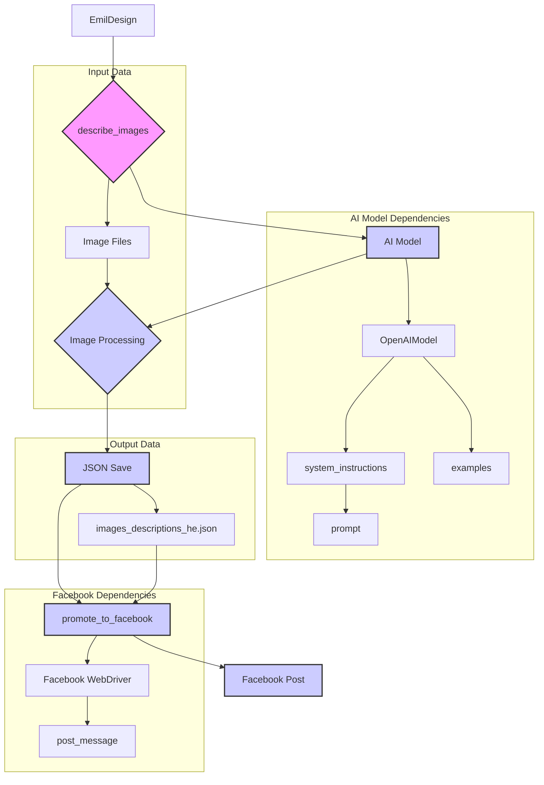

# <input code>

```python
## \file hypotez/src/endpoints/emil/emil_design.py
# -*- coding: utf-8 -*-\
#! venv/Scripts/python.exe
#! venv/bin/python/python3.12

"""
.. module: src.endpoints.emil 
	:platform: Windows, Unix
	:synopsis:

"""
MODE = 'dev'


"""
	:platform: Windows, Unix
	:synopsis:

"""


"""
	:platform: Windows, Unix
	:synopsis:

"""


"""
  :platform: Windows, Unix

"""
"""
  :platform: Windows, Unix
  :platform: Windows, Unix
  :synopsis:
"""MODE = 'dev'
  
""" module: src.endpoints.emil """


""" Module for managing and processing images and promoting to Facebook and PrestaShop. """

import header
from pathlib import Path
from types import SimpleNamespace
import time

from src import gs, logger
from src.endpoints.PrestaShop.api.api import PrestaShop
from src.webdriver.driver import Driver, Chrome
from src.ai.gemini import GoogleGenerativeAI
from src.ai.openai.model import OpenAIModel
from src.product import Product
from src.endpoints.advertisement.facebook.scenarios.post_message import post_message, post_title, upload_media
from src.utils.file import read_text_file, save_text_file, get_filenames
from src.utils.jjson import j_loads_ns, j_dumps
from src.logger import logger

class EmilDesign:
    """ Class for designing and promoting images through various platforms. """

    # Base path for the module data
    base_path: Path = (
        gs.path.google_drive
        / "emil"
    )

    def __init__(self):
        """ Initialize the EmilDesign class. """
        ...

    def describe_images(self, from_url: str = False):
        """ Describe images based on the provided instruction and examples.

        Args:
            from_url (str, optional): If True, uses URL to describe images. Defaults to False.
        """
        ...
        # ... (rest of the describe_images method)
    
    def promote_to_facebook(self):
        """ Promote images and their descriptions to Facebook.

        This function logs into Facebook and posts messages derived from the image descriptions.
        """
        d = Driver(Chrome)
        d.get_url(r'https://www.facebook.com/groups/1080630957030546')
        messages: SimpleNamespace | list = j_loads_ns(self.base_path / "images_descritions_he.json")
        
        for m in messages:
            message: SimpleNamespace = SimpleNamespace() 
            setattr(message, 'title', f"{m.parent}\\n{m.category}")
            setattr(message, 'description', m.description)
            message.products = SimpleNamespace()
            setattr(message.products, 'local_saved_image', [m.local_saved_image])
           
            post_message(d, message, without_captions=True)
            ...


    def upload_to_PrestaShop(self):
        """ Upload product information to PrestaShop.

        This function initializes a product and PrestaShop instance for uploading data.
        """
        p = Product()
        presta = PrestaShop()
        

if __name__ == "__main__":
    e = EmilDesign()
    # e.describe_images()
    # e.promote_to_facebook()
```

# <algorithm>

**Algorithm for `describe_images`:**

1. **Initialization:** Defines paths for instructions, examples, image directory, and output file. Loads system instructions and examples from text files.
2. **Prompt Creation:** Generates an AI prompt.
3. **AI Model Initialization:** Initializes the OpenAI model with system instructions and assistant ID.
4. **Example Categorization:** Sends examples to the AI model to categorize them.  
5. **Image Processing Loop:** Iterates through image files in the directory.
   - Skips images already processed (from `updated_images.txt`).
   - Describes the image using the AI model (either from URL or local file).
   - Parses the AI response into a structured format (using `j_loads_ns`).
   - Stores the result into the `data` list.
   - Adds the image path to the `updated_images_list`.
   - Saves the `updated_images_list` back to the file.
   - Logs the response.
6. **Data Saving:** Saves the processed data to a JSON file.

**Algorithm for `promote_to_facebook`:**

1. **Initialization:** Creates a WebDriver instance, opens the Facebook group URL.
2. **Load Data:** Loads the image descriptions from the JSON file into the `messages` list.
3. **Facebook Post Loop:** Iterates through each image description in the `messages` list.
4. **Message Construction:** Constructs a `SimpleNamespace` object for each image, containing title, description, and image path.
5. **Facebook Post:** Calls the `post_message` function to post the image and description to Facebook.

**Data Flow:**

- Image file paths are read from a file.
- The AI model processes image data (possibly URLs).
- The processed image data is then saved to JSON file (`images_descriptions_he.json`).
- `promote_to_facebook` reads this file to get descriptions.

# <mermaid>




# <explanation>

**Imports:**

- `header`: Likely a custom module for general project-wide header or initialization.  
- `pathlib`: For working with file paths in an object-oriented way.
- `types`: To work with `SimpleNamespace`.
- `time`: Used for potential pausing or timing in the code (not currently active).
- `gs` and `logger`: From the `src` package, likely for Google Cloud Storage interaction and logging configuration.
- `PrestaShop`: From the `src.endpoints.PrestaShop.api.api` module, for interacting with the PrestaShop API.
- `Driver`, `Chrome`: From the `src.webdriver.driver` module, for using a web driver (likely for Facebook interaction).
- `GoogleGenerativeAI`: From `src.ai.gemini`, potentially an unused or backup AI model.
- `OpenAIModel`: From `src.ai.openai.model`, for interacting with the OpenAI API.
- `Product`: From `src.product`, likely to interact with product data.
- `post_message`, `post_title`, `upload_media`: from `src.endpoints.advertisement.facebook.scenarios.post_message`, for posting to Facebook (likely).
- `read_text_file`, `save_text_file`, `get_filenames`: from `src.utils.file`, for file IO.
- `j_loads_ns`, `j_dumps`: from `src.utils.jjson`, for JSON parsing into `SimpleNamespace`.
- `logger`: From `src.logger`, for logging.

**Classes:**

- `EmilDesign`: This is the main class for the module. Its role is to handle image description, Facebook promotion, and PrestaShop uploading.
    - `base_path`: A class attribute that stores the base path for the module's data, derived from `gs.path.google_drive`.
    - `__init__`: The constructor.
    - `describe_images`: Processes image descriptions from instructions and examples using the OpenAI model.
    - `promote_to_facebook`: Posts image descriptions to a Facebook group.
    - `upload_to_PrestaShop`: Uploads product data to PrestaShop.


**Functions:**

- `describe_images`: Takes an optional `from_url` argument indicating whether to use image URLs or local file paths.  This function reads images from local files or provided URLs, processes them using the AI model (OpenAI), and saves the results to a JSON file.
- `promote_to_facebook`: Posts processed image descriptions to a Facebook group. It uses a WebDriver to interact with Facebook.
- `upload_to_PrestaShop`: Initializes `Product` and `PrestaShop` objects for uploading product information to PrestaShop.

**Variables:**

- `MODE`: A global string variable, presumably used to control different modes of operation (e.g., development vs. production).
- `system_instruction_path`, `examples_path`, `images_dir`, `output_file`, `updated_images_path`: Variables holding file paths.
- `base_url`: Stores the base URL for images.
- `trainig_data`, `system_instruction`, `examples`, `prompt`: Variables related to input data and AI prompts.
- `model`: An instance of `OpenAIModel`.
- `updated_images_list`: List of already processed images.
- `images_path_list`: List of image file names in the images directory.
- `data`: List to hold the results of image descriptions.
- `res_ns`: Instance of `SimpleNamespace` to hold the processed response.
- `d`: Instance of `Driver`, used for interacting with the Facebook page.
- `messages`: The list of image descriptions to post to Facebook.
- `message`:  A SimpleNamespace used to hold the message data to be posted.
- `p`: Instance of `Product`.
- `presta`: Instance of `PrestaShop`.


**Possible Errors/Improvements:**

- **Error Handling:** The code lacks robust error handling. For example, if an API call fails, or if a file cannot be read, it could result in a crash or unexpected behavior.  Add `try...except` blocks to handle potential exceptions.
- **Input Validation:** Validate inputs to ensure that image URLs are valid and that file paths exist.
- **Concurrency:** Using asynchronous operations (e.g., using libraries like `asyncio`) for describing multiple images or promoting multiple messages could significantly improve performance.
- **Facebook Login:**  The code assumes the WebDriver is already logged into Facebook.  Implement Facebook login logic, using appropriate Facebook authentication and session handling.
- **Rate Limiting:** Add rate limiting to API calls to avoid being blocked by the API providers (OpenAI, Facebook).
- **Logging details**: The `logger` is used, but details could be improved (e.g., timestamps, more descriptive messages).
- **`...` Placeholders:** The code has many `...` placeholders that indicate unfinished logic.  Complete these sections.

**Relationships with Other Parts of the Project:**

The code heavily relies on various modules within the `src` package.  Dependencies are explicitly defined by imports.  The `gs`, `logger`, `PrestaShop`, `Driver`, `Chrome`, `Product`, `OpenAIModel`, and specific Facebook posting modules (like `post_message`) are all part of this ecosystem. The system likely uses a configuration system like Google Cloud Storage to manage storage (through `gs`).

This analysis provides a comprehensive understanding of the `emil_design.py` script and its interaction with the surrounding project structure.