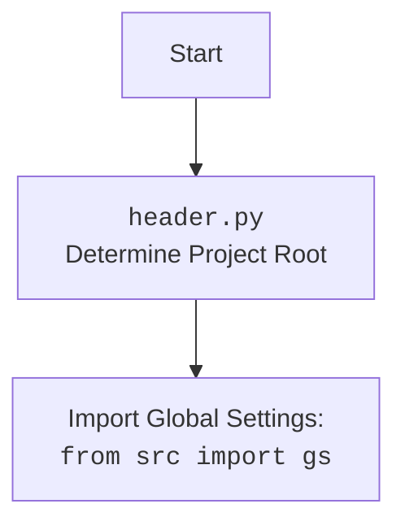

## ИНСТРУКЦИЯ:

Анализируй предоставленный код подробно и объясни его функциональность. Ответ должен включать три раздела:

1.  **<алгоритм>**: Опиши рабочий процесс в виде пошаговой блок-схемы, включая примеры для каждого логического блока, и проиллюстрируй поток данных между функциями, классами или методами.
2.  **<mermaid>**: Напиши код для диаграммы в формате `mermaid`, проанализируй и объясни все зависимости,
    которые импортируются при создании диаграммы.
    **ВАЖНО!** Убедитесь, что все имена переменных, используемые в диаграмме `mermaid`,
    имеют осмысленные и описательные имена. Имена переменных вроде `A`, `B`, `C`, и т.д., не допускаются!

    **Дополнительно**: Если в коде есть импорт `import header`, добавьте блок `mermaid` flowchart, объясняющий `header.py`:
    ```mermaid
    flowchart TD
        Start --> Header[<code>header.py</code><br> Determine Project Root]

        Header --> import[Import Global Settings: <br><code>from src import gs</code>]
    ```

3.  **<объяснение>**: Предоставьте подробные объяснения:
    -   **Импорты**: Их назначение и взаимосвязь с другими пакетами `src.`.
    -   **Классы**: Их роль, атрибуты, методы и взаимодействие с другими компонентами проекта.
    -   **Функции**: Их аргументы, возвращаемые значения, назначение и примеры.
    -   **Переменные**: Их типы и использование.
    -   Выделите потенциальные ошибки или области для улучшения.

Дополнительно, постройте цепочку взаимосвязей с другими частями проекта (если применимо).

Это обеспечивает всесторонний и структурированный анализ кода.
## Формат ответа: `.md` (markdown)
**КОНЕЦ ИНСТРУКЦИИ**

## <алгоритм>

1. **Инициализация:**
   - Загрузка глобальных настроек (`gs`) и инициализация логгера.
   - Инициализация класса `EmilDesign` с пустой реализацией `__init__` (пока не делает ничего).
   
2. **`describe_images(from_url=False)`:**
   - Определяются пути к файлам:
     - `system_instruction_path`: путь к файлу с инструкциями для AI.
     - `examples_path`: путь к файлу с примерами для AI.
     - `images_dir`: путь к директории с изображениями.
     - `output_file`: путь к файлу для сохранения описаний изображений.
     - `base_url`: базовый URL для изображений (если используется `from_url=True`).
   - Считываются инструкции (`system_instruction`) и примеры (`examples`) из файлов.
   - Создается экземпляр `OpenAIModel` с загруженными инструкциями.
   - AI модель просит создать категории на основе примеров
   - Считывается список уже обработанных изображений `updated_images_list`.
   - Получается список всех файлов изображений в `images_dir`.
   - Итерируется по каждому файлу изображения:
     - Если изображение уже обработано (есть в `updated_images_list`), пропускается.
     - Если `from_url=True`, формируется URL изображения, иначе используется локальный путь к изображению.
     - AI модель запрашивается описание изображения (с использованием URL или локального пути, а также инструкции).
       - Пример запроса: `model.describe_image("https://emil-design.com/img/images_emil/image1.jpg", "איזה רהיטים מוצגים כאן?", "инструкция из файла")` или `model.describe_image(Path("path/to/image1.jpg"), "איזה רהיטים מוצגים כאן?", "инструкция из файла")`
     - Если ответ от модели пустой, переходим к следующему изображению.
     - Ответ AI модели (JSON) преобразуется в `SimpleNamespace`, добавляется путь к локальному файлу `local_image_path`, результат добавляется в список `data`.
     - Список `data` сохраняется в JSON файл.
     - Имя обработанного изображения добавляется в `updated_images_list`.
     - Список обработанных изображений сохраняется в файл.
     - Логгируется ответ от AI.

3.  **`promote_to_facebook()`:**
    - Создается экземпляр `Driver` для управления браузером Chrome.
    - Открывается страница Facebook.
    - Загружаются описания изображений из JSON файла в список `messages`.
    - Итерируется по каждому описанию в `messages`:
        -  Создается `SimpleNamespace` `message` для подготовки данных для публикации.
        -  Извлекается заголовок и описание из данных.
        -  Сохраняется путь к локальному файлу изображения.
        -  Вызывается функция `post_message` для публикации в Facebook, передавая `message`, и `Driver`, `without_captions`.
          - Пример: `post_message(d, message, without_captions=True)`

4.  **`upload_to_PrestaShop()`:**
    - Создается экземпляр `Product` и `PrestaShop`.
    -  (Функциональность загрузки в PrestaShop не реализована).

5.  **`if __name__ == "__main__":`:**
    -  Создается экземпляр класса `EmilDesign`.
    -  Вызовы функций `describe_images()`, `promote_to_facebook()`  закомментированы.
    
```mermaid
flowchart TD
    Start[Start] --> Init[Initialize EmilDesign Class]
    Init --> DescribeImagesCall{Call describe_images()}
    DescribeImagesCall -- Yes --> DescribeImages[describe_images()]
    DescribeImagesCall -- No --> PromoteFacebookCall{Call promote_to_facebook()}    
    
    DescribeImages --> SetPaths[Set paths for instructions, examples, images, output]
    SetPaths --> ReadFiles[Read system instructions, examples from files]
    ReadFiles --> InitAI[Initialize OpenAIModel]
    InitAI --> AskAI[Ask AI to categorize examples]
    AskAI --> ReadUpdatedImages[Read updated images list]
    ReadUpdatedImages --> GetImagesList[Get list of images from directory]
    GetImagesList --> LoopImages[Loop through images]
    LoopImages -- Image already processed --> LoopImages
    LoopImages -- Image not processed --> CheckFromUrl{Check if from_url=True}
    CheckFromUrl -- Yes --> GetImageURL[Get image URL]
    CheckFromUrl -- No --> GetImagePath[Get local image path]
    GetImageURL --> DescribeImageAI[Ask AI to describe image from URL]
    GetImagePath --> DescribeImageAI[Ask AI to describe image from local path]    
    DescribeImageAI --> CheckResponse{Check if AI response is not empty}
    CheckResponse -- No --> LoopImages    
    CheckResponse -- Yes --> ProcessResponse[Process response: Convert to SimpleNamespace, add local image path]
    ProcessResponse --> SaveData[Save data to json, update processed list and file]
    SaveData --> LogAIResponse[Log AI response]
    LogAIResponse --> LoopImages
    LoopImages -- All images processed --> PromoteFacebookCall
    
    PromoteFacebookCall -- Yes --> PromoteFacebook[promote_to_facebook()]
    PromoteFacebookCall -- No --> UploadPrestashopCall{Call upload_to_PrestaShop()}

    PromoteFacebook --> InitDriver[Initialize browser Driver]
    InitDriver --> GetFacebookURL[Get Facebook URL]
    GetFacebookURL --> ReadDescriptions[Read image descriptions from json]
    ReadDescriptions --> LoopDescriptions[Loop through image descriptions]
    LoopDescriptions --> PrepareMessage[Prepare message data (title, description, image path)]
    PrepareMessage --> PostMessageFacebook[Post message to Facebook]
    PostMessageFacebook --> LoopDescriptions
    LoopDescriptions -- All descriptions processed --> UploadPrestashopCall
    
    UploadPrestashopCall -- Yes --> UploadPrestashop[upload_to_PrestaShop()]
    UploadPrestashop --> InitProduct[Initialize Product class]
    InitProduct --> InitPrestashop[Initialize PrestaShop class]
    InitPrestashop --> End[End]

```



## <объяснение>

**Импорты:**

-   `from __future__ import annotations`: Позволяет использовать аннотации типов, включая отложенные вычисления.
-   `import header`: Импортирует модуль `header`, вероятно, для определения корневого каталога проекта.
-   `from pathlib import Path`: Импортирует класс `Path` для работы с путями к файлам и директориям.
-   `from types import SimpleNamespace`:  Импортирует класс `SimpleNamespace` для создания объектов с произвольными атрибутами.
-   `import time`: Импортирует модуль `time` для работы со временем.
-   `from src import gs, logger`: Импортирует глобальные настройки (`gs`) и логгер (`logger`) из пакета `src`. Позволяет использовать общие настройки и логирование во всем проекте.
-   `from src.endpoints.prestashop.api.api import PrestaShop`: Импортирует класс `PrestaShop` для работы с API PrestaShop.
-   `from src.webdriver.driver import Driver, Chrome`: Импортирует классы `Driver` и `Chrome` для управления браузером.
-   `from src.ai.gemini import GoogleGenerativeAI`: Импортирует класс `GoogleGenerativeAI` для работы с Gemini AI.
-   `from src.ai.openai.model import OpenAIModel`: Импортирует класс `OpenAIModel` для работы с OpenAI.
-   `from src.product import Product`: Импортирует класс `Product` для работы с продуктами.
-   `from src.endpoints.advertisement.facebook.scenarios.post_message import post_message, post_title, upload_media`: Импортирует функции для публикации в Facebook.
-    `from src.utils.file import read_text_file, save_text_file, get_filenames`: Импортирует функции для работы с файлами.
-    `from src.utils.jjson import j_loads_ns, j_dumps`: Импортирует функции для работы с JSON.
-    `from src.logger.logger import logger`: Импортирует логгер.

**Класс `EmilDesign`:**

-   **Роль**: Управляет процессом описания изображений с помощью AI, продвижения их в Facebook и загрузки в PrestaShop.
-   **Атрибуты:**
    -   `base_path`: Путь к директории с данными модуля (изображения, инструкции и т.д.).
    -   `gemini`: экземпляр `GoogleGenerativeAI`.
    -   `openai`: экземпляр `OpenAIModel`.
-   **Методы:**
    -   `__init__`: Конструктор класса (пока пустой).
    -   `describe_images(from_url: str = False)`:
        -   Описывает изображения с помощью AI (OpenAIModel).
        -   `from_url`: Определяет, использовать URL или локальный путь для изображений.
        -   Читает инструкции и примеры для AI из файлов.
        -   Обрабатывает каждое изображение, получая его описание от AI, и сохраняет описание.
        -   Сохраняет описания изображений в JSON файл.
    -   `promote_to_facebook()`:
        -   Публикует описания изображений в Facebook.
        -   Использует `Driver` для управления браузером.
        -   Загружает описания из JSON файла.
        -   Итерируется по описаниям, создавая сообщение для публикации.
        -   Использует функцию `post_message` для публикации сообщения.
    -   `upload_to_PrestaShop()`:
        -   Загружает данные продукта в PrestaShop.
        -   Инициализирует классы `Product` и `PrestaShop`.

**Функции:**

-   `describe_images(from_url: bool = False)`:
    -   **Аргументы:**
        -   `from_url` (bool, optional): Если `True`, использует URL для описания изображений. По умолчанию `False`.
    -   **Возвращаемое значение:** `None` (неявно).
    -   **Назначение**: Описывает изображения, используя AI, сохраняет описания в JSON-файл.
    -   **Пример**: `describe_images(from_url=True)` будет использовать URL для описания изображений, в то время как `describe_images()` (без аргументов) будет использовать локальные файлы.
-   `promote_to_facebook()`:
    -   **Аргументы:** Нет.
    -   **Возвращаемое значение**: `None` (неявно).
    -   **Назначение**: Публикует описания изображений в Facebook.
    -   **Пример**: `promote_to_facebook()`
-    `upload_to_PrestaShop()`:
    -   **Аргументы:** Нет.
    -   **Возвращаемое значение**: `None` (неявно).
    -   **Назначение**: Загружает информацию о продукте в PrestaShop (функциональность не полная).
    -   **Пример**: `upload_to_PrestaShop()`

**Переменные:**

-   `MODE`: Строковая переменная, устанавливающая режим работы приложения (например, `dev`).
-   `base_path` (в классе `EmilDesign`): Объект `Path`, представляющий путь к директории с данными модуля.
-   `system_instruction_path`, `examples_path`, `images_dir`, `output_file`, `base_url`, `updated_images_path`: Объекты `Path` и строки, представляющие пути к файлам и директориям, URL для изображений.
-   `system_instruction`, `examples`: Строковые переменные, содержащие содержимое файлов инструкций и примеров.
-    `prompt`: Строковая переменная, содержащая текст запроса для AI.
-   `model`: Экземпляр класса `OpenAIModel`, используемый для описания изображений.
-    `updated_images_list`: Список, содержащий имена обработанных изображений.
-   `images_path_list`: Список, содержащий имена файлов изображений.
-   `data`: Список, содержащий описания изображений в формате `SimpleNamespace`.
-   `response`: Строка, содержащая ответ от AI модели.
-   `res_ns`: Экземпляр `SimpleNamespace`, содержащий обработанный ответ от AI.
-   `d`: Экземпляр класса `Driver` для управления браузером.
-   `messages`: Список или `SimpleNamespace`, содержащий описания изображений для публикации в Facebook.
-   `message`: Экземпляр `SimpleNamespace`, содержащий данные для публикации сообщения в Facebook.
-   `p`: Экземпляр класса `Product`.
-   `presta`: Экземпляр класса `PrestaShop`.
-   `e`: Экземпляр класса `EmilDesign`.

**Потенциальные ошибки и области для улучшения:**

-   **Обработка ошибок:** В коде отсутствует обработка исключений, что может привести к сбоям при возникновении ошибок (например, при чтении файлов, обращении к API).
-   **Логирование:** Логирование не везде используется, что затрудняет отладку.
-   **Асинхронность:** Код выполняется синхронно, что может замедлить выполнение при большом количестве изображений. Рассмотреть использование асинхронного программирования.
-   **Управление зависимостями:** Зависимости явно не указаны, что может затруднить развертывание проекта.
-   **Неполная реализация:** Функциональность `upload_to_PrestaShop` не реализована.

**Взаимосвязи с другими частями проекта:**

-   `header.py`: Определяет корневой каталог проекта.
-   `src.gs`: Предоставляет глобальные настройки для проекта, такие как пути к файлам.
-    `src.logger`: Обеспечивает логирование событий.
-   `src.endpoints.prestashop.api.api.PrestaShop`: Обеспечивает взаимодействие с API PrestaShop.
-   `src.webdriver.driver`: Управляет браузером для автоматизации действий на веб-страницах.
-    `src.ai.gemini.GoogleGenerativeAI`: Обеспечивает взаимодействие с API Google Gemini.
-   `src.ai.openai.model.OpenAIModel`: Обеспечивает взаимодействие с API OpenAI.
-   `src.product.Product`: Управляет данными о продуктах.
-   `src.endpoints.advertisement.facebook.scenarios.post_message`: Обеспечивает взаимодействие с Facebook.
-    `src.utils.file`: Обеспечивает операции с файловой системой.
-    `src.utils.jjson`: Обеспечивает работу с JSON файлами.

**Заключение:**

Этот код представляет собой класс `EmilDesign`, предназначенный для автоматизации процесса описания изображений с помощью AI и их дальнейшей публикации в Facebook и PrestaShop. Код нуждается в дополнительной обработке ошибок, улучшении логирования и, возможно, использовании асинхронного программирования для повышения эффективности. Полная реализация функциональности `upload_to_PrestaShop` также необходима для завершения проекта.