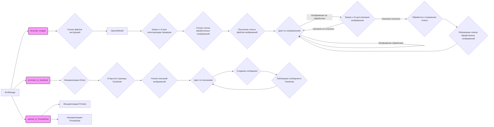

## <алгоритм>

1.  **Инициализация `EmilDesign`**:
    *   Создается экземпляр класса `EmilDesign`.
    *   Определяется `base_path` как путь к данным модуля.

2.  **`describe_images`**:
    *   Принимает аргумент `from_url` (по умолчанию `False`), который определяет, откуда брать изображения (из URL или локально).
    *   Определяются пути к файлам инструкций (`system_instruction_path`, `examples_path`), директории изображений (`images_dir`) и выходному файлу JSON (`output_file`).
        *   Пример: `system_instruction_path` = `/path/to/google_drive/emil/instructions/hand_made_furniture_he.txt`.
        *   Пример: `images_dir` = `/path/to/google_drive/emil/images`.
    *   Загружаются текстовые данные из файлов инструкций (`system_instruction` и `examples`).
    *   Инициализируется `OpenAIModel` с предоставленными инструкциями и `assistant_id`.
    *   Используется модель для создания категорий на основе примеров.
    *   Читается список обработанных изображений из `updated_images_path`.
        *   Пример: `updated_images_list` = `['image1.jpg', 'image2.png']`.
    *   Получается список всех файлов изображений в `images_dir`.
        *   Пример: `images_path_list` = `['image1.jpg', 'image2.png', 'image3.jpeg']`.
    *   Цикл по каждому изображению в `images_path_list`:
        *   Проверка, было ли изображение уже обработано (находится ли в `updated_images_list`). Если да, то пропуск итерации.
        *   Вызов `model.describe_image` для получения описания изображения.
            *   Если `from_url` = `True`, то используется URL для запроса к AI модели.
            *   Если `from_url` = `False`, то передается локальный путь к файлу изображения.
            *   Пример: `model.describe_image(images_dir / 'image1.jpg', prompt, system_instruction)`.
        *   Обработка ответа от модели:
            *   Ответ преобразуется в `SimpleNamespace`.
            *   Добавляется атрибут `local_saved_image` с полным путем к файлу.
            *   Добавляется `SimpleNamespace` в список `data`.
            *   Данные `data` сохраняются в JSON (`output_file`).
            *   Текущее изображение добавляется в список обработанных.
            *   Список обработанных изображений сохраняется.
            *   Выводится `response` в лог.
    *   Возврата нет.

3.  **`promote_to_facebook`**:
    *   Инициализируется `Driver` с типом браузера `Chrome`.
    *   Открывается URL страницы Facebook.
    *   Загружаются описания изображений из JSON (`images_descritions_he.json`).
    *   Цикл по каждому описанию изображения:
        *   Создается `SimpleNamespace` для каждого сообщения.
        *   Устанавливаются атрибуты `title` и `description` для сообщения.
            *  Пример: `message.title` = "parent_category\\ncategory"
        *   Устанавливается атрибут `local_saved_image` для сообщения.
        *   Вызывается функция `post_message` для публикации сообщения на Facebook.
    *   Возврата нет.

4.  **`upload_to_PrestaShop`**:
    *   Инициализируется `Product`.
    *   Инициализируется `PrestaShop`.
    *   Возврата нет.

5. **`if __name__ == "__main__":`**
  * Создается экземпляр класса `EmilDesign`.
  * Закомментированы вызовы методов `describe_images()` и `promote_to_facebook()`, поэтому при запуске скрипта эти методы не будут выполнятся.

## <mermaid>

**Описание зависимостей:**

*   **`EmilDesign`**: Основной класс, который координирует работу по описанию, публикации и загрузке данных.
*   **`describe_images`**: Метод класса `EmilDesign`, использующий `OpenAIModel` для описания изображений. Зависит от чтения файлов и каталогов, а так же AI модели.
*   **`promote_to_facebook`**: Метод класса `EmilDesign`, использующий `Driver` для публикации сообщений на Facebook. Зависит от `Driver` и сохраненных описаний изображений.
*   **`upload_to_PrestaShop`**: Метод класса `EmilDesign`, использующий `Product` и `PrestaShop` для загрузки данных в PrestaShop. Зависит от `Product` и `PrestaShop`.
*   **`OpenAIModel`**: Модель ИИ для обработки текста и описания изображений.
*   **`Driver`**: Класс для управления браузером.
*  **`Product`**: Класс, представляющий продукт, который будет загружен в PrestaShop.
*   **`PrestaShop`**: Класс для взаимодействия с API PrestaShop.
*   **Взаимосвязи:**
    *   `EmilDesign` использует методы `describe_images`, `promote_to_facebook` и `upload_to_PrestaShop` для выполнения задач.
    *   `describe_images` использует `OpenAIModel`, файловые операции для чтения/записи.
    *   `promote_to_facebook` использует `Driver` и данные, созданные `describe_images`.
    *   `upload_to_PrestaShop` использует `Product` и `PrestaShop`.

## <объяснение>

**Импорты:**

*   `header`: Импорт модуля `header` из текущей директории.
*   `pathlib.Path`: Используется для работы с путями к файлам и директориям.
*   `types.SimpleNamespace`: Используется для создания объектов, к которым можно обращаться как к атрибутам.
*   `time`: Используется для работы со временем, например для задержек (в коде закомментирован).
*   `src.gs`: Импорт глобальных настроек (`gs`).
*   `src.logger`: Импорт модуля логирования (`logger`).
*   `src.endpoints.PrestaShop.api.api.PrestaShop`: Класс для взаимодействия с PrestaShop API.
*   `src.webdriver.driver.Driver`, `src.webdriver.driver.Chrome`: Классы для управления браузером.
*   `src.ai.gemini.GoogleGenerativeAI`: Класс для использования Google Gemini AI. (в коде не используется)
*   `src.ai.openai.model.OpenAIModel`: Класс для использования OpenAI.
*  `src.product.Product`: Класс для представления продукта.
*   `src.endpoints.advertisement.facebook.scenarios.post_message.post_message, post_title, upload_media`: Функции для публикации сообщений в Facebook.
*   `src.utils.file.read_text_file, save_text_file, get_filenames`: Функции для работы с файлами.
*   `src.utils.jjson.j_loads_ns, j_dumps`: Функции для работы с JSON.
*   `src.logger.logger.logger`: Логгер для записи сообщений.

**Классы:**

*   **`EmilDesign`**:
    *   **Назначение**: Класс для управления и продвижения изображений через различные платформы.
    *   **Атрибуты**:
        *   `base_path`: `Path` - базовый путь к каталогу данных модуля.
    *   **Методы**:
        *   `__init__`: Конструктор класса. В текущей версии ничего не делает.
        *   `describe_images`: Метод для описания изображений с помощью AI модели.
        *   `promote_to_facebook`: Метод для публикации сообщений в Facebook.
        *   `upload_to_PrestaShop`: Метод для загрузки данных о товарах в PrestaShop.

**Функции:**

*   `read_text_file(file_path: Path, as_list: bool = False) -> str | list`: Читает текстовый файл, возвращает строку или список строк.
    *   `file_path`: `Path` - путь к файлу.
    *   `as_list`: `bool` - определяет, возвращать список строк или одну строку (по умолчанию `False`).
*   `save_text_file(data: str | list, file_path: Path) -> None`: Сохраняет текстовые данные в файл.
    *   `data`: `str | list` - данные для сохранения.
    *   `file_path`: `Path` - путь к файлу.
*   `get_filenames(dir_path: Path) -> list`: Возвращает список имен файлов из директории.
    *   `dir_path`: `Path` - путь к директории.
*   `j_loads_ns(json_path: Path | str) -> SimpleNamespace | list`: Загружает JSON из файла и возвращает `SimpleNamespace` или список `SimpleNamespace`.
    *   `json_path`: `Path | str` - путь к файлу JSON.
*   `j_dumps(data: list, file_path: Path) -> None`: Сохраняет данные в формате JSON в файл.
    *    `data`: `list` - данные для сохранения.
    *   `file_path`: `Path` - путь к файлу.
*   `post_message(driver, message, without_captions = True)`: Публикует сообщение в Facebook.
    *   `driver`: Экземпляр `Driver`
    *   `message`: `SimpleNamespace` с данными для публикации.
    *   `without_captions`: `bool`, определяет публикацию без подписей.

**Переменные:**

*   `MODE`: `str` - используется для определения режима работы.
*   `base_path`: `Path` - путь к данным модуля.
*   `system_instruction_path`, `examples_path`, `images_dir`, `output_file`: `Path` - пути к файлам и директориям.
*   `system_instruction`, `examples`: `str` - текстовые инструкции и примеры.
*   `prompt`: `str` - запрос для AI модели.
*   `model`: Экземпляр `OpenAIModel`.
*   `updated_images_list`, `images_path_list`, `data`: `list` - списки для хранения данных.
*   `response`: `str` - ответ от AI модели.
*   `res_ns`: Экземпляр `SimpleNamespace` для обработки ответа от AI модели.
*   `d`: Экземпляр `Driver`.
*   `messages`: `SimpleNamespace | list` - описания изображений.
*   `message`: Экземпляр `SimpleNamespace` - данные для публикации в Facebook.
*   `p`: Экземпляр `Product`.
*   `presta`: Экземпляр `PrestaShop`.

**Потенциальные ошибки и области для улучшения:**

*   **Обработка ошибок**: Отсутствует обработка исключений (например, при чтении/записи файлов, сетевых ошибках).
*   **Логирование**: Не все действия хорошо залогированы, для отладки нужно больше логов.
*   **Задержки**: Задержка `time.sleep(20)` закомментирована, если она нужна, то необходимо включить.
*   **Конфигурация**: Пути и параметры могут быть вынесены в файл конфигурации.
*   **Абстракция**: Код можно сделать более гибким, например, вынести параметры AI модели в настройки.

**Взаимосвязи с другими частями проекта:**

*   Использует `src.gs` для получения пути к Google Drive.
*   Использует `src.logger` для логирования.
*   Интегрируется с `src.endpoints.PrestaShop` для работы с PrestaShop.
*   Использует `src.webdriver` для работы с браузером.
*   Использует `src.ai` для работы с AI моделями.
*   Интегрируется с `src.product` для представления продукта.
*   Использует `src.endpoints.advertisement.facebook` для продвижения в Facebook.
*   Использует `src.utils.file` и `src.utils.jjson` для файловых операций.