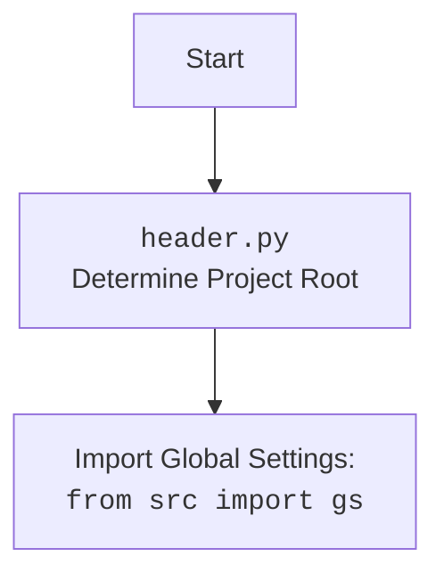

## АНАЛИЗ КОДА: `hypotez/src/endpoints/emil/emil_design.py`

### 1. <алгоритм>

**1. `EmilDesign` Класс:**
   -   Инициализация:
        -   Устанавливает константу `ENDPOINT` как "emil".
        -   Инициализирует пути к базовой директории и директории с данными.
        -   Загружает конфигурацию из `emil.json` в `SimpleNamespace`.
        -   Инициализирует `GoogleGenerativeAI` и `OpenAIModel`.

**2. `describe_images(lang: str)` метод:**
   1.  **Инициализация AI:**
        -  Читает инструкции для AI из файла `hand_made_furniture_{lang}.md`.
        -   Выбирает модель AI: либо `OpenAIModel`, либо `GoogleGenerativeAI`.
        -   Если `use_gemini` = True - инициализирует `GoogleGenerativeAI` с ключом API, моделью и системной инструкцией.
        -   Читает категории мебели из файла `main_categories_furniture.json` и добавляет их в системную инструкцию.
    2. **Подготовка данных:**
        -   Определяет пути к файлу вывода описаний изображений.
        -   Загружает список уже описанных изображений из файла `described_images.txt`.
        -   Получает список файлов изображений из директории `images/furniture_images`.
        -   Фильтрует список изображений, оставляя только те, которые еще не были описаны.
        -   Создает путь к файлу `out_{gs.now}_{lang}.json` для сохранения результатов.
    3. **Обработка изображений:**
        -   Итерируется по каждому изображению в списке `images_to_process`.
        -   Получает байтовое представление изображения (`get_image_bytes`) и необработанные бинарные данные (`get_raw_image_data`).
        -   Отправляет запрос в `gemini.describe_image` с необработанными бинарными данными изображения и системной инструкцией.
        -   Если ответ от модели AI получен:
            -   Преобразует JSON ответ в `SimpleNamespace`.
            -   Устанавливает атрибут `local_image_path` для сохранения пути к исходному изображению.
            -   Добавляет структурированные данные в список `data` и сохраняет в JSON-файл.
            -   Добавляет путь к обработанному изображению в список `described_images` и сохраняет в файл.
   
**3. `promote_to_facebook()` метод:**
   1.  Инициализирует веб-драйвер `Chrome`.
   2.  Переходит по ссылке на группу в Facebook.
   3.  Загружает описания изображений из `images_descritions_he.json`.
   4.  Итерируется по загруженным описаниям:
        -  Формирует заголовок из родительской категории и категории.
        -   Формирует описание товара из описания.
        -   Устанавливает локальный путь к изображению.
        -   Публикует сообщение с изображением и описанием на Facebook.

**4. `upload_to_prestashop(products_list: Optional[SimpleNamespace | list[SimpleNamespace]], lang: Optional[str])` метод:**
   1. **Инициализация данных:**
        - Загружает список продуктов из JSON файла, если `products_list` не передан.
        - Загружает локализации магазина из файла `locales.json`.
        -  Получает индекс языка из `lang_ns`.
    2. **Подготовка данных для PrestaShop:**
        -   Инициализирует объект `ProductFields` с индексом языка.
        -   Определяет хост и ключ API PrestaShop.
    3. **Загрузка продуктов:**
        -   Итерируется по списку продуктов.
        -   Конвертирует данные из `SimpleNamespace` в формат `ProductFields`.
        -   Создает экземпляр `ProductAsync` для загрузки продукта в PrestaShop.
        -   Загружает продукт в PrestaShop и получает его ID.

**Примеры:**
- **`describe_images`:**
    - Входные данные: `lang` (например, 'he').
    -  Обрабатывает изображения из `data_path/images/furniture_images` и генерирует их описания с помощью AI, сохраняет результаты в JSON.
- **`promote_to_facebook`:** 
    - Загружает описания из JSON, используя веб-драйвер `Chrome` размещает посты в Facebook.
- **`upload_to_prestashop`:**
    - Загружает данные продуктов из JSON, используя PrestaShop API, создает новые продукты.

**Поток данных:**
1. **`describe_images`**:
    -   `hand_made_furniture_{lang}.md` -> `system_instruction`
    -   `main_categories_furniture.json` -> `system_instruction`
    -   `images/furniture_images` -> изображения -> AI model (`GoogleGenerativeAI`) -> описание изображения
    -   описания -> `out_{gs.now}_{lang}.json` , `described_images.txt`
2.  **`promote_to_facebook`**:
    - `images_descritions_he.json` -> описания -> Facebook пост
3.  **`upload_to_prestashop`**:
     -  `out_{gs.now}_{lang}.json` -> данные о продукте -> PrestaShop API -> продукты на PrestaShop

### 2. <mermaid>
```mermaid
flowchart TD
    subgraph EmilDesign
    Start --> Init[Init EmilDesign]
        Init --> GetConfig[Get config from  <br> <code>{ENDPOINT}.json</code>]
        GetConfig --> SetDataPath[Set data path from  <br> <code>config.storage</code>]

    subgraph describe_images(lang: str)
        Init --> InitAI[Init AI model  <br> <code>GoogleGenerativeAI</code> or  <br> <code>OpenAIModel</code>]
        InitAI --> ReadInstructions[Read Instructions from  <br><code>hand_made_furniture_{lang}.md</code>]
        ReadInstructions --> ReadCategories[Read Categories from <br> <code>main_categories_furniture.json</code>]
        ReadCategories --> SetOutputPaths[Set output files paths <br> <code>described_images_{lang}.json</code>]
        SetOutputPaths --> GetDescribedImages[Get already  <br> described images <br> <code>described_images.txt</code>]
        GetDescribedImages --> GetImagesList[Get images list <br> from <code>data_path/images/furniture_images</code>]
         GetImagesList --> FilterImages[Filter images <br> which not described]
         FilterImages --> LoopThroughImages[Loop through each image]
             LoopThroughImages --> GetImageBytes[Get image bytes <br> <code>get_image_bytes()</code> and raw <br> <code>get_raw_image_data()</code>]
             GetImageBytes --> SendToAI[Send image to AI model]
             SendToAI --> ProcessAIResponse[Process AI response]
             ProcessAIResponse -- Response --> SaveOutput[Save data to <br> <code>out_{gs.now}_{lang}.json</code>]
             SaveOutput --> AddDescribedImage[Add processed image path to <br><code>described_images.txt</code>]
             AddDescribedImage --> LoopThroughImages
        
        LoopThroughImages --> EndDescribe[End describe_images]

    end
     subgraph promote_to_facebook()
        Start --> InitDriver[Init Driver <br> <code>Chrome</code>]
        InitDriver --> GetFacebookPage[Navigate to Facebook Group]
        GetFacebookPage --> GetDescriptions[Get Descriptions from <br> <code>images_descritions_he.json</code>]
        GetDescriptions --> LoopThroughMessages[Loop through messages]
            LoopThroughMessages --> PrepareMessage[Prepare post message]
            PrepareMessage --> PostToFacebook[Post message to Facebook]
        PostToFacebook --> LoopThroughMessages
        LoopThroughMessages --> EndPromote[End promote_to_facebook]
    end
    subgraph upload_to_prestashop(products_list: Optional[SimpleNamespace | list[SimpleNamespace]], lang: Optional[str])
       Start --> GetProductsData[Get products data  from<br> JSON or argument <code>products_list</code>]
       GetProductsData --> GetLocales[Get locales from <code>locales.json</code>]
       GetLocales --> InitProductFields[Init  Product Fields <br> <code>ProductFields</code>]
       InitProductFields --> LoopThroughProducts[Loop through products]
            LoopThroughProducts --> ConvertProductData[Convert data to ProductFields]
            ConvertProductData --> InitProductAsync[Init <br> <code>ProductAsync</code> <br> with PrestaShop credentials]
            InitProductAsync --> UploadToPrestashop[Upload product to <br> PrestaShop]
         UploadToPrestashop --> LoopThroughProducts
        LoopThroughProducts --> EndUpload[End upload_to_prestashop]
    end
    
    EndDescribe --> End[End EmilDesign]
    EndPromote --> End
    EndUpload --> End
    end
```


### 3. <объяснение>

**Импорты:**

*   `from __future__ import annotations`:  Позволяет использовать аннотации типов для будущих версий Python.
*   `from typing import Optional`:  Используется для обозначения необязательных типов аргументов.
*   `import asyncio`: Для работы с асинхронным программированием.
*   `import time`: Для добавления пауз в выполнение кода.
*   `from pathlib import Path`:  Упрощает работу с путями к файлам и директориям.
*   `from types import SimpleNamespace`:  Для создания простых объектов с атрибутами.
*   `import header`: Импортирует модуль для определения корневой директории проекта.
*   `from src import gs`: Импортирует глобальные настройки и переменные проекта из пакета `src`.
*  `from src.webdriver.driver import Driver`: Абстрактный класс для инициализации webdriver.
*   `from src.webdriver.chrome import Chrome`: Драйвер для управления браузером Chrome.
*   `from src.webdriver.firefox import Firefox`: Драйвер для управления браузером Firefox.
*   `from src.ai.gemini import GoogleGenerativeAI`:  Класс для взаимодействия с моделью Gemini AI от Google.
*   `from src.ai.openai.model import OpenAIModel`: Класс для взаимодействия с моделью OpenAI.
*   `from src.endpoints.prestashop.product_fields import ProductFields`: Класс для представления данных о продукте в формате PrestaShop.
*   `from src.endpoints.prestashop.product_async import ProductAsync`: Класс для асинхронного взаимодействия с PrestaShop API.
*   `from src.endpoints.advertisement.facebook.scenarios.post_message import post_message, post_title, upload_media`: Функции для постинга сообщений в Facebook.
*   `from src.utils.file_async import read_text_file, save_text_file, get_filenames_from_directory`: Функции для асинхронной работы с файлами.
*   `from src.utils.jjson import j_loads, j_loads_ns, j_dumps`: Функции для работы с JSON данными.
*   `from src.utils.image import get_image_bytes, get_raw_image_data`:  Функции для работы с изображениями (получение байтов и raw data).
*   `from src.utils.convertors.ns import ns2dict`: Функции для конвертации `SimpleNamespace` в словарь.
*   `from src.logger.logger import logger`: Для логирования сообщений в приложении.

**Класс `EmilDesign`:**

*   **`ENDPOINT`**:  Константа, определяющая имя endpoint.
*   **`gemini`**: Экземпляр класса `GoogleGenerativeAI` для взаимодействия с Google Gemini AI.
*   **`openai`**: Экземпляр класса `OpenAIModel` для взаимодействия с OpenAI.
*   **`base_path`**: Путь к базовой директории endpoint, где хранятся конфигурационные файлы.
*   **`config`**: Объект `SimpleNamespace`, содержащий конфигурации, загруженные из `emil.json`.
*   **`data_path`**: Путь к директории для хранения данных endpoint.

**Методы:**

*   **`__init__`**: Инициализатор класса. В данном примере не выполняет никаких действий, но может быть расширен для инициализации дополнительных атрибутов класса.
*   **`describe_images(lang: str)`**: 
    -   Описывает изображения, используя AI модель. 
    -   Аргументы:
        -   `lang:str`: Язык для описания.
    -   Возвращаемое значение: `None`.
    -   Использует либо `GoogleGenerativeAI`, либо `OpenAIModel`, в зависимости от выбранной конфигурации.
    -   Читает инструкции и категории из файлов.
    -   Обрабатывает каждое изображение, отправляя его в AI модель и сохраняет описание.
*   **`promote_to_facebook()`**:
    -   Публикует сообщения в Facebook, используя веб-драйвер.
    -   Аргументы: `None`.
    -   Возвращаемое значение: `None`.
    -   Загружает данные из `images_descritions_he.json` и публикует сообщения в Facebook.
*   **`upload_to_prestashop(products_list: Optional[SimpleNamespace | list[SimpleNamespace]] = None, lang: Optional[str] = None)`**:
    -   Загружает информацию о продуктах в PrestaShop.
    -   Аргументы:
        -   `products_list: Optional[SimpleNamespace | list[SimpleNamespace]] = None`: Список продуктов для загрузки, если не передается, то данные загружаются из JSON файла.
        -   `lang: Optional[str] = None`: Язык для описания.
    -   Возвращаемое значение: `bool`.
    -   Загружает данные из JSON файла, если `products_list` не передан.
    -   Преобразует данные в формат `ProductFields` и отправляет в PrestaShop с помощью `ProductAsync`.

**Переменные:**

*   `ENDPOINT`: Строка, хранящая имя endpoint (`emil`).
*  `base_path`: объект `Path`, хранит путь к базовой директории endpoint.
*   `config`: Объект `SimpleNamespace`, хранит конфигурации.
*   `data_path`: Объект `Path`, хранит путь к директории с данными.
*   `system_instruction`: Строка, содержащая инструкции для AI.
*   `use_openai`, `use_gemini`: Логические переменные, определяющие, какую AI модель использовать.
*   `images_dir`: Объект `Path`, путь к директории с изображениями.
*   `images_files_list`: Список строк, содержащий имена файлов изображений.
*   `images_to_process`: Список строк, содержащий имена файлов изображений для обработки.
*   `output_json`: Объект `Path`, путь к файлу, в который будут записаны результаты.
*   `data`: Список, в котором будут храниться результаты работы.
*   `described_images`: Список, в котором хранятся пути к обработанным изображениям.
*   `img_bytes`: Байтовое представление изображения.
*   `raw_img_data`:  Необработанные бинарные данные изображения.
*   `response`: Ответ от AI модели.
*    `res_ns`: Объект `SimpleNamespace`, содержащий описание изображения.
*    `messages`: Объект `SimpleNamespace`, или список объектов, содержащие описания товаров для Facebook.
*    `message`: Объект `SimpleNamespace`, содержащий сообщение для поста в Facebook.
*   `d`: Экземпляр класса `Driver` для управления веб-драйвером.
*   `f`: Экземпляр класса `ProductFields`, хранит данные продукта для PrestaShop.
*   `p`: Экземпляр класса `ProductAsync` для отправки данных в PrestaShop.
*    `host`: хост для доступа к PrestaShop API
*    `api_key`: api_key для доступа к PrestaShop API
*    `lang_ns`: Объект `SimpleNamespace`, содержащий локали магазина.
*   `lang_index`: индекс языка.

**Потенциальные ошибки и улучшения:**

*   **Обработка ошибок:** В коде присутствует много мест, где может возникнуть ошибка (например, ошибка при чтении файла, ошибка API запроса). Следует добавить обработку исключений для более стабильной работы программы.
*   **Параллельная обработка:** Для ускорения обработки изображений, можно использовать асинхронность для загрузки и обработки нескольких изображений одновременно (например, `asyncio.gather`).
*   **Конфигурация:** Некоторые параметры (например, пути к файлам, ключи API) должны быть вынесены в конфигурационные файлы для большей гибкости.
*   **Логирование:** Необходимо добавить более подробное логирование, включая информацию об ошибках, и этапах обработки.
*   **Унификация AI моделей:** Рассмотреть создание абстрактного класса для AI моделей, чтобы упростить переключение между разными моделями.
*   **Разделение кода на модули:** Разделить код на более мелкие модули для повышения читаемости и удобства поддержки.
*  **Типизация:** Добавить аннотацию типов для всех переменных и параметров функций, повысив читаемость и предотвращая ошибки.
*  **Зависимости:** Модуль зависит от сторонних библиотек и нескольких модулей внутри проекта `src`. Нужно управлять версиями библиотек и убедиться, что зависимости корректно установлены.

**Взаимосвязь с другими частями проекта:**

*   **`header.py`:** Используется для определения корневой директории проекта, что обеспечивает гибкость при запуске кода из разных директорий.
*   **`gs`**: Глобальные настройки проекта, включают пути к файлам, ключи API и другие глобальные параметры.
*   **`webdriver`:** Используется для управления браузером при взаимодействии с Facebook.
*   **`ai`:** Используется для обработки изображений с помощью моделей Google Gemini и OpenAI.
*   **`prestashop`**: Используется для загрузки информации о товарах на платформу PrestaShop.
*   **`utils`**: Различные утилиты для работы с файлами, JSON, изображениями и конвертациями данных.
*    **`logger`**:  Используется для логирования работы приложения.