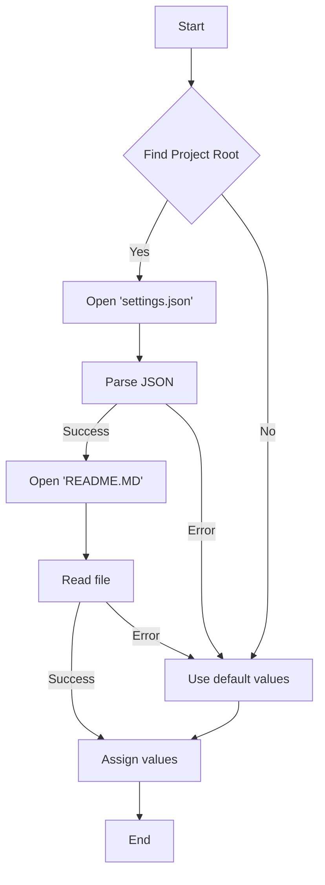
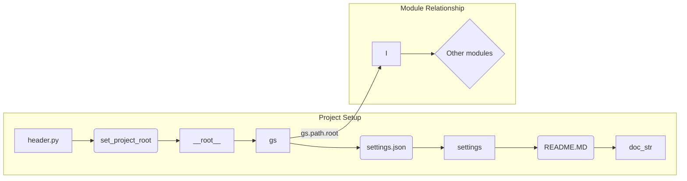

```MD
# <input code>

```python
## \file hypotez/src/endpoints/emil/header.py
# -*- coding: utf-8 -*-\
#! venv/Scripts/python.exe
#! venv/bin/python/python3.12

"""
.. module: src.endpoints.emil 
	:platform: Windows, Unix
	:synopsis:

"""
MODE = 'dev'


import sys
import json
from packaging.version import Version

from pathlib import Path
def set_project_root(marker_files=('pyproject.toml', 'requirements.txt', '.git')) -> Path:
    """
    Finds the root directory of the project starting from the current file's directory,
    searching upwards and stopping at the first directory containing any of the marker files.

    Args:
        marker_files (tuple): Filenames or directory names to identify the project root.
    
    Returns:
        Path: Path to the root directory if found, otherwise the directory where the script is located.
    """
    __root__:Path
    current_path:Path = Path(__file__).resolve().parent
    __root__ = current_path
    for parent in [current_path] + list(current_path.parents):
        if any((parent / marker).exists() for marker in marker_files):
            __root__ = parent
            break
    if __root__ not in sys.path:
        sys.path.insert(0, str(__root__))
    return __root__


# Get the root directory of the project
__root__ = set_project_root()
"""__root__ (Path): Path to the root directory of the project"""

from src import gs

settings:dict = None
try:
    with open(gs.path.root / 'src' /  'settings.json', 'r') as settings_file:
        settings = json.load(settings_file)
except (FileNotFoundError, json.JSONDecodeError):
    ...

doc_str:str = None
try:
    with open(gs.path.root / 'src' /  'README.MD', 'r') as settings_file:
        doc_str = settings_file.read()
except (FileNotFoundError, json.JSONDecodeError):
    ...


__project_name__ = settings.get("project_name", 'hypotez') if settings  else 'hypotez'
__version__: str = settings.get("version", '')  if settings  else ''
__doc__: str = doc_str if doc_str else ''
__details__: str = ''
__author__: str = settings.get("author", '')  if settings  else ''
__copyright__: str = settings.get("copyrihgnt", '')  if settings  else ''
__cofee__: str = settings.get("cofee", "Treat the developer to a cup of coffee for boosting enthusiasm in development: https://boosty.to/hypo69")  if settings  else "Treat the developer to a cup of coffee for boosting enthusiasm in development: https://boosty.to/hypo69"
```

# <algorithm>



**Пример:**

Предположим, текущий файл находится в `hypotez/src/endpoints/emil/header.py`.  Функция `set_project_root` ищет директории выше, пока не найдет `pyproject.toml`, `requirements.txt` или `.git`. Если найдет, то добавляет корневую директорию в `sys.path`.

# <mermaid>



**Объяснение диаграммы:**

* `header.py` - главный модуль, инициализирующий переменные, связанные с проектом.
* `set_project_root` - функция, которая находит корневую папку проекта.
* `gs` - модуль (вероятно, из `src`), предоставляющий доступ к пути к корневой директории проекта.
* `settings.json` и `README.MD` - файлы конфигурации и документации, расположенные в корне проекта.

# <explanation>

**Импорты:**

* `sys`:  Используется для управления модульным поиском (`sys.path`).
* `json`: Используется для работы с файлами JSON.
* `packaging.version`: Вероятно, используется для обработки версий.
* `pathlib`: Предоставляет удобный способ работы с путями.
* `src import gs`:  Импортирует модуль `gs` из пакета `src`. Вероятно, этот модуль содержит полезные функции или атрибуты для работы с корневой директорией проекта, например `gs.path.root`.

**Классы:**

В данном коде нет объявления классов.

**Функции:**

* `set_project_root(marker_files)`:
    * **Аргументы:** `marker_files` (кортеж строк) — список файлов/директорий, используемых для определения корневой директории проекта.
    * **Возвращаемое значение:** `Path` — путь к корневой директории проекта.
    * **Функциональность:** Рекурсивно поднимается по директориям от текущей до тех пор, пока не найдет директорию, содержащую один из `marker_files`.
    * **Примеры:**
        * Если `marker_files` содержит `pyproject.toml` и `requirements.txt`, функция найдет первую найденную директорию, содержащую эти файлы, и вернет её путь.

**Переменные:**

* `MODE`, `__root__`, `settings`, `doc_str`, `__project_name__`, `__version__`, `__doc__`, `__details__`, `__author__`, `__copyright__`, `__cofee__`:  Различные переменные, используемые для хранения конфигурации, имени проекта, версии, документации и прочей информации о проекте.

**Возможные ошибки и улучшения:**

* **Обработка ошибок:**  Используются блоки `try...except` для обработки `FileNotFoundError` и `json.JSONDecodeError`. Это хорошо, но можно добавить более специфическую информацию об ошибке в `except` для отладки.
* **Чтение файла README.md:**  Если `README.MD` не существует, переменная `doc_str` останется `None`, что может привести к ошибкам в дальнейшем, если не предусмотрена проверка.  Можно добавить более ясную обработку этого случая (например, присвоить пустую строку).
* **Изменчивость `sys.path`:** Изменение `sys.path` внутри функции `set_project_root` может вызывать непредсказуемые последствия, если функция вызывается из других частей проекта. Лучше использовать относительные импорты (`from . import module`) там, где это возможно.

**Взаимосвязь с другими частями проекта:**

Модуль `header.py` устанавливает настройки проекта и импортирует `gs`, который, вероятно, предоставляет инфраструктуру, необходимую для работы с файлами конфигурации и другими ресурсами проекта.