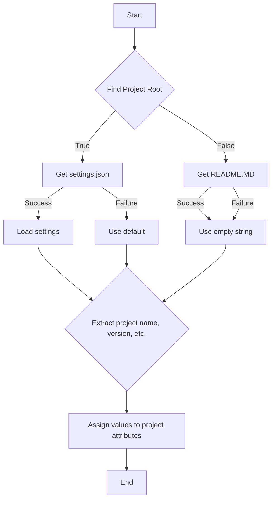

# <input code>

```python
## \file hypotez/src/endpoints/emil/header.py
# -*- coding: utf-8 -*-\
#! venv/Scripts/python.exe
#! venv/bin/python/python3.12

"""
.. module: src.endpoints.emil 
	:platform: Windows, Unix
	:synopsis:

"""
MODE = 'dev'


import sys
import json
from packaging.version import Version

from pathlib import Path
def set_project_root(marker_files=('pyproject.toml', 'requirements.txt', '.git')) -> Path:
    """
    Finds the root directory of the project starting from the current file's directory,
    searching upwards and stopping at the first directory containing any of the marker files.

    Args:
        marker_files (tuple): Filenames or directory names to identify the project root.
    
    Returns:
        Path: Path to the root directory if found, otherwise the directory where the script is located.
    """
    __root__:Path
    current_path:Path = Path(__file__).resolve().parent
    __root__ = current_path
    for parent in [current_path] + list(current_path.parents):
        if any((parent / marker).exists() for marker in marker_files):
            __root__ = parent
            break
    if __root__ not in sys.path:
        sys.path.insert(0, str(__root__))
    return __root__


# Get the root directory of the project
__root__ = set_project_root()
"""__root__ (Path): Path to the root directory of the project"""

from src import gs

settings:dict = None
try:
    with open(gs.path.root / 'src' /  'settings.json', 'r') as settings_file:
        settings = json.load(settings_file)
except (FileNotFoundError, json.JSONDecodeError):
    ...

doc_str:str = None
try:
    with open(gs.path.root / 'src' /  'README.MD', 'r') as settings_file:
        doc_str = settings_file.read()
except (FileNotFoundError, json.JSONDecodeError):
    ...


__project_name__ = settings.get("project_name", 'hypotez') if settings  else 'hypotez'
__version__: str = settings.get("version", '')  if settings  else ''
__doc__: str = doc_str if doc_str else ''
__details__: str = ''
__author__: str = settings.get("author", '')  if settings  else ''
__copyright__: str = settings.get("copyrihgnt", '')  if settings  else ''
__cofee__: str = settings.get("cofee", "Treat the developer to a cup of coffee for boosting enthusiasm in development: https://boosty.to/hypo69")  if settings  else "Treat the developer to a cup of coffee for boosting enthusiasm in development: https://boosty.to/hypo69"
```

# <algorithm>



**Пример:**

Если файл `settings.json` находится в каталоге `hypotez/src`, и файл `pyproject.toml`  также есть в `hypotez/`, то `set_project_root` вернет путь к `hypotez`. Далее, из файла `settings.json` будут загружены данные.


# <mermaid>

```mermaid
graph LR
    subgraph Project Initialization
        A[header.py] --> B(set_project_root);
        B --> C{Check for marker files};
        C -- True --> D[sys.path.insert(0, str(__root__))];
        C -- False --> E[Return current_path];
        D --> F[__root__ = Path(returned value)];
        F --> G[from src import gs];
        G --> H[try: open settings.json];
        H -- Success --> I[settings = json.load(settings_file)];
        H -- Failure --> J[settings = None];
        I --> K[try: open README.MD];
        K -- Success --> L[doc_str = settings_file.read()];
        K -- Failure --> L[doc_str = None];
        L --> M[Assign values to project attributes (__project_name__, __version__, etc.)];
    end
    M --> N[End];
```

**Объяснение зависимостей:**

* `header.py` - Основной файл, инициализирующий проект.
* `Path` (из `pathlib`) - используется для работы с путями.
* `sys.path` (из `sys`) - необходим для импорта модулей из корня проекта.
* `json` (из `json`) - для работы с файлом `settings.json`.
* `gs` (из `src`) - скорее всего содержит функции или переменные, определяющие пути к файлам проекта (`gs.path.root`).  Важно, что `src` является подмодулем основного проекта.
* `packaging.version` - нужен для работы с версиями.

# <explanation>

* **Импорты:**
    * `sys`: для работы с системными переменными, в частности, добавления пути к проекту в `sys.path`.
    * `json`: для работы с файлом `settings.json`.
    * `packaging.version`: для работы с версиями пакетов.
    * `pathlib.Path`: для работы с файловыми путями.
    * `src.gs`: видимо, содержит вспомогательные функции, используемые в проекте.  Импортируется из пакета `src`.  Очень важно уточнить, что значит `gs` в контексте проекта.  Это важный аспект понимания.

* **Классы:** Нет классов в данном фрагменте кода.

* **Функции:**
    * `set_project_root(marker_files)`: находит корневой каталог проекта, ища вверх по дереву каталогов, пока не найдёт директорию, содержащую указанные файлы-маркеры.  Это важная функция для определения расположения файлов проекта и импорта модулей из разных каталогов.  Очень важная функция, позволяющая обойти проблему относительных импортов.   Аргумент `marker_files` позволяет гибко настраивать поиск корня.  Возвращает `Path` объект к корневому каталогу.

* **Переменные:**
    * `MODE`: строковая константа, вероятно, определяющая режим работы.
    * `__root__`: путь к корневому каталогу проекта (тип `Path`).
    * `settings`: словарь, загруженный из файла `settings.json`
    * `doc_str`: строка, содержащая содержимое файла `README.MD`.
    * `__project_name__`, `__version__`, `__doc__`, `__details__`, `__author__`, `__copyright__`, `__cofee__`:  строковые переменные, содержащие метаданные о проекте, полученные из `settings.json` или использующие значения по умолчанию.

* **Возможные ошибки и улучшения:**

    * Обработка ошибок `FileNotFoundError` и `json.JSONDecodeError`  в `settings` и `doc_str` – хорошее решение.
    * Возможно, стоит добавить более подробную информацию о том, куда логгируются потенциальные ошибки.
    *  Уточнение структуры `src.gs` было бы очень полезным.  Важно понять, как именно модуль `gs` определяет пути (`gs.path.root`).

* **Взаимосвязь с другими частями проекта:**  Код показывает зависимость от файла `settings.json` и `README.MD` в корне проекта.  Для корректной работы проекта требуется, чтобы файлы были в определённых директориях, которые находятся внутри корневой директории проекта.  Также важна зависимость от модуля `gs`, который вероятно, определяет пути и логику работы с файлами проекта.  Пропущенные детали и предположения (например, что `gs` возвращает) – это важные моменты для понимания.