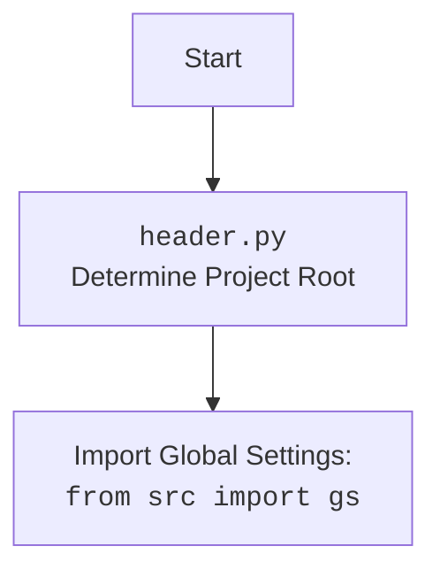

## <алгоритм>

1. **`set_project_root(marker_files)`**:
   - **Начало**: Функция принимает кортеж `marker_files` (по умолчанию `('__root__', '.git')`) как маркеры для определения корневого каталога проекта.
   - **Инициализация**: 
      - `current_path` устанавливается в абсолютный путь родительского каталога текущего файла (`header.py`).
      - `__root__`  инициализируется как `current_path`.
   - **Поиск корневого каталога**:
     - Цикл перебирает текущий каталог и все его родительские каталоги.
     - Для каждого родительского каталога `parent` проверяется, существует ли в нем какой-либо из файлов или каталогов, указанных в `marker_files`.
     - **Пример:** Если `marker_files`  равен  `('__root__', '.git')` , и в одном из родительских каталогов будет найдет файл `__root__`, поиск завершается.
     - Если маркер найден, `__root__`  устанавливается в этот родительский каталог, цикл прерывается.
   - **Добавление в `sys.path`**: 
     - Проверяется, находится ли `__root__` в списке путей поиска модулей `sys.path`.
     - Если нет, `__root__`  добавляется в начало списка, чтобы обеспечить возможность импорта модулей из корневого каталога.
   - **Возврат**: Функция возвращает путь к корневому каталогу проекта (`__root__`).
2. **`__root__: Path = set_project_root()`**:
    - Вызывается `set_project_root()` для определения корневого каталога проекта, результат сохраняется в глобальной переменной `__root__`.
3. **Импорт настроек `gs`**:
    - Выполняется импорт `from src import gs`, который, предположительно, предоставляет глобальные настройки, включая пути.
4. **Загрузка настроек из `settings.json`**:
    - Пытается открыть файл `settings.json`, расположенный в каталоге `src` относительно корневого каталога, и загрузить его содержимое как словарь `settings`.
    - **Пример:** Файл `settings.json`  может содержать:
      ```json
      {
         "project_name": "hypotez",
         "version": "1.0.0",
         "author": "John Doe",
         "copyrihgnt": "2024 John Doe" ,
         "cofee":"Treat the developer to a cup of coffee for boosting enthusiasm in development: https://boosty.to/hypo69"
      }
      ```
    - Если файл не найден или содержимое не является валидным JSON, обработка исключения игнорируется, и `settings` остается равным `None`.
5. **Чтение содержимого `README.MD`**:
   - Пытается открыть файл `README.MD`  из каталога `src` относительно корневого каталога и прочитать его содержимое в строку `doc_str`.
   - Если файл не найден или возникает ошибка при чтении, обработка исключения игнорируется, и `doc_str` остается `None`.
6. **Инициализация глобальных переменных**:
    - **`__project_name__`**:  Устанавливается значение из ключа `"project_name"` словаря `settings`, или `"hypotez"` если `settings`  равен `None` или в словаре нет ключа `"project_name"`.
    - **`__version__`**: Устанавливается значение из ключа `"version"` словаря `settings` или `''`, если `settings`  равен `None` или в словаре нет ключа `"version"`.
    - **`__doc__`**: Устанавливается значение  `doc_str`, или `''`, если `doc_str`  равен `None`.
    - **`__details__`**:  Устанавливается в пустую строку `''`.
    - **`__author__`**: Устанавливается значение из ключа `"author"` словаря `settings` или `''`, если `settings`  равен `None` или в словаре нет ключа `"author"`.
     - **`__copyright__`**:  Устанавливается значение из ключа `"copyrihgnt"` словаря `settings` или `''`, если `settings`  равен `None` или в словаре нет ключа `"copyrihgnt"`.
    - **`__cofee__`**:  Устанавливается значение из ключа `"cofee"` словаря `settings` или строку "Treat the developer to a cup of coffee for boosting enthusiasm in development: https://boosty.to/hypo69", если `settings`  равен `None` или в словаре нет ключа `"cofee"`.

## <mermaid>

```mermaid
flowchart TD
    Start[Start] --> FindProjectRoot[<code>set_project_root()</code><br>Find Project Root Directory]
    FindProjectRoot --> CheckMarkers[Check for Marker Files<br>(<code>__root__</code>, <code>.git</code>)]
    CheckMarkers -- Found --> SetRoot[Set <code>__root__</code> to Parent Directory]
    CheckMarkers -- Not Found --> NextParent[Move to Parent Directory]
    NextParent --> CheckMarkers
    SetRoot -->  AddToSysPath[Add <code>__root__</code> to <code>sys.path</code> if needed]
    AddToSysPath --> ReturnRoot[Return <code>__root__</code>]
    ReturnRoot --> SetGlobalRoot[<code>__root__: Path = set_project_root()</code><br>Set Global Project Root]
    SetGlobalRoot --> ImportGlobalSettings[Import Global Settings:<br> <code>from src import gs</code>]
    ImportGlobalSettings --> LoadSettings[Load Settings:<br><code>settings = json.load(...)</code>]
    LoadSettings -- Success --> ReadDoc[Read Document:<br><code>doc_str = settings_file.read()</code>]
    LoadSettings -- Error --> ReadDoc
    ReadDoc -- Success --> SetProjectInfo[Set Global Project Info]
    ReadDoc -- Error --> SetProjectInfo
    SetProjectInfo --> End[End]

    
   
```



## <объяснение>

**Импорты:**

- **`import sys`**: Модуль `sys` предоставляет доступ к некоторым переменным и функциям, взаимодействующим с интерпретатором Python. Используется здесь для добавления пути к корневому каталогу проекта в список путей поиска модулей (`sys.path`), что позволяет импортировать модули из этого каталога.
- **`import json`**: Модуль `json`  предназначен для работы с JSON-данными. Здесь используется для загрузки настроек проекта из файла `settings.json`.
-  **`from packaging.version import Version`**:  Импортирует класс `Version` из пакета `packaging`, который предназначен для сравнения и работы с версиями программного обеспечения. В данном коде не используется напрямую, но может быть предназначен для дальнейшего использования.
- **`from pathlib import Path`**: Модуль `pathlib` предоставляет объектно-ориентированный способ работы с путями файловой системы. Класс `Path` используется для определения путей и манипуляций с ними, что делает код более читаемым и кроссплатформенным.
-   **`from src import gs`**: Импортирует  глобальные настройки из пакета `src`, предположительно, включая переменные `gs.path.root` которые используются  для формирования  пути к файлам настроек.

**Функции:**

- **`set_project_root(marker_files: tuple = ('__root__', '.git')) -> Path`**:
  - **Аргументы**: `marker_files` — кортеж строк, содержащих имена файлов или каталогов, используемых для идентификации корневого каталога проекта. По умолчанию `('__root__', '.git')`.
  - **Возвращает**: Объект `Path`, представляющий путь к корневому каталогу проекта.
  - **Назначение**:  Эта функция находит корневой каталог проекта, поднимаясь вверх по дереву каталогов, пока не найдет каталог, содержащий один из файлов-маркеров.  Используется для того, чтобы определить начальную точку проекта, от которой строятся относительные пути к другим файлам и ресурсам.

**Переменные:**

- **`__root__`**: Глобальная переменная типа `Path`, хранящая путь к корневому каталогу проекта, определенный функцией `set_project_root`. Используется другими частями кода для доступа к ресурсам проекта.
-   **`settings`**: Глобальная переменная типа `dict`, содержащая настройки проекта, загруженные из файла `settings.json`. Может быть `None`, если файл не найден или не является валидным JSON.
-   **`doc_str`**: Глобальная переменная типа `str`,  содержащая содержимое файла `README.MD`.  Может быть `None`, если файл не найден или не прочитан.
-   **`__project_name__`**: Глобальная переменная типа `str`, хранящая имя проекта, полученное из файла настроек, или "hypotez" по умолчанию.
-   **`__version__`**: Глобальная переменная типа `str`, хранящая версию проекта, полученную из файла настроек, или `''` по умолчанию.
-   **`__doc__`**: Глобальная переменная типа `str`, хранящая документацию проекта, полученную из файла `README.MD` , или `''` по умолчанию.
-   **`__details__`**: Глобальная переменная типа `str`, пока установлена в пустую строку.
-   **`__author__`**: Глобальная переменная типа `str`, хранящая имя автора проекта, полученное из файла настроек, или `''` по умолчанию.
-   **`__copyright__`**: Глобальная переменная типа `str`, хранящая  авторские права проекта, полученное из файла настроек, или `''` по умолчанию.
-   **`__cofee__`**: Глобальная переменная типа `str`, хранящая сообщение для поддержки разработчика, полученное из файла настроек, или  "Treat the developer to a cup of coffee for boosting enthusiasm in development: https://boosty.to/hypo69"  по умолчанию.

**Потенциальные ошибки и области для улучшения:**

- **Обработка ошибок:** Исключения `FileNotFoundError` и `json.JSONDecodeError` обрабатываются при чтении `settings.json` и `README.MD`, однако обработка простая - `...`. Логично было бы записать  сообщения об ошибках в лог.
- **Зависимость от `src.gs`:** Код сильно зависит от структуры пакета `src` и глобальных настроек, которые предоставляются через `gs`. Отсутствует проверка того, что `gs` содержит необходимые пути.
- **Отсутствие обработки не найденных ключей в `settings`**: Если в файле `settings.json` не будет, к примеру, ключа `project_name` или любого другого, код вернет значения по умолчанию.  Но это может быть некорректным.
- **Использование `__` для глобальных переменных**: Использование имен с двойным подчеркиванием `__`  может конфликтовать с именами private атрибутов классов.

**Взаимосвязи с другими частями проекта:**

-  `header.py` устанавливает глобальные переменные, включая  `__root__`  и  настройки из `settings.json`, что позволяет другим модулям проекта  получать доступ к корневому каталогу проекта и его настройкам.
- Код предполагает наличие  файлов `settings.json` и `README.MD` в каталоге `src`.
-  Использует `src.gs` для получения пути к корневому каталогу и расположения файлов настроек.