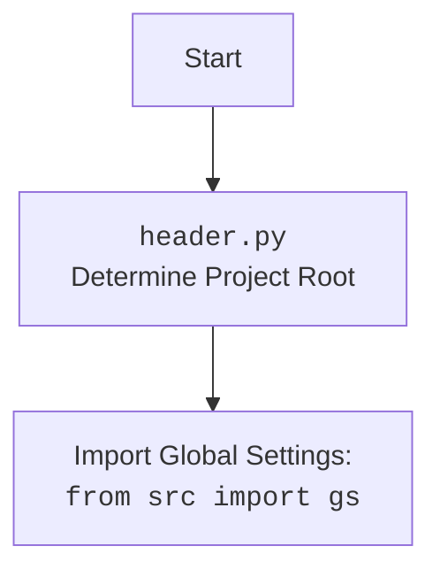

## Анализ кода `hypotez/src/endpoints/emil/header.py`

### <алгоритм>
1. **`set_project_root(marker_files)`**:
   - На вход функция принимает кортеж `marker_files` (по умолчанию `('__root__')`), который содержит имена файлов или директорий, которые используются как маркеры корневой директории проекта.
   - Определяется абсолютный путь к директории, в которой находится текущий файл (`__file__`). 
   - Присваивается переменной `__root__` путь текущей директории.
   - Проходится по родительским директориям, начиная с текущей.
   - Для каждой родительской директории проверяется наличие в ней любого из файлов, указанных в `marker_files`.
   - Если маркерный файл найден, то путь к родительской директории присваивается переменной `__root__` и цикл завершается.
   - Если директория `__root__` не содержится в `sys.path`, добавляется в начало списка путей для поиска модулей.
   - Возвращается путь к корневой директории `__root__`.

   **Пример:**

   Предположим, структура проекта такая:
   ```
   project/
     __root__
     src/
       endpoints/
         emil/
           header.py
   ```
   - `set_project_root()` будет вызван из `header.py`.
   - На начальном этапе `current_path` будет указывать на `project/src/endpoints/emil`.
   - Цикл будет проверять наличие `__root__` в следующих директориях, пока не найдет его:
     - `project/src/endpoints/emil`
     - `project/src/endpoints`
     - `project/src`
     - `project`
   - В директории `project` будет найден файл `__root__`, поэтому `__root__` станет `project`.
   - В результате `set_project_root` вернет путь `Path("project")`.

2. **`__root__ = set_project_root()`**:
   - Вызывается функция `set_project_root()` без параметров, результат (путь к корню проекта) сохраняется в глобальную переменную `__root__`.

3. **Чтение `settings.json`**:
   - Пытается открыть файл `src/settings.json` в корневой директории проекта.
   - Если файл существует и является валидным JSON, его содержимое загружается в словарь `settings`.
   - В случае ошибки (файл не найден или JSON невалиден) обработка ошибки пропускается.

4. **Чтение `README.MD`**:
    - Пытается открыть файл `src/README.MD` в корневой директории проекта.
    - Если файл существует, его содержимое считывается в строку `doc_str`.
    - В случае ошибки (файл не найден) обработка ошибки пропускается.
5. **Инициализация глобальных переменных**:
    - Инициализируются глобальные переменные `__project_name__`, `__version__`, `__doc__`, `__details__`, `__author__`, `__copyright__` и `__cofee__` из словаря `settings`, если он был загружен. В противном случае, они принимают значения по умолчанию.

### <mermaid>
```mermaid
flowchart TD
    Start --> FindProjectRoot[<code>set_project_root()</code><br> Determine Project Root]
    
    FindProjectRoot --> SetCurrentPath[Set Current Path to: <br><code>Path(__file__).resolve().parent</code>]
    SetCurrentPath --> StartSearch[Start Searching Upward]
    StartSearch -- For Each Parent Directory --> CheckMarker[Check for Marker Files]
    CheckMarker -- Marker Found --> SetRoot[Set Root Path: <br><code>__root__ = parent</code>]
    SetRoot --> BreakLoop[Break Loop]
    CheckMarker -- Marker Not Found --> StartSearch
    StartSearch -- No More Parents --> CheckSysPath[Check if Root is in <code>sys.path</code>]
    BreakLoop --> CheckSysPath
    CheckSysPath -- Not in <code>sys.path</code> --> AddSysPath[Add Root Path to <code>sys.path</code>]
    AddSysPath --> ReturnRoot[Return Root Path]
    CheckSysPath -- In <code>sys.path</code> --> ReturnRoot
    ReturnRoot --> SaveRoot[Save Root Path in: <br><code>__root__</code>]
    SaveRoot --> LoadSettings[Load Settings from: <br><code>settings.json</code>]
    LoadSettings -- Success --> ReadReadme[Read README.MD]
    LoadSettings -- Failure --> ReadReadme
    ReadReadme -- Success --> InitGlobalVars[Initialize Global Variables]
    ReadReadme -- Failure --> InitGlobalVars
    InitGlobalVars --> End
    
    style FindProjectRoot fill:#f9f,stroke:#333,stroke-width:2px
    style LoadSettings fill:#ccf,stroke:#333,stroke-width:2px
    style ReadReadme fill:#ccf,stroke:#333,stroke-width:2px
     style InitGlobalVars fill:#ccf,stroke:#333,stroke-width:2px
```



**Объяснение зависимостей:**

-   **`Start`**: Начало выполнения скрипта `header.py`.
-   **`FindProjectRoot`**:  Вызов функции `set_project_root()`, которая находит корневую директорию проекта.
-   **`SetCurrentPath`**: Определение пути к директории, содержащей текущий файл.
-   **`StartSearch`**: Начало итерации по родительским директориям.
-   **`CheckMarker`**: Проверка наличия маркерных файлов (например, `__root__`) в текущей родительской директории.
-   **`SetRoot`**: Если маркерный файл найден, устанавливается путь к корневой директории.
-   **`BreakLoop`**: Прерывание цикла поиска родительских директорий, если корень был найден.
-   **`CheckSysPath`**: Проверка, есть ли корневой путь проекта в списке путей для поиска модулей Python (`sys.path`).
-   **`AddSysPath`**: Добавление корневого пути проекта в список путей, если его там нет.
-   **`ReturnRoot`**: Функция `set_project_root()` возвращает найденный путь к корню проекта.
-   **`SaveRoot`**: Сохранение возвращённого пути в глобальной переменной `__root__`.
-    **`LoadSettings`**: Попытка загрузки настроек из файла `settings.json`.
-    **`ReadReadme`**: Попытка прочитать содержимое файла `README.MD`.
-    **`InitGlobalVars`**: Инициализация глобальных переменных проекта (`__project_name__`, `__version__` и т.д.)
-    **`End`**: Завершение выполнения скрипта `header.py`.
-   **`Header`**:  представляет блок кода `header.py`
-   **`import`**: Импорт глобальных настроек проекта из модуля `src.gs`.

### <объяснение>
**Импорты:**

*   **`sys`**: Используется для работы с параметрами и функциями, специфичными для Python, в частности, для добавления пути к корню проекта в `sys.path` для корректного импорта модулей из `src`.
*   **`json`**:  Используется для работы с JSON-файлами. В данном случае используется для загрузки настроек из файла `settings.json`.
*   **`packaging.version.Version`**: Импортируется класс `Version` из модуля `packaging.version`, который используется для работы с версиями, но в данном коде не используется.
*   **`pathlib.Path`**: Используется для работы с путями к файлам и директориям в кроссплатформенном формате. 
*   **`from src import gs`**: Импортирует модуль `gs` (global settings) из директории `src`, предоставляющий глобальные настройки проекта, например, путь к корневой директории. Этот импорт зависит от того, что путь к корню проекта добавлен в `sys.path`.

**Функции:**
*   **`set_project_root(marker_files: tuple = ('__root__')) -> Path`**: 
    *   **Аргументы**:
        *   `marker_files`: кортеж, содержащий имена файлов или директорий, которые служат маркерами для определения корневой директории проекта. По умолчанию используется `('__root__')`.
    *   **Возвращаемое значение**: Объект `pathlib.Path`, представляющий путь к корневой директории проекта или директории, где находится файл скрипта.
    *   **Назначение**: Функция ищет корневую директорию проекта, поднимаясь вверх по дереву директорий, пока не найдет директорию, содержащую маркерный файл или директорию. Добавляет путь к корню в `sys.path`, если он там отсутствует.

**Переменные:**
*   **`MODE`**: Глобальная константа, определяющая режим работы приложения (в данном случае - `'dev'`).
*   **`__root__`**: Переменная типа `Path`, хранящая путь к корневой директории проекта. Она инициализируется результатом вызова `set_project_root()` и используется для определения путей к другим файлам проекта.
*   **`settings`**: Словарь, в который загружаются настройки из файла `settings.json`. Может быть `None`, если файл не найден или невалиден.
*   **`doc_str`**: Строка, содержащая текст из файла `README.MD`. Может быть `None`, если файл не найден.
*   **`__project_name__`**: Строка, содержащая имя проекта. Получается из файла `settings.json`, либо устанавливается значение по умолчанию `'hypotez'`.
*   **`__version__`**: Строка, содержащая версию проекта. Получается из файла `settings.json`, либо устанавливается значение по умолчанию `''`.
*   **`__doc__`**: Строка, содержащая документацию проекта. Получается из файла `README.MD`, либо устанавливается значение по умолчанию `''`.
*   **`__details__`**: Строка, содержащая дополнительную информацию о проекте.
*  **`__author__`**: Строка, содержащая имя автора проекта. Получается из файла `settings.json`, либо устанавливается значение по умолчанию `''`.
*   **`__copyright__`**: Строка, содержащая информацию об авторских правах проекта. Получается из файла `settings.json`, либо устанавливается значение по умолчанию `''`.
*   **`__cofee__`**: Строка, содержащая ссылку для пожертвования разработчику. Получается из файла `settings.json`, либо устанавливается значение по умолчанию `Treat the developer to a cup of coffee for boosting enthusiasm in development: https://boosty.to/hypo69`.

**Потенциальные ошибки и области для улучшения:**
*   Обработка ошибок при чтении JSON-файла (`settings.json`) и файла README.MD не информативная и пропускает их.  Рекомендуется логировать ошибки или выводить их в консоль для отладки.
*   Использование пустой обработки исключения `...` делает отладку сложнее.
*   Не используется импортированный класс `Version` из `packaging.version`
*  Переменные `__details__`  используется, но не инициализируется, рекомендуется либо убрать ее, либо использовать.
*   Переменная `__cofee__`  имеет опечатку в имени,  рекомендуется исправить на `__coffee__`.
*  При чтении `settings.json` или `README.MD` можно добавить проверку на существование файла, перед его открытием, что бы избежать исключения `FileNotFoundError`
*   Желательно добавить документацию к глобальным переменным, чтобы было понятно, для чего они используются.

**Взаимосвязи с другими частями проекта:**
*   Этот модуль является частью пакета `src.endpoints.emil`.
*   Он импортирует `src.gs`, что показывает его зависимость от глобальных настроек проекта.
*   Он использует `settings.json` для настройки различных параметров проекта и `README.MD` для загрузки описания проекта, показывая, что `header.py` - основной модуль для  установки  базовой информации о проекте.
*   Значения глобальных переменных, таких как `__project_name__`, `__version__`, и т.д., могут использоваться в других частях проекта.