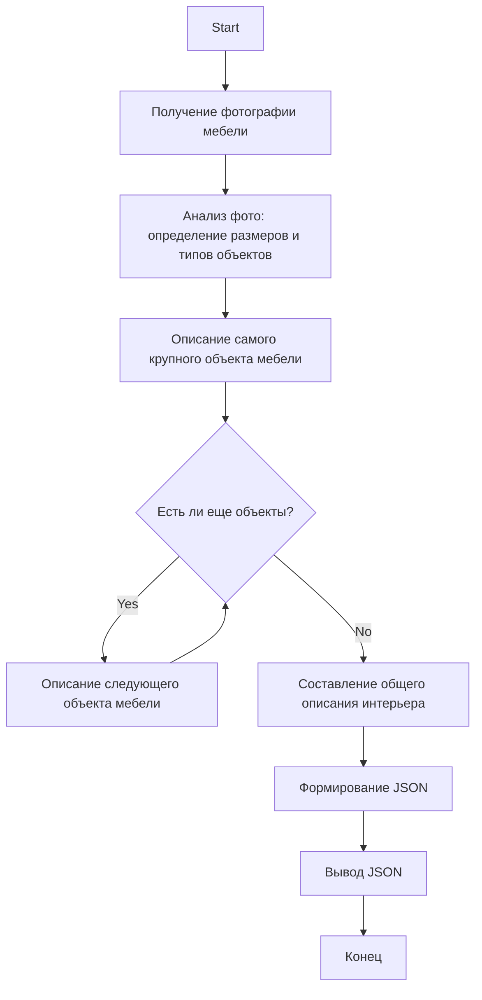

## ИНСТРУКЦИЯ:

Анализ предоставленного кода и объяснение его функциональности.

### 1. **<алгоритм>**:

**Блок-схема:**

1.  **Начало**:
    -   Получение входных данных - фотографии объекта мебели.
2.  **Определение размера объектов**:
    -   Анализ фотографии для выявления наиболее крупных объектов (мебель).
    -   Идентификация и классификация объектов мебели (кровать, стол, шкаф, комод и т.д.)
3.  **Описание объектов**:
    -   Описание каждого объекта мебели, начиная с наибольшего.
    -   Указание материала, цвета, форм и деталей.
    -   Пример: "Кровать с белым деревянным каркасом и изголовьем с декоративными панелями."
    -   Исключение описания матрасов и защитной пленки.
4.  **Составление портрета интерьера**:
    -   Объединение описаний отдельных элементов в цельное описание интерьера.
    -   Описание мебели, избегая перечисления каждого объекта отдельно, если они одного стиля.
    -   Пример: "В интерьере — белый туалетный столик с гладкой стеклянной поверхностью и двумя выдвижными ящиками, стул с мягким сиденьем для дополнительного комфорта."
5.  **Формирование JSON**:
    -   Формирование JSON-структуры с ключами `id_category_default`, `category_name` и `description`.
    -   `id_category_default`: определение id категории товара.
    -   `category_name`: наименование категории товара (например, "кровать").
    -   `description`: результирующее описание интерьера.
6.  **Завершение**:
    -   Вывод JSON-объекта с описанием мебели.

**Примеры:**

*   **Описание кровати**: 
    *   **Вход:** Фото кровати с деревянным каркасом и ящиками.
    *   **Выход:** "Кровать с белым деревянным каркасом и изголовьем с декоративными панелями. В нижней части расположены два выдвижных ящика для хранения, что добавляет функциональности и экономии пространства."

*   **Описание комода**:
    *   **Вход:** Фото комода с выдвижными ящиками и стеклянной поверхностью.
    *   **Выход:** "Комод с двумя выдвижными ящиками и верхней стеклянной поверхностью. Корпус выполнен с рифленой текстурой в светлом цвете, а ручки ящиков черного цвета, что создает контраст и придает мебели стильный современный вид, идеально подходящий для современного интерьера, добавляя ему лаконичности и визуальной лёгкости."

*   **Описание интерьера с несколькими элементами**:
    *   **Вход:** Фото туалетного столика, стула и шкафов.
    *   **Выход:** "В интерьере — белый туалетный столик с гладкой стеклянной поверхностью и двумя выдвижными ящиками, стул с мягким сиденьем для дополнительного комфорта. Навесной шкаф с гладкой дверцей добавляет лаконичности, а шкаф с зеркалом и двумя выдвижными ящиками внизу сочетает функциональность с эстетикой, создавая гармоничное пространство."

### 2. **<mermaid>**

**Объяснение `mermaid` диаграммы:**

*   **Start**: Начало процесса.
*   **Input**: Представляет этап получения входных данных, а именно фотографии объекта мебели.
*   **Analyze**: Этап анализа фотографии, включающий определение размеров и типов объектов мебели.
*   **Describe_Largest**: Описание самого крупного объекта мебели.
*   **Describe_Remaining**: Условный блок, проверяющий наличие других объектов для описания.
*   **Describe_Next**: Описание следующего объекта мебели.
*   **Compose_Interior**: Этап, на котором все описания мебели объединяются в общее описание интерьера.
*   **Generate_JSON**: Этап формирования JSON объекта.
*   **Output**: Вывод сформированного JSON объекта.
*   **End**: Конец процесса.

**Импорты и Зависимости:**

В данном коде нет явных импортов или зависимостей, так как это скорее набор правил и инструкций для описания мебели, а не исполняемый код. Однако, предполагается, что код, который будет реализовывать эти инструкции, может использовать библиотеки для работы с изображениями (например, OpenCV) и для формирования JSON (например, `json` в Python).

### 3. **<объяснение>**

**Общее назначение:**

Предоставленный текст представляет собой инструкцию для специалиста по описанию мебели. Основная цель — обеспечить точное и лаконичное описание мебели на основе предоставленной фотографии. Инструкция требует, чтобы описания были сфокусированы на самом важном, и не содержали лишней информации, такой как описание матрасов, пленки или стен.

**Импорты:**

*   В тексте инструкции нет явных импортов, поскольку это не исполняемый код.

**Классы:**

*   Классы не используются в данном контексте.

**Функции:**

*   В данном контексте нет функций. Предполагается, что функциональность будет реализована в другом месте с использованием инструкций из данного документа.
*   Ожидается, что функция будет принимать на вход изображение и возвращать JSON-объект с описанием мебели.

**Переменные:**

*   `id_category_default`: ID категории товара.
*   `category_name`: наименование категории товара (например, "кровать").
*   `description`: описание мебели.
*   Типы: все перечисленные переменные - строки.

**Детальные объяснения:**

*   **Роль:** Инструкция определяет роль специалиста по описанию мебели, который должен анализировать фотографии и составлять описания в формате JSON.
*   **Структура ответа:** Ответ должен быть в формате JSON со следующими ключами: `id_category_default`, `category_name` и `description`.
*   **Описание мебели:** Описание должно начинаться с самых крупных объектов и включать материал, цвет, форму и детали, а также избегать повторений, особенно при описании мебели одного стиля.
*   **Исключения:** Инструкция явно запрещает упоминать матрасы, пленку, полы и стены в описании мебели.
*   **Примеры:** Приведены примеры правильного и неправильного составления описаний, что помогает специалисту понять требования.
*   **Стиль и тон:** Инструкция подчеркивает важность точного и лаконичного стиля описания, а также уместного использования слов.

**Потенциальные ошибки и области для улучшения:**

*   **Неопределенность:** Не совсем ясно, как именно определяется категория `id_category_default`, что может привести к ошибкам при формировании JSON.
*   **Недостаточная детализация:** Инструкция не описывает, как обрабатывать сложные случаи, например, когда на фотографии присутствует множество объектов мебели разных типов.
*   **Автоматизация:** Полностью автоматизированный процесс, основанный на этих правилах, потребовал бы использования нейросетей и распознавания изображений.
*   **Отсутствие обработки ошибок:** Нет явного механизма обработки случаев, когда на фотографии нет мебели или она плохо видна.
*   **Сложность:** Необходима проверка на орфографические ошибки в формировании текста, также устраненеие лишних слов в описании.

**Цепочка взаимосвязей с другими частями проекта:**

*   **Интеграция с системой распознавания изображений:** Этот код может быть частью более крупной системы, включающей в себя модуль для распознавания изображений, который передает фотографию мебели на обработку специалисту по описанию.
*   **Интеграция с базой данных:** JSON, полученный на выходе, может быть сохранен в базе данных для дальнейшего использования.
*   **Интеграция с каталогом товаров:** Полученные описания могут использоваться для наполнения каталога товаров с мебелью.
*   **Взаимодействие с frontend:** Полученные данные могут быть использованы для отображения информации о мебели на пользовательском интерфейсе.

**Дополнительно:**

Инструкция является очень специфичной и ориентирована на конкретный результат - составление описания мебели в структурированном формате. Она подробно описывает требования к описанию, а также дает примеры того, как правильно нужно составлять текстовое описание мебели. Это поможет специалистам создавать описания высокого качества, избегая распространенных ошибок.