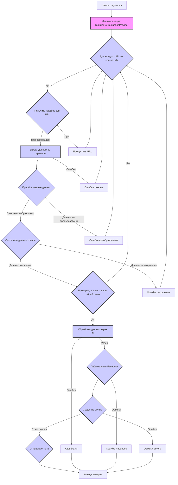
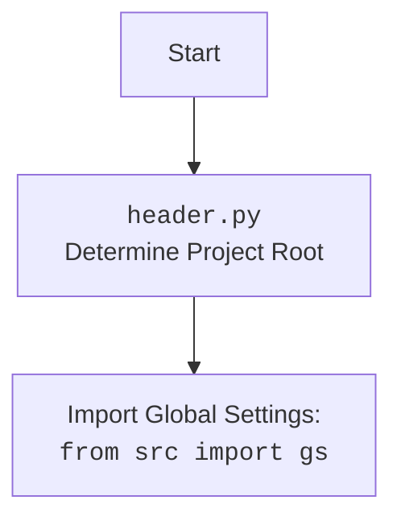

## АНАЛИЗ КОДА: `from_supplier_to_prestashop.py`

### 1. <алгоритм>

**Блок-схема обработки данных о продукте от поставщика до публикации в Prestashop:**



**Примеры:**
1.  **Инициализация `SupplierToPrestashopProvider`:** Создается объект класса, загружаются настройки из `emil.json`, устанавливаются пути для хранения данных и настраивается модель `GoogleGenerativeAI`.
    
2.  **Получение граббера:**  Для URL `'https://example.com/product1'`, вызывается `get_graber_by_supplier_url()`, который возвращает объект граббера, например, `AliexpressGraber()`, если URL содержит домен `aliexpress.com`.
    
3.  **Захват данных со страницы:** Для объекта `AliexpressGraber` вызывается `grab_page()`,  который  возвращает объект `ProductFields`, содержащий такие атрибуты как `id_product`, `name`, `description_short`, `description`, `specification`, `local_image_path`.
    
4.  **Преобразование данных:** Функция `convert_product_fields` преобразует объект `ProductFields` в словарь, готовый для обработки AI, с обязательными полями `product_title`, `product_id`, `description_short` и т.д.
    
5.  **Сохранение данных:** Функция `save_product_data` сохраняет данные в формате JSON в файл, например, `export_path/products/12345.json`
    
6.  **Обработка данных через AI:**  Функция `process_ai` отправляет данные в AI модель, получая результат на двух языках `ru` и `he`.
    
7.  **Публикация в Facebook:** Функция `post_facebook` публикует сообщение и загружает медиа-файлы в Facebook.
    
8.  **Генерация отчёта:** Функция `create_report` генерирует отчёт в форматах `html` и `pdf`.

### 2. <mermaid>

```mermaid
flowchart TD
    Start[Start Scenario: `run_scenario`]
    Start --> LoadConfig[Load Configuration: `self.config = j_loads_ns(...)`];
    LoadConfig --> SetPaths[Set Export Paths: `self.export_path = ...`];
    SetPaths --> InitAI[Initialize AI Model: `self.model = GoogleGenerativeAI(...)`];
    InitAI --> LoopUrls[Loop through URLs: `for url in urls:`];
    LoopUrls --> GetGrabber[Get Grabber: `self.get_graber_by_supplier_url(url)`];
     GetGrabber -- Grabber Found --> GrabPage[Grab Product Data: `graber.grab_page(...)`];
       GrabPage -- Success --> ConvertFields[Convert Product Fields: `self.convert_product_fields(f)`];
         ConvertFields -- Success --> SaveData[Save Product Data: `self.save_product_data(product_data)`];
          SaveData -- Success --> AddToList[Append data to `products_list`];

       SaveData -- Fail --> NextUrl[Next URL];

         ConvertFields -- Fail --> NextUrl1[Next URL];
          GrabPage -- Fail --> NextUrl2[Next URL];
    GetGrabber -- Grabber Not Found --> NextUrl3[Next URL];
     NextUrl --> LoopUrls
      NextUrl1 --> LoopUrls
       NextUrl2 --> LoopUrls
        NextUrl3 --> LoopUrls
   AddToList --> CheckAllProcessed{Check if all URLs processed};
   CheckAllProcessed -- No --> LoopUrls;
   CheckAllProcessed -- Yes --> ProcessAI[Process data with AI: `self.process_ai(products_list)`];
    ProcessAI --> PostFacebook[Post to Facebook: `self.post_facebook(mexiron)`];
   PostFacebook --> GenerateReport[Generate Report: `self.create_report(...)`];

    GenerateReport --> End[End Scenario];

     style LoadConfig fill:#f9f,stroke:#333,stroke-width:2px
    style SetPaths fill:#f9f,stroke:#333,stroke-width:2px
    style InitAI fill:#f9f,stroke:#333,stroke-width:2px
        style LoopUrls fill:#ccf,stroke:#333,stroke-width:2px
   style GetGrabber fill:#ccf,stroke:#333,stroke-width:2px
    style GrabPage fill:#ccf,stroke:#333,stroke-width:2px
    style ConvertFields fill:#ccf,stroke:#333,stroke-width:2px
    style SaveData fill:#ccf,stroke:#333,stroke-width:2px
 style AddToList fill:#ccf,stroke:#333,stroke-width:2px
   style CheckAllProcessed fill:#ccf,stroke:#333,stroke-width:2px
     style ProcessAI fill:#ccf,stroke:#333,stroke-width:2px
     style PostFacebook fill:#ccf,stroke:#333,stroke-width:2px
     style GenerateReport fill:#ccf,stroke:#333,stroke-width:2px


```

**Зависимости:**

*   `Start` - Начало сценария `run_scenario`
*   `LoadConfig` - Загружает конфигурационные настройки из файла `emil.json`.
*   `SetPaths` - Устанавливает пути для сохранения данных на основе настроек.
*   `InitAI` - Инициализирует модель `GoogleGenerativeAI` с инструкциями и API-ключом.
*   `LoopUrls` - Цикл по списку URL.
*   `GetGrabber` - Получает объект граббера для конкретного URL.
*   `GrabPage` - Захватывает данные продукта со страницы.
*   `ConvertFields` - Преобразует данные продукта в словарь.
*  `SaveData` - Сохраняет данные в JSON файл
*   `AddToList` - Добавляет данные в `products_list`.
*   `CheckAllProcessed` - Проверяет, все ли URL обработаны.
*   `ProcessAI` - Обрабатывает данные через AI модель.
*   `PostFacebook` - Публикует сообщение в Facebook.
*   `GenerateReport` - Генерирует отчет в форматах HTML и PDF.
*   `End` - Конец сценария

**Диаграмма для `header.py`:**



### 3. <объяснение>

#### Импорты:

*   **`from __future__ import annotations`**:  Позволяет использовать аннотации типов в более гибкой форме, включая ссылки на типы, которые ещё не полностью определены.
*   **`import asyncio`**:  Предоставляет инструменты для асинхронного программирования, позволяет выполнять несколько задач одновременно.
*  **`import random`**: Модуль для генерации случайных чисел, используется для создания различных случайных значений.
*   **`import shutil`**:  Модуль для высокоуровневых файловых операций, таких как копирование и удаление файлов.
*   **`from pathlib import Path`**:  Класс для работы с путями файловой системы, упрощает манипуляции с путями.
*  **`from typing import Optional, List`**: Используется для определения необязательных (Optional) и списочных (List) типов переменных.
*  **`from types import SimpleNamespace`**:  Простой класс для создания объектов, к атрибутам которых можно обращаться через точку.
*   **`from dataclasses import field`**:  Функция для создания полей данных в классах данных.
*  **`from telegram import Update`**: Импортирует класс `Update` для обработки обновлений от Telegram.
*  **`from telegram.ext import CallbackContext`**: Класс контекста для обработчиков Telegram.
*   **`import header`**:  Импортирует модуль `header.py`, который вероятно определяет корень проекта и загружает глобальные настройки.
*   **`from src import gs`**: Импортирует глобальные настройки проекта, доступные через объект `gs`.
*  **`from src.endpoints.prestashop.product_fields import ProductFields`**: Импортирует класс `ProductFields`, представляющий структуру данных для товара Prestashop.
*  **`from src.webdriver.driver import Driver`**: Импортирует класс `Driver` для управления Selenium WebDriver.
*   **`from src.ai.gemini import GoogleGenerativeAI`**:  Импортирует класс для работы с AI моделью Gemini.
*   **`from src.endpoints.advertisement.facebook.scenarios import post_message_title, upload_post_media, message_publish`**: Импортирует функции для работы с Facebook API.
*   **`from src.utils.jjson import j_loads, j_loads_ns, j_dumps`**: Импортирует функции для работы с JSON данными.
*   **`from src.utils.file import read_text_file, save_text_file, recursively_get_file_path`**: Импортирует функции для работы с файлами.
*   **`from src.utils.image import save_image_from_url, save_image`**:  Импортирует функции для работы с изображениями.
*   **`from src.utils.convertors.unicode import decode_unicode_escape`**: Импортирует функцию для декодирования Unicode-последовательностей.
*   **`from src.utils.printer import pprint`**: Импортирует функцию для форматированного вывода.
*   **`from src.logger.logger import logger`**:  Импортирует объект для логирования событий.

#### Класс `SupplierToPrestashopProvider`:

*   **Назначение:** Управляет процессом извлечения, обработки и сохранения данных о продуктах от поставщика до публикации в Prestashop.
*   **Атрибуты:**
    *   `driver` (`Driver`): Объект WebDriver для взаимодействия с браузером.
    *   `export_path` (`Path`): Путь к папке для сохранения данных.
    *   `mexiron_name` (`str`): Название Mexiron.
    *    `price` (`float`): Цена для товара.
    *    `timestamp` (`str`): Временная метка.
    *   `products_list` (`List`): Список словарей с данными о товарах.
    *   `model` (`GoogleGenerativeAI`): Объект AI модели.
    *   `config` (`SimpleNamespace`): Объект с конфигурационными настройками.
    *   `update` (`Update`): Объект для работы с обновлениями Telegram.
    *   `context` (`CallbackContext`): Объект для хранения контекста Telegram.
*   **Методы:**
    *   `__init__(self, driver: Driver)`: Инициализирует класс, загружает конфигурации, устанавливает пути, настраивает AI модель.
    *   `run_scenario(self, update: Update, context: CallbackContext, urls: list[str], price: Optional[str] = '', mexiron_name: Optional[str] = '')`: Основной метод, управляющий сценарием: парсит товары, обрабатывает AI, сохраняет данные.
    *   `convert_product_fields(self, f: ProductFields) -> dict`: Конвертирует объект `ProductFields` в словарь.
    *   `save_product_data(self, product_data: dict)`: Сохраняет данные товара в файл.
    *   `process_ai(self, products_list: List[str], lang:str,  attempts: int = 3) -> tuple | bool`: Обрабатывает данные через AI модель.
    *   `post_facebook(self, mexiron:SimpleNamespace) -> bool`: Публикует сообщение в Facebook.
    *   `create_report(self, data: dict, lang:str, html_file: Path, pdf_file: Path) -> bool`: Генерирует отчёт в форматах `html` и `pdf`.

#### Функции:
*   `get_graber_by_supplier_url()`: Функция, которая определяет какой граббер использовать, исходя из URL.
*   `post_message_title(self.d, title)`: Публикует сообщение в Facebook.
*   `upload_post_media(self.d, media = mexiron.products)`: Загружает медиафайлы в Facebook.
*   `message_publish(self.d)`: Публикует сообщение с медиафайлами в Facebook.
*   `j_loads`, `j_dumps` ,`j_loads_ns`: функции для обработки JSON.
*   `read_text_file`, `save_text_file`, `recursively_get_file_path`: функции для работы с файлами.
*   `save_image_from_url`, `save_image`: Функции для работы с изображениями.
*   `decode_unicode_escape`: Функция для декодирования unicode.
*   `pprint`: Функция для форматированного вывода.
*   `logger.error`, `logger.debug`, `logger.warning`: функции для логирования.

#### Переменные:

*   `required_fields` (`tuple`): Кортеж с полями, необходимыми для обработки товара.
*   `urls` (`list`): Список URL-адресов товаров для обработки.
*   `price` (`str`): Цена товара (может быть пустой).
*   `mexiron_name` (`str`): Название Mexiron (может быть пустой).
*   `storage`: Путь к папке для хранения данных на основе настроек.
*   `api_key`: API ключ для доступа к Gemini.
*    `model_command`: Команда для AI модели.
*   `response`: Ответ от AI модели.
*   `response_dict`: Словарь, преобразованный из ответа AI.
*   `file_path`: Путь к файлу, в который сохраняются данные.
*    `html_file`, `pdf_file`: пути к сгенерированным файлам отчета.
*    `generator`: Объект для создания отчетов.

#### Потенциальные ошибки и области для улучшения:

1.  **Обработка ошибок:**
    *   В коде есть `try-except` блоки, но не все исключения обрабатываются с должной детальностью, отсутствует обработка `except` без указания типа ошибки `except Exception as ex:`.
    *   Не всегда понятно, как обрабатываются ошибки внутри функций, и как это влияет на общий ход выполнения сценария.
    *   Нужно добавить больше логирования ошибок и исключений для отладки.
2.  **Валидация данных:**
    *   Недостаточно строгая проверка корректности данных, полученных от граббера или AI.
    *   Нужна проверка входных данных (например, URL, цены, названия) на соответствие формату.
3.  **Производительность:**
    *   Слишком много вызовов `strip()` и `replace()` в методе `convert_product_fields`, что может замедлить обработку больших объемов данных.
    *   Необходимо добавить асинхронность для всех операций, особенно при работе с сетью или диском.
4.  **Повторное использование кода:**
    *   Некоторые функции, такие как сохранение данных, могут быть вынесены в отдельные модули для повторного использования.
5.  **AI модель:**
    *   Обработка ошибок, связанных с моделью AI (например, невалидный ответ), выполняется не оптимально.
    *   Нужен механизм повторной отправки запроса или альтернативный алгоритм обработки, если AI выдал ошибку.
6.  **Управление зависимостями:**
    *   Код сильно зависит от глобального объекта `gs`, что затрудняет тестирование и переиспользование. Нужно рассмотреть внедрение зависимостей.

#### Взаимосвязи с другими частями проекта:

*   **`src.suppliers`:** Модуль, содержащий грабберы для различных поставщиков (например, `aliexpress`).
*   **`src.endpoints.prestashop`:** Модуль для работы с API Prestashop.
*  **`src.webdriver`:** Модуль, предоставляющий функциональность для работы с веб-драйверами.
*   **`src.ai`:** Модуль для работы с моделями искусственного интеллекта, в частности с `GoogleGenerativeAI`.
*   **`src.endpoints.advertisement.facebook`:** Модуль для работы с Facebook API для публикации рекламы.
*   **`src.utils`:** Модуль, содержащий вспомогательные утилиты (работа с JSON, файлами, изображениями, unicode).
*   **`src.logger`:** Модуль для логирования.
*   `header.py` - Модуль, который устанавливает корень проекта и загружает глобальные настройки, доступные через `gs`.

**Дополнительные замечания:**

*   В коде есть много  `...`  и `continue` без объяснения, что может затруднить отладку. Нужно добавлять комментарии или логи для лучшего понимания.
*   Код написан с применением `f-строк` для логирования и форматирования строк. Это облегчает чтение и модификацию кода.
*   Используются асинхронные операции, что делает код более эффективным при работе с I/O.
*  В коде встречается вызов `self.driver.wait(5)`, который помечен как "Замедлитель", что указывает на потенциальное решение проблемы с задержками.