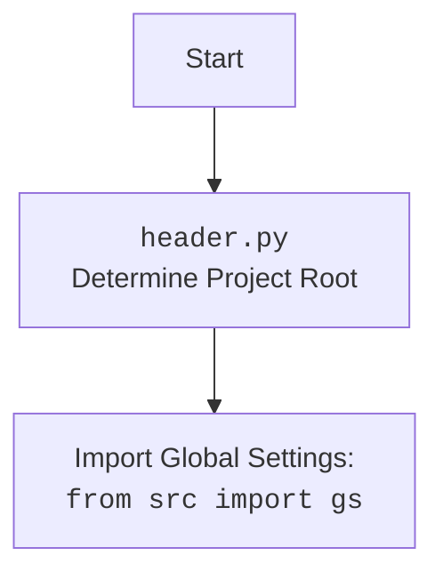

## АНАЛИЗ КОДА: `hypotez/src/endpoints/emil/scenarios/from_supplier_to_prestashop.py`

### 1. <алгоритм>
**Блок-схема рабочего процесса:**

1.  **Инициализация `SupplierToPrestashopProvider`:**
    *   Принимает `driver` (экземпляр WebDriver).
    *   Загружает конфигурацию из `emil.json`.
    *   Устанавливает `timestamp`.
    *   Определяет путь экспорта `export_path`.
    *   Загружает системные инструкции из `system_instruction_mexiron.md`.
    *   Инициализирует модель `GoogleGenerativeAI`.
    *   Пример: `provider = SupplierToPrestashopProvider(driver)`

2.  **`run_scenario` (асинхронная функция):**
    *   Принимает `update` (Telegram Update), `context` (CallbackContext), `urls` (список URL товаров), `price`, `mexiron_name` (опционально).
    *   Итерируется по списку `urls`.
        *   Определяет граббер (`get_graber_by_supplier_url`) на основе URL поставщика.
            *   Пример: `graber = self.get_graber_by_supplier_url("https://aliexpress.com/item/...")`
        *   Если граббер найден:
            *   Выводит сообщение в чат о начале обработки URL.
            *   Запускает граббер (`graber.grab_page`) для извлечения данных о товаре.
                *   Пример: `f = await graber.grab_page('id_product', 'name', 'description_short', 'description', 'specification', 'local_image_path')`
            *   Конвертирует поля товара в словарь (`convert_product_fields`).
                *   Пример: `product_data = await self.convert_product_fields(f)`
            *   Сохраняет данные товара (`save_product_data`).
            *   Добавляет `product_data` в список `products_list`.
        *   Если граббер не найден, пропускает URL.
    *   Завершает работу после обработки всех URL.

3.  **`convert_product_fields` (асинхронная функция):**
    *   Принимает объект `ProductFields`.
    *   Извлекает данные о товаре из `ProductFields`, форматирует их в словарь с ключами:
        *   `product_title`, `product_id`, `description_short`, `description`, `specification`, `local_image_path`.
        *   Пример:`{'product_title': 'Название товара', 'product_id': '123', 'description_short': 'Короткое описание', ... }`
    *   Возвращает словарь с данными товара.
    *   Возвращает пустой словарь `{}` если `f.id_product` не определен.

4.  **`save_product_data` (асинхронная функция):**
    *   Принимает словарь `product_data`.
    *   Формирует путь к файлу JSON на основе `product_id` и сохраняет `product_data` в формате JSON.
        *   Пример: `file_path =  /path/to/export/products/123.json`
    *   Возвращает `True` если сохранение успешно, иначе `None`.

5.  **`process_ai` (асинхронная функция):**
    *   Принимает `products_list` (список данных о товарах), `lang`, `attempts` (количество попыток).
    *   Читает инструкцию для ИИ из файла.
    *   Формирует запрос для ИИ, комбинируя инструкцию и данные о товарах.
    *   Отправляет запрос в модель `GoogleGenerativeAI`.
    *   Если ответ получен:
        *   Парсит ответ в словарь.
        *   Если парсинг успешен, возвращает словарь.
        *   Если парсинг не удался, вызывает себя рекурсивно с уменьшенным числом `attempts`.
    *   Возвращает пустой словарь `{}` если не удалось получить валидный ответ.
       
6.  **`post_facebook` (асинхронная функция):**
    *   Принимает `mexiron` (SimpleNamespace) c данными о мехироне.
    *   Переходит по ссылке на профиль Facebook.
    *   Формирует заголовок из полей `title`, `description`, `price` и `currency`.
    *   Вызывает функции `post_message_title`, `upload_post_media`, `message_publish` из `src.endpoints.advertisement.facebook.scenarios` для постинга в Facebook.
    *   Возвращает `True` если все операции успешны.

7.  **`create_report` (асинхронная функция):**
    *   Принимает `data` (словарь с данными), `lang` (язык), `html_file`, `pdf_file` (пути к файлам).
    *   Инициализирует `ReportGenerator`.
    *   Создает отчет в форматах HTML и PDF.
    *   Если создание PDF-файла успешно, отправляет его боту и возвращает `True`.
    *   Если PDF-файл не найден или не является файлом, логирует ошибку и возвращает `None`.

### 2. <mermaid>

```mermaid
flowchart TD
    Start[Start] --> InitProvider[Initialize SupplierToPrestashopProvider]
    InitProvider --> LoadConfig[Load configuration from emil.json]
    LoadConfig --> SetTimestamp[Set timestamp]
    SetTimestamp --> SetExportPath[Set export path]
    SetExportPath --> LoadInstructions[Load AI instructions from system_instruction_mexiron.md]
    LoadInstructions --> InitModel[Initialize GoogleGenerativeAI model]
    InitModel --> RunScenario[Run scenario: run_scenario]

    RunScenario --> LoopUrls[Loop through URLs]
    LoopUrls -- URL exists --> GetGraber[Get grabber by supplier URL: get_graber_by_supplier_url]
    GetGraber -- grabber found --> GrabPage[Grab page data: grab_page(*required_fields)]
    GrabPage --> ConvertData[Convert product fields: convert_product_fields]
    ConvertData --> SaveData[Save product data: save_product_data]
    SaveData --> AppendData[Append product data to list]
    AppendData --> LoopUrls
    GetGraber -- grabber not found --> LoopUrls
    LoopUrls -- No more URLs --> ProcessAI[Process product data by AI: process_ai]
     
    RunScenario --> ProcessAI
    ProcessAI --> PostFacebook[Post message to Facebook: post_facebook]
    PostFacebook --> CreateReport[Create report in html and pdf: create_report]
    CreateReport --> End[End]
    
     style Start fill:#f9f,stroke:#333,stroke-width:2px
     style End fill:#ccf,stroke:#333,stroke-width:2px

    classDef function fill:#ccf,stroke:#333,stroke-width:1px
    class InitProvider, LoadConfig, SetTimestamp, SetExportPath, LoadInstructions, InitModel, RunScenario, LoopUrls, GetGraber, GrabPage, ConvertData, SaveData, AppendData, ProcessAI, PostFacebook, CreateReport function

```



**Объяснение зависимостей в `mermaid`:**

*   `Start`: Начало процесса.
*   `InitProvider`: Инициализирует класс `SupplierToPrestashopProvider`, который является основным компонентом, управляющим сценарием.
*   `LoadConfig`: Загружает конфигурацию приложения из JSON-файла.
*   `SetTimestamp`: Устанавливает временную метку для логирования и других целей.
*   `SetExportPath`: Определяет путь, куда будут сохраняться сгенерированные файлы.
*   `LoadInstructions`: Загружает инструкции для модели ИИ из файла.
*   `InitModel`: Инициализирует модель ИИ `GoogleGenerativeAI`.
*   `RunScenario`: Запускает основной сценарий обработки данных.
*   `LoopUrls`: Цикл перебора URL товаров.
*   `GetGraber`: Получает объект-граббер для конкретного поставщика на основе URL.
*   `GrabPage`: Извлекает необходимые поля товара со страницы.
*   `ConvertData`: Преобразует полученные поля в формат словаря.
*   `SaveData`: Сохраняет преобразованные данные в JSON-файл.
*   `AppendData`: Добавляет полученные данные в список `products_list`.
*    `ProcessAI`: Обрабатывает данные товара с использованием модели ИИ.
*   `PostFacebook`: Публикует сообщение с медиа на Facebook.
*   `CreateReport`: Создает отчет в формате HTML и PDF.
*   `End`: Конец процесса.
* `header.py` - отвечает за определение корневой директории проекта и импорт глобальных настроек.

Все переменные имеют осмысленные имена, отражающие их роль в процессе.

### 3. <объяснение>

**Импорты:**

*   `from __future__ import annotations`: Позволяет использовать аннотации типов, такие как `List`, `Optional` и др., без необходимости импорта из `typing`.
*   `import asyncio`: Библиотека для асинхронного программирования, позволяет выполнять несколько задач параллельно, что важно для работы с веб-запросами и операциями ввода-вывода.
*    `import random`: Библиотека для генерации случайных чисел. В данном случае используется в коде, но не видно явного применения в предоставленном фрагменте. 
*   `import shutil`: Библиотека для высокоуровневых операций с файлами (копирование, удаление и т.д.).
*   `from pathlib import Path`: Класс для работы с путями файлов и каталогов.
*   `from typing import Optional, List`: Аннотации типов для указания необязательных параметров и списков.
*   `from types import SimpleNamespace`: Класс для создания простых объектов с атрибутами, доступными по имени.
*   `from dataclasses import field`: Используется для создания полей данных класса, например, для определения `products_list` как списка по умолчанию.
*   `from telegram import Update`: Класс для обработки входящих обновлений от Telegram.
*   `from telegram.ext import CallbackContext`: Класс для работы с контекстом Telegram бота.
*   `import header`: Модуль, определяющий корневую директорию проекта.
*   `from src import gs`: Импортирует глобальные настройки из модуля `gs`.
*   `from src.endpoints.prestashop.product_fields import ProductFields`: Импортирует класс для представления данных о товаре.
*   `from src.webdriver.driver import Driver`: Импортирует класс для управления браузером с помощью Selenium.
*   `from src.ai.gemini import GoogleGenerativeAI`: Импортирует класс для работы с моделью ИИ Google Gemini.
*    `from src.endpoints.advertisement.facebook.scenarios import post_message_title, upload_post_media, message_publish`: Импортирует функции для работы с Facebook API.
*   `from src.utils.jjson import j_loads, j_loads_ns, j_dumps`: Функции для работы с JSON.
*   `from src.utils.file import read_text_file, save_text_file, recursively_get_file_path`: Функции для чтения и сохранения текстовых файлов.
*   `from src.utils.image import save_png_from_url, save_png`: Функции для работы с изображениями.
*   `from src.utils.convertors.unicode import decode_unicode_escape`: Функция для декодирования unicode escape последовательностей.
*   `from src.utils.printer import pprint`: Функция для красивого вывода данных.
*   `from src.logger.logger import logger`: Функция для логгирования.

**Класс `SupplierToPrestashopProvider`:**

*   **Роль:** Организует и управляет процессом извлечения данных о товарах от поставщиков, их обработки с помощью ИИ и последующей публикации.
*   **Атрибуты:**
    *   `driver`: Экземпляр `webdriver.Driver` для управления браузером.
    *   `export_path`: Путь для сохранения результатов работы.
    *   `mexiron_name`: Имя мехирона (каталога товаров).
    *   `price`: Цена товаров.
    *   `timestamp`: Временная метка.
    *   `products_list`: Список обработанных данных о товарах.
    *   `model`: Экземпляр `GoogleGenerativeAI` для взаимодействия с ИИ.
    *   `config`: Конфигурация приложения, загруженная из файла `emil.json`.
    *   `update`: Объект `Update` от Telegram.
    *   `context`: Объект `CallbackContext` от Telegram.
*   **Методы:**
    *   `__init__`: Инициализирует класс, загружает конфигурацию, устанавливает пути, инициализирует модель ИИ.
    *   `run_scenario`: Основная логика сценария. Итерируется по списку URL, извлекает и обрабатывает данные, вызывает функции для сохранения и обработки данных с помощью ИИ.
    *   `convert_product_fields`: Преобразует объект `ProductFields` в словарь.
    *   `save_product_data`: Сохраняет данные о товаре в JSON-файл.
    *   `process_ai`: Обрабатывает список товаров через модель ИИ.
    *   `post_facebook`: Публикует сообщение в Facebook.
    *  `create_report`: Создает отчет в формате HTML и PDF.

**Функции:**

*   `run_scenario`:
    *   **Аргументы:** `update`, `context`, `urls`, `price`, `mexiron_name`.
    *   **Возвращаемое значение:** `bool` (True/False) в зависимости от успеха выполнения сценария.
    *   **Назначение:** Управляет процессом парсинга страниц товаров, их обработки и сохранения.
*   `convert_product_fields`:
    *   **Аргументы:** `f` (объект `ProductFields`).
    *   **Возвращаемое значение:** `dict` (словарь с данными о товаре).
    *   **Назначение:** Преобразует данные товара из объекта `ProductFields` в формат словаря, пригодный для дальнейшей обработки.
*   `save_product_data`:
    *   **Аргументы:** `product_data` (словарь с данными о товаре).
    *   **Возвращаемое значение:** `bool` (True/False) в зависимости от успеха сохранения.
    *   **Назначение:** Сохраняет данные о товаре в JSON-файл.
*    `process_ai`:
    *    **Аргументы:** `products_list` (список данных о товарах), `lang` (язык), `attempts` (количество попыток).
    *   **Возвращаемое значение:** `tuple` (обработанный ответ) или `bool` (False в случае неудачи).
    *   **Назначение:** Отправляет запрос к модели ИИ для обработки данных о товарах.
*   `post_facebook`:
    *   **Аргументы:** `mexiron` (объект `SimpleNamespace` с данными о мехироне).
    *   **Возвращаемое значение:** `bool` (True/False) в зависимости от успеха публикации.
    *   **Назначение:** Публикует сообщение в Facebook с данными мехирона.
*    `create_report`:
    *    **Аргументы:** `data` (словарь с данными), `lang` (язык), `html_file`, `pdf_file` (пути к файлам).
    *   **Возвращаемое значение:** `bool` (True/False) в зависимости от успеха создания отчета.
    *   **Назначение:** Создает отчет в формате HTML и PDF.

**Переменные:**

*   Большинство переменных имеют понятные имена и соответствуют их назначению.
*   `required_fields`: Кортеж с названиями полей, которые нужно получить от грабера.
*   `self.config`: Объект `SimpleNamespace` с конфигурацией, загруженной из `emil.json`.
*   `self.timestamp`: Текущее время.
*   `self.export_path`: Путь к каталогу для сохранения данных.

**Потенциальные ошибки и области для улучшения:**

1.  **Обработка ошибок:** В коде есть блоки `try...except`, но в некоторых местах после ошибки стоит `...` вместо обработки. Необходимо добавить обработку ошибок для обеспечения стабильности работы программы.
2.  **Логирование:** Добавить логгирование в начале и конце важных функций, а также перед выходами из функций с ошибками для отслеживания процесса.
3.  **Улучшение обработки данных:** Добавить проверку на наличие обязательных полей в `product_data` перед сохранением.
4.  **Рекурсивный `process_ai`:** Рекурсивный вызов `process_ai` может привести к переполнению стека при большом количестве неудачных попыток.
5.  **Асинхронность:** Использовать асинхронный подход во всех возможных местах.
6. **Управление драйвером браузера**: В коде не прослеживается явного закрытия драйвера браузера, который был инициализирован. Рекомендуется добавить `driver.quit()` после завершения работы с ним.

**Взаимосвязь с другими частями проекта:**

*   `header.py` определяет корневую директорию проекта и импортирует глобальные настройки.
*   Модуль `src.product` предоставляет класс `ProductFields` для представления данных о товаре.
*   Модуль `src.webdriver` предоставляет класс `Driver` для управления браузером.
*   Модуль `src.ai` предоставляет класс `GoogleGenerativeAI` для работы с моделью ИИ.
*    `src.endpoints.advertisement.facebook.scenarios` содержит функции для публикации сообщений в Facebook.
*   `src.utils` содержит утилиты для работы с JSON, файлами, изображениями и т.д.
*   `src.logger` обеспечивает логирование работы программы.
*   `gs` - модуль с глобальными настройками и путями проекта.

Этот сценарий является частью более крупного проекта и обеспечивает функциональность по автоматическому сбору, обработке и публикации данных о товарах.