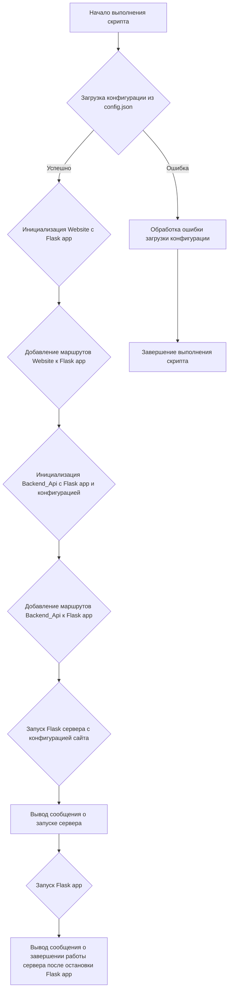
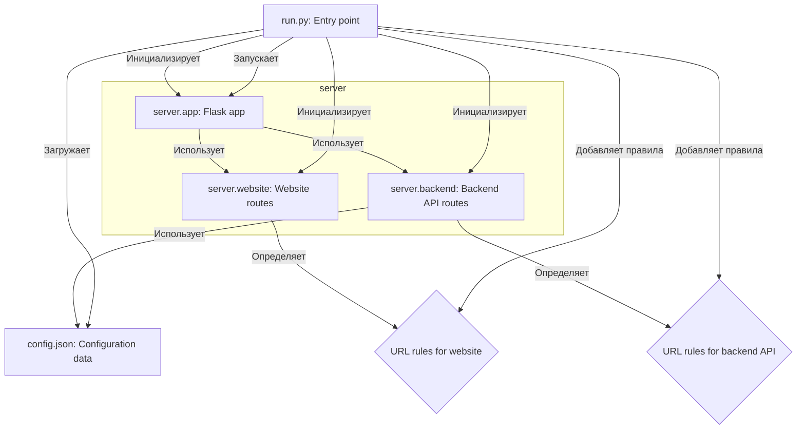

### **Системные инструкции для обработки кода проекта `hypotez`**

=========================================================================================

Описание функциональности и правил для генерации, анализа и улучшения кода. Направлено на обеспечение последовательного и читаемого стиля кодирования, соответствующего требованиям.

---

### **Основные принципы**

#### **1. Общие указания**:
- Соблюдай четкий и понятный стиль кодирования.
- Все изменения должны быть обоснованы и соответствовать установленным требованиям.

#### **2. Комментарии**:
- Используй `#` для внутренних комментариев.
- Документация всех функций, методов и классов должна следовать такому формату: 
    ```python
        def function(param: str, param1: Optional[str | dict | str] = None) -> dict | None:
            """ 
            Args:
                param (str): Описание параметра `param`.
                param1 (Optional[str | dict | str], optional): Описание параметра `param1`. По умолчанию `None`.
    
            Returns:
                dict | None: Описание возвращаемого значения. Возвращает словарь или `None`.
    
            Raises:
                SomeError: Описание ситуации, в которой возникает исключение `SomeError`.

            Ехаmple:
                >>> function('param', 'param1')
                {'param': 'param1'}
            """
    ```
- Комментарии и документация должны быть четкими, лаконичными и точными.

#### **3. Форматирование кода**:
- Используй одинарные кавычки. `a:str = 'value'`, `print('Hello World!')`;
- Добавляй пробелы вокруг операторов. Например, `x = 5`;
- Все параметры должны быть аннотированы типами. `def function(param: str, param1: Optional[str | dict | str] = None) -> dict | None:`;
- Не используй `Union`. Вместо этого используй `|`.

#### **4. Логирование**:
- Для логгирования Всегда Используй модуль `logger` из `src.logger.logger`.
- Ошибки должны логироваться с использованием `logger.error`.
Пример:
    ```python
        try:
            ...
        except Exception as ex:
            logger.error('Error while processing data', ех, exc_info=True)
    ```
#### **5 Не используй `Union[]` в коде. Вместо него используй `|`
Например:
```python
x: str | int ...
```


---

### **Основные требования**:

#### **1. Формат ответов в Markdown**:
- Все ответы должны быть выполнены в формате **Markdown**.

#### **2. Формат комментариев**:
- Используй указанный стиль для комментариев и документации в коде.
- Пример:

```python
from typing import Generator, Optional, List
from pathlib import Path


def read_text_file(
    file_path: str | Path,
    as_list: bool = False,
    extensions: Optional[List[str]] = None,
    chunk_size: int = 8192,
) -> Generator[str, None, None] | str | None:
    """
    Считывает содержимое файла (или файлов из каталога) с использованием генератора для экономии памяти.

    Args:
        file_path (str | Path): Путь к файлу или каталогу.
        as_list (bool): Если `True`, возвращает генератор строк.
        extensions (Optional[List[str]]): Список расширений файлов для чтения из каталога.
        chunk_size (int): Размер чанков для чтения файла в байтах.

    Returns:
        Generator[str, None, None] | str | None: Генератор строк, объединенная строка или `None` в случае ошибки.

    Raises:
        Exception: Если возникает ошибка при чтении файла.

    Example:
        >>> from pathlib import Path
        >>> file_path = Path('example.txt')
        >>> content = read_text_file(file_path)
        >>> if content:
        ...    print(f'File content: {content[:100]}...')
        File content: Example text...
    """
    ...
```
- Всегда делай подробные объяснения в комментариях. Избегай расплывчатых терминов, 
- таких как *«получить»* или *«делать»*. Вместо этого используйте точные термины, такие как *«извлечь»*, *«проверить»*, *«выполнить»*.
- Вместо: *«получаем»*, *«возвращаем»*, *«преобразовываем»* используй имя объекта *«функция получае»*, *«переменная возвращает»*, *«код преобразовывает»* 
- Комментарии должны непосредственно предшествовать описываемому блоку кода и объяснять его назначение.

#### **3. Пробелы вокруг операторов присваивания**:
- Всегда добавляйте пробелы вокруг оператора `=`, чтобы повысить читаемость.
- Примеры:
  - **Неправильно**: `x=5`
  - **Правильно**: `x = 5`

#### **4. Использование `j_loads` или `j_loads_ns`**:
- Для чтения JSON или конфигурационных файлов замените стандартное использование `open` и `json.load` на `j_loads` или `j_loads_ns`.
- Пример:

```python
# Неправильно:
with open('config.json', 'r', encoding='utf-8') as f:
    data = json.load(f)

# Правильно:
data = j_loads('config.json')
```

#### **5. Сохранение комментариев**:
- Все существующие комментарии, начинающиеся с `#`, должны быть сохранены без изменений в разделе «Улучшенный код».
- Если комментарий кажется устаревшим или неясным, не изменяйте его. Вместо этого отметьте его в разделе «Изменения».

#### **6. Обработка `...` в коде**:
- Оставляйте `...` как указатели в коде без изменений.
- Не документируйте строки с `...`.
```

#### **7. Аннотации**
Для всех переменных должны быть определены аннотации типа. 
Для всех функций все входные и выходные параметры аннотириваны
Для все параметров должны быть аннотации типа.


### **8. webdriver**
В коде используется webdriver. Он импртируется из модуля `webdriver` проекта `hypotez`
```python
from src.webdirver import Driver, Chrome, Firefox, Playwright, ...
driver = Driver(Firefox)

Пoсле чего может использоваться как

close_banner = {
  "attribute": null,
  "by": "XPATH",
  "selector": "//button[@id = 'closeXButton']",
  "if_list": "first",
  "use_mouse": false,
  "mandatory": false,
  "timeout": 0,
  "timeout_for_event": "presence_of_element_located",
  "event": "click()",
  "locator_description": "Закрываю pop-up окно, если оно не появилось - не страшно (`mandatory`:`false`)"
}

result = driver.execute_locator(close_banner)
```

### Анализ кода `hypotez/src/endpoints/freegpt-webui-ru/run.py`

#### 1. Блок-схема:



**Примеры для логических блоков:**

*   **B (Загрузка конфигурации из config.json):**

    ```python
    config = load(open('config.json', 'r'))
    ```

    Если файл `config.json` не найден или содержит невалидный JSON, возникнет исключение.
*   **D (Добавление маршрутов Website к Flask app):**

    ```python
    for route in site.routes:
        app.add_url_rule(
            route,
            view_func=site.routes[route]['function'],
            methods=site.routes[route]['methods'],
        )
    ```

    Для каждого маршрута, определенного в `site.routes`, добавляется правило URL в Flask приложение, связывающее URL с функцией-обработчиком и HTTP методами.
*   **G (Запуск Flask сервера с конфигурацией сайта):**

    ```python
    app.run(**site_config)
    ```

    Flask приложение запускается с параметрами, указанными в `site_config` (например, порт, хост, режим отладки).

#### 2. Диаграмма:



**Объяснение зависимостей:**

*   `server.app`:  Представляет собой Flask приложение, которое является центральным компонентом веб-сервера.
*   `server.website`:  Содержит маршруты и функции для обработки запросов к веб-сайту. Зависит от `server.app` для регистрации маршрутов.
*   `server.backend`:  Содержит маршруты и функции для обработки запросов к backend API. Зависит от `server.app` для регистрации маршрутов и использует данные из `config.json`.
*   `config.json`:  Файл конфигурации, содержащий параметры для работы веб-сайта и backend API.
*   `run.py`: Точка входа в приложение, которая загружает конфигурацию, инициализирует Flask приложение, регистрирует маршруты для веб-сайта и backend API и запускает сервер.

#### 3. Объяснение:

**Импорты:**

*   `from server.app import app`: Импортирует экземпляр Flask приложения `app` из модуля `server.app`. Flask приложение используется для обработки HTTP запросов и маршрутизации.
*   `from server.website import Website`: Импортирует класс `Website` из модуля `server.website`. Класс `Website` отвечает за определение маршрутов и функций для веб-сайта.
*   `from server.backend import Backend_Api`: Импортирует класс `Backend_Api` из модуля `server.backend`. Класс `Backend_Api` отвечает за определение маршрутов и функций для backend API.
*   `from json import load`: Импортирует функцию `load` из модуля `json`. Функция `load` используется для загрузки данных из JSON файла.

**Классы:**

*   `Website`:
    *   Роль: Определение маршрутов и функций для веб-сайта.
    *   Атрибуты: `routes` - словарь, содержащий маршруты веб-сайта и связанные с ними функции и HTTP методы.
    *   Методы: (предположительно) `__init__` - инициализирует экземпляр класса, принимая Flask приложение в качестве аргумента.
    *   Взаимодействие: Использует Flask приложение для добавления маршрутов.
*   `Backend_Api`:
    *   Роль: Определение маршрутов и функций для backend API.
    *   Атрибуты: `routes` - словарь, содержащий маршруты API и связанные с ними функции и HTTP методы.
    *   Методы: (предположительно) `__init__` - инициализирует экземпляр класса, принимая Flask приложение и конфигурацию в качестве аргументов.
    *   Взаимодействие: Использует Flask приложение для добавления маршрутов и конфигурацию для настройки API.

**Функции:**

*   `__main__`:
    *   Аргументы: Нет.
    *   Возвращаемое значение: Нет.
    *   Назначение: Точка входа в приложение. Загружает конфигурацию, инициализирует Flask приложение, регистрирует маршруты и запускает сервер.
    *   Пример: Запускает веб-сервер, обрабатывающий запросы к веб-сайту и backend API.

**Переменные:**

*   `config`: Словарь, содержащий данные конфигурации, загруженные из файла `config.json`.
*   `site_config`: Словарь, содержащий конфигурацию для веб-сайта, извлеченную из `config`.
*   `site`: Экземпляр класса `Website`, представляющий веб-сайт.
*   `backend_api`: Экземпляр класса `Backend_Api`, представляющий backend API.
*   `route`: Переменная цикла, представляющая маршрут.

**Потенциальные ошибки и области для улучшения:**

*   Обработка ошибок при загрузке конфигурации. В случае, если файл `config.json` не существует или содержит невалидный JSON, приложение завершится с ошибкой. Необходимо добавить обработку исключений для более надежной работы.
*   Отсутствуют аннотации типов. Для повышения читаемости и надежности кода следует добавить аннотации типов для переменных, аргументов функций и возвращаемых значений.
*   Нет логирования. В коде отсутствуют логи, что затрудняет отладку и мониторинг работы приложения. Следует добавить логирование для записи информации о важных событиях, ошибках и предупреждениях.
*   Использование `print` для вывода информации о запуске и завершении сервера. Следует заменить `print` на использование модуля `logger` из `src.logger.logger`.

**Цепочка взаимосвязей с другими частями проекта:**

`run.py` является точкой входа в приложение и зависит от модулей `server.app`, `server.website` и `server.backend`. Модули `server.website` и `server.backend` используют Flask приложение, предоставляемое модулем `server.app`, для регистрации маршрутов и обработки запросов. Также, `server.backend` использует данные из `config.json` для настройки API.