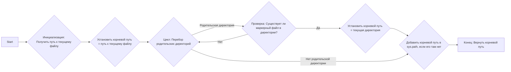
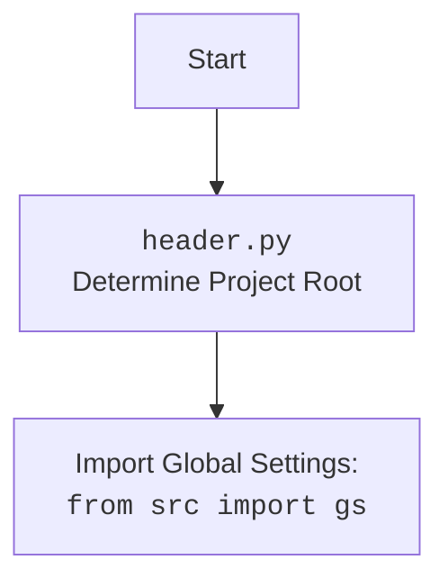

## АНАЛИЗ КОДА `hypotez/src/endpoints/gemini_simplechat/header.py`

### 1. <алгоритм>

**Описание:**
Код предназначен для автоматического определения корневой директории проекта. Это позволяет сделать импорты модулей относительно корня, независимо от текущей рабочей директории.

**Блок-схема:**



**Примеры:**

1.  **`__file__`** указывает на `hypotez/src/endpoints/gemini_simplechat/header.py`.
2.  **`current_path`** инициализируется путем к директории, содержащей файл `header.py`, например, `hypotez/src/endpoints/gemini_simplechat`.
3.  **`marker_files`** – это кортеж `('__root__', '.git')`. Это маркерные файлы, которые используются для определения корня проекта.
4.  **Цикл `for parent in ...`**: Перебирает родительские директории, поднимаясь вверх по дереву каталогов.
    *   Например:
        *   1-я итерация: `hypotez/src/endpoints/gemini_simplechat`
        *   2-я итерация: `hypotez/src/endpoints`
        *   3-я итерация: `hypotez/src`
        *   4-я итерация: `hypotez`
    *   Если, например, в директории `hypotez` найдется файл `.git`, то эта директория станет корневой директорией.

5.  **Проверка `(parent / marker).exists()`**: Если в одной из родительских директорий найдено хотя бы одно из значений `marker_files`, цикл прерывается.
6.  **`sys.path.insert(0, str(__root__))`**:  Добавляет корневую директорию в список путей поиска модулей. Это позволяет импортировать модули из корневой директории, используя пути вида `from src.module import ...`.

### 2. <mermaid>

```mermaid
flowchart TD
    Start[Start] --> GetCurrentFile[Получить путь к текущему файлу <code>__file__</code>]
    GetCurrentFile --> InitializeCurrentPath[Инициализировать current_path: <br> Путь к директории, содержащей текущий файл]
    InitializeCurrentPath --> InitializeRootPath[Инициализировать root_path: <br> root_path = current_path]
    InitializeRootPath --> StartLoop[Начать цикл по родительским директориям <br> current_path и его предки]
    StartLoop --> CheckMarkerFiles{Проверить наличие маркерных файлов<br>  (__root__, .git) в родительской директории}
    CheckMarkerFiles -- "Найдено" --> SetRootPath[Установить root_path = текущая родительская директория]
    SetRootPath --> BreakLoop[Прервать цикл]
    CheckMarkerFiles -- "Не найдено" --> NextParentDir[Перейти к следующей родительской директории]
    NextParentDir --> StartLoop
     StartLoop  -- "Нет родителя" --> CheckSysPath[Проверить, есть ли root_path в sys.path]
     BreakLoop --> CheckSysPath
    CheckSysPath -- "Нет" --> AddToSysPath[Добавить root_path в sys.path]
    CheckSysPath -- "Да" --> ReturnRootPath[Вернуть root_path]
    AddToSysPath --> ReturnRootPath
    ReturnRootPath --> End[Конец]

  style Start fill:#f9f,stroke:#333,stroke-width:2px
  style End fill:#ccf,stroke:#333,stroke-width:2px

```

**Импорт зависимостей и объяснение:**

*   **`import sys`**: Модуль `sys` используется для модификации пути поиска модулей (`sys.path`). Это позволяет добавлять корневую директорию проекта в список путей, по которым Python ищет модули для импорта.
*   **`from pathlib import Path`**: Импортирует класс `Path` из модуля `pathlib`. `Path` используется для представления путей к файлам и директориям в виде объектов, предоставляя удобные методы для манипуляции путями (например, `resolve()`, `parent`, `exists()`).

**Диаграмма `header.py`**


### 3. <объяснение>

**Импорты:**

*   **`import sys`**:
    *   **Назначение**: Модуль `sys` предоставляет доступ к некоторым переменным и функциям, которые взаимодействуют с интерпретатором Python. В данном коде `sys` используется для изменения списка `sys.path`, который определяет места поиска Python-модулей при выполнении оператора `import`.
    *   **Взаимосвязь с `src`**:  Изменяя `sys.path`, мы влияем на то, как Python будет искать модули в других частях проекта, включая директорию `src`. Добавление корневой директории в `sys.path` позволяет импортировать модули, используя пути вида `from src.module import ...`.
*   **`from pathlib import Path`**:
    *   **Назначение**: Класс `Path` из модуля `pathlib` предоставляет объектно-ориентированный способ работы с путями файлов и директорий. Это делает код более читаемым и удобным для работы с путями.
    *   **Взаимосвязь с `src`**: `Path` используется для определения абсолютного пути к корневой директории проекта. Это важно для правильной работы `sys.path`, который используется при импорте модулей из директории `src`.

**Функции:**

*   **`set_project_root(marker_files=('__root__', '.git')) -> Path`**:
    *   **Аргументы**:
        *   `marker_files` (tuple): Кортеж строк, представляющих имена файлов или директорий, которые используются для определения корневой директории проекта. Значение по умолчанию - `('__root__', '.git')`.
    *   **Возвращаемое значение**:
        *   `Path`: Объект `Path`, представляющий абсолютный путь к корневой директории проекта.
    *   **Назначение**: Функция определяет корневую директорию проекта, поднимаясь вверх по дереву директорий от места, где находится текущий скрипт. Поиск останавливается, когда в одной из родительских директорий найден один из маркерных файлов/директорий. Затем добавляет корень проекта в `sys.path`.
    *   **Пример**:
        Если `header.py` находится в `hypotez/src/endpoints/gemini_simplechat`, а маркерный файл `.git` находится в `hypotez`, то функция вернёт `Path('hypotez')`.

**Переменные:**

*   **`__root__`**:
    *   **Тип**: `Path`.
    *   **Использование**: Глобальная переменная, хранящая путь к корневой директории проекта. Она инициализируется вызовом функции `set_project_root()` и используется для других частей проекта, где необходимо определить корневой путь.

**Потенциальные ошибки и области для улучшения:**

*   **Отсутствие маркерных файлов**: Если ни один из маркерных файлов не найден, корневой директорией будет директория, где находится скрипт, что может привести к неправильным импортам. В таком случае лучше явно указывать путь к корню,  предусмотреть обработку ошибки и вывод предупреждения.

**Цепочка взаимосвязей с другими частями проекта:**

1.  Файл `header.py` определяет корневую директорию проекта.
2.  Глобальная переменная `__root__`, созданная в `header.py`, используется другими модулями для построения путей к файлам и импорта других модулей.
3.  Это позволяет модулям проекта независимо от их расположения корректно импортировать друг друга, используя абсолютные пути относительно корня проекта.
4.  `sys.path` влияет на механизм поиска модулей и пакетов в python.
5.  `set_project_root` добавляет корень проекта в `sys.path`.
6.  Это позволяет модулям использовать `from src.module import ...` для импорта.
7.  Таким образом, `header.py` играет ключевую роль в организации и структурировании проекта.

**Связь с `src`**
Файл `header.py` обеспечивает правильную работу импортов в рамках всего проекта, включая директорию `src`, где находятся основные модули и пакеты. Определяя корень проекта, он позволяет всем модулям корректно находить и импортировать нужные ресурсы через `sys.path`.