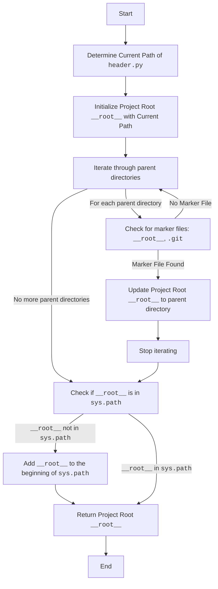

## Анализ кода `header.py`

### 1. <алгоритм>

**Назначение**: Модуль `header.py` предназначен для определения корневой директории проекта. Все импорты других модулей в рамках проекта должны быть относительны этого корня. 

**Блок-схема**:

1. **Начало**:
   - Скрипт начинает выполнение.

2. **Определение текущего пути**:
   -  `current_path` = путь к директории, где находится файл `header.py`.
      - *Пример:* Если файл расположен в `/home/user/projects/my_project/src/endpoints/gemini_simplechat/header.py`, то `current_path` будет `/home/user/projects/my_project/src/endpoints/gemini_simplechat`.

3. **Инициализация `__root__`**:
   - Переменная `__root__` инициализируется как `current_path`
     - *Пример:* `__root__` сейчас `/home/user/projects/my_project/src/endpoints/gemini_simplechat`.

4. **Поиск корневой директории**:
   - Цикл `for parent in [current_path] + list(current_path.parents)`: Перебираются директория текущего файла и все его родительские директории, поднимаясь вверх по иерархии.
     - *Пример:* На итерации `parent` будет принимать значения:
       1. `/home/user/projects/my_project/src/endpoints/gemini_simplechat`
       2. `/home/user/projects/my_project/src/endpoints`
       3. `/home/user/projects/my_project/src`
       4. `/home/user/projects/my_project`
       5. `/home/user/projects`
       6. `/home/user`
       7. `/home`
       8. `/`

5. **Проверка наличия маркерных файлов**:
   -  Для каждой `parent` проверяется, есть ли в ней хотя бы один из маркерных файлов (`__root__`, `.git`).
    - *Пример*: Проверяется `/home/user/projects/my_project/src/endpoints/gemini_simplechat/__root__` или `/home/user/projects/my_project/src/endpoints/gemini_simplechat/.git`, потом `/home/user/projects/my_project/src/endpoints/__root__` или `/home/user/projects/my_project/src/endpoints/.git`, и так далее.
     - Если маркерный файл найден:
       -  `__root__` обновляется до `parent` (найденная корневая директория).
       -  Цикл прерывается (`break`).
      
6. **Добавление `__root__` в `sys.path`**:
    -  Если `__root__` еще нет в `sys.path`:
       -  `__root__` преобразуется в строку и вставляется в начало `sys.path`.
        -  Это позволяет импортировать модули, находящиеся в корневой директории.

7. **Возврат `__root__`**:
    - Функция `set_project_root` возвращает `__root__` — путь к корневой директории.

8. **Присвоение значения переменной `__root__`**:
   - Глобальная переменная `__root__` получает значение, возвращенное функцией `set_project_root`.

### 2. <mermaid>



**Объяснение диаграммы:**

- `Start`: Начало выполнения скрипта.
- `FindCurrentPath`:  Определение абсолютного пути к текущему файлу `header.py`.
- `InitializeRoot`: Переменной `__root__` присваивается путь, найденный на предыдущем шаге.
- `IterateParents`: Цикл, перебирающий родительские директории текущего файла, начиная с самой директории текущего файла.
- `CheckMarkerFiles`: Проверка наличия маркерных файлов (`__root__`, `.git`) в текущей родительской директории.
- `UpdateRoot`: Если маркерный файл найден, переменная `__root__` обновляется до текущей родительской директории.
- `StopIteration`: Прекращение итераций после нахождения маркерного файла.
- `CheckSysPath`: Проверка, содержится ли `__root__` в `sys.path`.
- `AddToSysPath`: Добавление пути к корневой директории `__root__` в начало списка путей поиска модулей `sys.path`.
- `ReturnRoot`: Возврат значения переменной `__root__`.
- `End`: Завершение выполнения скрипта.

**Импорты:**

- `sys`: Модуль `sys` используется для доступа к системным переменным, таким как `sys.path`, который содержит список путей для поиска модулей.

- `pathlib.Path`: Модуль `pathlib` используется для работы с путями в файловой системе. Объект `Path` предоставляет удобный интерфейс для манипуляций с путями.

### 3. <объяснение>

**Импорты:**

- `sys`: Модуль `sys` используется для манипуляции с переменной `sys.path`. `sys.path` - это список путей, по которым Python ищет модули при импорте. Добавление пути к корню проекта в `sys.path` позволяет импортировать модули из других частей проекта, используя относительные пути от корня.

- `pathlib.Path`: Этот модуль предоставляет классы для представления путей в виде объектов, что делает работу с путями более удобной и кросс-платформенной. Используется для получения абсолютного пути к файлу `header.py` и его родительских директорий.

**Функции:**

- `set_project_root(marker_files: tuple = ('__root__', '.git')) -> Path`:
    - **Аргументы**:
        - `marker_files`: Кортеж строк, представляющий имена файлов или каталогов, которые обозначают корневой каталог проекта. По умолчанию `('__root__', '.git')`.
    - **Возвращаемое значение**:
        - Объект `pathlib.Path`, представляющий путь к корневой директории проекта. Если корневая директория не найдена, возвращается директория, где находится файл `header.py`.
    - **Назначение**: Найти корневой каталог проекта, начиная с директории текущего файла и поднимаясь вверх по иерархии, пока не будет найден маркерный файл или достигнут корень файловой системы.
    - **Пример**:
        ```python
        root_path = set_project_root()
        print(root_path) # Выведет путь до корня проекта.
        ```

**Переменные:**

- `__root__`: Глобальная переменная типа `pathlib.Path`, которая хранит путь к корневой директории проекта. Эта переменная используется для того, чтобы другие модули могли узнать корень проекта и импортировать другие модули, используя относительный путь от корня.
- `current_path`: Локальная переменная типа `pathlib.Path`, которая хранит путь к директории, где находится файл `header.py`.
- `marker_files`: Локальная переменная типа `tuple` хранит маркерные файлы для поиска корня.

**Цепочка взаимосвязей с другими частями проекта:**
1. Этот файл является основой для определения корня проекта и используется для всех импортов внутри проекта.
2. Все другие модули проекта должны импортировать другие модули, используя относительный путь от найденного корня.

**Потенциальные ошибки и области для улучшения:**

- **Возможные проблемы**:
    - Если маркерные файлы не будут найдены, то корневым каталогом станет каталог, где находится файл `header.py`. Это может привести к проблемам, если проектная структура не предполагает такого поведения.
    - Если маркерные файлы имеют некорректные имена (например, если пользователь случайно переименует маркерные файлы), то корень проекта не будет найден, что приведет к проблемам с импортом.
- **Области для улучшения**:
    - Добавить возможность использовать переменную окружения для установки корневой директории проекта, что будет полезно при развертывании приложения.
    - В случае если маркерные файлы не будут найдены, можно выдать ошибку, вместо возврата директории `header.py`.

Этот модуль является критически важным для проекта, так как обеспечивает правильную работу механизма импорта модулей и гарантирует, что все части проекта могут найти друг друга.