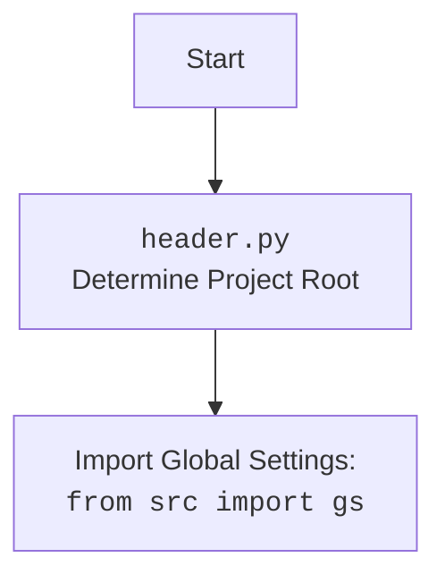

## <алгоритм>

1.  **`set_project_root(marker_files)`**:
    *   **Вход**: Список `marker_files` (по умолчанию `('__root__',)`), используемых для определения корневой папки проекта.
    *   **Инициализация**: 
        *   Определяется текущий путь файла (`__file__`) и его родительская папка `current_path`.
        *   `__root__` инициализируется как `current_path`.
    *   **Поиск корневой папки**:
        *   Перебираем текущую папку и все ее родительские папки.
        *   Для каждой папки `parent` проверяем, существует ли в ней хотя бы один из файлов `marker_files`.
        *   Если файл найден, то `__root__` присваивается текущая папка `parent` и цикл прекращается.
    *   **Добавление в `sys.path`**:
        *   Если найденная корневая папка `__root__` отсутствует в `sys.path`, то она добавляется в начало списка.
    *   **Возврат**: Возвращается путь к корневой папке `__root__`.

    **Пример**:
    ```python
    # Предположим, что структура папок следующая:
    # hypotez/
    #  ├── src/
    #  │   ├── endpoints/
    #  │   │   └── header.py
    #  │   └── settings.json
    #  └── __root__

    # Если header.py вызывает set_project_root()
    # 1. current_path = Path("hypotez/src/endpoints")
    # 2. Проверяет текущую папку и родительские на наличие '__root__'
    # 3. Находит файл '__root__' в hypotez
    # 4. __root__ = Path("hypotez")
    # 5. Добавляет путь hypotez в sys.path если его там нет
    # 6. Возвращает Path("hypotez")
    ```
2.  **Получение корневой папки**:
    *   Вызываем `set_project_root()` без параметров, чтобы установить значение `__root__`.
3.  **Загрузка `settings.json`**:
    *   Пытаемся открыть файл `settings.json` из папки `src` относительно корневой папки (`__root__`).
    *   Читаем файл с помощью `json.load()` и сохраняем в переменную `settings`.
    *   Если файл не найден или не является корректным JSON, то перехватываем исключения `FileNotFoundError` и `json.JSONDecodeError`, ничего не делаем.
4.  **Загрузка `README.MD`**:
    *   Пытаемся открыть файл `README.MD` из папки `src` относительно корневой папки (`__root__`).
    *   Читаем файл с помощью `read()` и сохраняем в переменную `doc_str`.
    *   Если файл не найден или не является корректным, то перехватываем исключения `FileNotFoundError` и `json.JSONDecodeError`, ничего не делаем.
5.  **Установка глобальных переменных**:
    *   Если `settings` загружен, берем значения полей `project_name`, `version`, `author`, `copyrihgnt`, `cofee`. Если нет - устанавливаем значения по умолчанию.
    *   `__project_name__` – Название проекта.
    *   `__version__` – Версия проекта.
    *   `__doc__` – Содержимое файла `README.MD`, если он найден.
    *   `__details__` – Пустая строка.
    *   `__author__` – Автор проекта.
    *   `__copyright__` – Авторское право.
    *    `__cofee__` – Сообщение о поддержке разработчика.

## <mermaid>

```mermaid
flowchart TD
    Start(Start) --> FindRoot[<code>set_project_root()</code><br> Determine Project Root]
    
    FindRoot --> CheckMarkers[Check for marker files in parent directories]
    CheckMarkers -- Found marker file --> SetRoot[Set project root path]
    CheckMarkers -- No marker file --> SetRoot[Set project root path to current directory]

    SetRoot --> AddToSysPath{Add root path to sys.path}
    AddToSysPath -- Yes --> LoadSettings[Load <code>settings.json</code>]
    AddToSysPath -- No --> LoadSettings
    
    LoadSettings --> LoadReadme[Load <code>README.MD</code>]
    LoadReadme --> SetGlobals[Set global variables using settings data or defaults]

    SetGlobals --> End(End)
    
    style Start fill:#f9f,stroke:#333,stroke-width:2px
    style End fill:#ccf,stroke:#333,stroke-width:2px
    
    classDef code fill:#fff,stroke:#333,stroke-width:1px;
    class FindRoot, CheckMarkers, SetRoot, AddToSysPath, LoadSettings, LoadReadme, SetGlobals code
```



**Объяснение зависимостей `mermaid`:**

1.  `flowchart TD`: Определяет тип диаграммы как блок-схему (flowchart) и направление сверху вниз (TD - Top-Down).
2.  `Start(Start)`: Начало блок-схемы.
3.  `FindRoot[<code>set_project_root()</code><br> Determine Project Root]`: Блок, представляющий функцию `set_project_root`, которая определяет корневую директорию проекта.
4.  `CheckMarkers[Check for marker files in parent directories]`: Блок, проверяющий наличие маркерных файлов в родительских директориях.
5. `SetRoot[Set project root path]`: Блок, устанавливающий путь к корневой директории.
6.  `AddToSysPath{Add root path to sys.path}`: Условный блок, проверяющий, нужно ли добавлять путь к корневой директории в `sys.path`.
7.  `LoadSettings[Load <code>settings.json</code>]`: Блок, загружающий данные из файла `settings.json`.
8.  `LoadReadme[Load <code>README.MD</code>]`: Блок, загружающий данные из файла `README.MD`.
9.  `SetGlobals[Set global variables using settings data or defaults]`: Блок, устанавливающий глобальные переменные на основе загруженных данных или значений по умолчанию.
10. `End(End)`: Конец блок-схемы.

## <объяснение>

**Импорты:**

*   `import sys`: Модуль `sys` используется для работы с параметрами и функциями, относящимися к Python runtime environment. В данном коде он используется для добавления корневой директории проекта в `sys.path`, чтобы обеспечить возможность импорта модулей из других частей проекта.
*   `import json`: Модуль `json` используется для работы с данными в формате JSON. Он применяется для чтения файла `settings.json`.
*  `from packaging.version import Version`: Импортируется класс `Version` из библиотеки `packaging.version`. Этот класс используется для сравнения версий, но в данном коде он не используется напрямую. Скорее всего, это осталось от предыдущих версий кода или планируется для будущих задач.
*   `from pathlib import Path`: Из модуля `pathlib` импортируется класс `Path`, который предоставляет удобный способ работы с путями к файлам и директориям. Он используется для манипуляций с путями в файловой системе.
*   `from src import gs`: Импортируется модуль `gs` из пакета `src`. Вероятно, `gs` содержит глобальные настройки или пути, которые используются в проекте. Этот импорт показывает, что данный модуль (header.py) зависит от других модулей внутри проекта.

**Функции:**

*   `set_project_root(marker_files: tuple = ('__root__')) -> Path`:
    *   **Аргументы**:
        *   `marker_files` (tuple): Кортеж имен файлов или директорий, которые используются для определения корневой папки проекта. По умолчанию установлен как `('__root__',)`.
    *   **Возвращаемое значение**:
        *   `Path`: Объект `Path`, представляющий корневую папку проекта.
    *   **Назначение**:
        *   Находит корневую директорию проекта, начиная с текущей директории, и поднимаясь по иерархии родительских папок, до тех пор пока не будет найдена директория, содержащая хотя бы один из файлов, указанных в `marker_files`.
        *   Добавляет найденную корневую директорию в список путей `sys.path`, чтобы Python мог находить модули в этом проекте.
    *   **Пример**:
        ```python
        # Если в проекте есть файл '__root__' в корне,
        # вызов set_project_root() вернет путь к этой корневой папке
        root_path = set_project_root()
        print(root_path) # Выведет Path('/путь/к/корневой/папке')
        ```

**Переменные:**

*   `MODE: str = 'dev'`: Устанавливает режим работы приложения в 'dev'.
*   `__root__: Path`:  Содержит путь к корневой директории проекта, полученный через функцию `set_project_root()`.
*   `settings: dict = None`:  Содержит словарь с настройками, загруженными из файла `settings.json`. Инициализируется как `None` и может быть изменен при удачной загрузке.
*   `doc_str: str = None`: Содержит строку с содержимым документа `README.MD`. Инициализируется как `None` и может быть изменена при удачной загрузке.
*   `__project_name__: str`: Название проекта, которое извлекается из файла `settings.json` или задается по умолчанию `'hypotez'`.
*   `__version__: str`: Версия проекта, извлеченная из `settings.json` или пустая строка по умолчанию.
*   `__doc__: str`: Содержимое документации проекта из файла `README.MD`.
*   `__details__: str`: Строка деталей, которая установлена как пустая строка.
*   `__author__: str`: Автор проекта, извлекается из `settings.json` или пустая строка по умолчанию.
*   `__copyright__: str`: Информация об авторском праве, извлекается из `settings.json` или пустая строка по умолчанию.
*   `__cofee__: str`: Сообщение о возможности поддержки разработчика, извлекается из `settings.json` или задается по умолчанию.

**Потенциальные ошибки и улучшения:**

*   **Обработка ошибок**:  Код использует `try...except` блоки для обработки `FileNotFoundError` и `json.JSONDecodeError`, но не логирует ошибки, что может затруднить отладку.  Рекомендуется добавить логирование ошибок, чтобы было проще понять, почему не удалось загрузить настройки или документацию.
*   **Жесткая привязка к путям**:  Код жёстко привязан к файлу `settings.json` в папке `src`.  Возможно, стоит сделать более гибкую систему загрузки настроек, позволяя пользователю устанавливать путь к файлу конфигурации.
*   **Неявные зависимости**:  Некоторые переменные не имеют явных значений по умолчанию (например, `__details__`).  Рекомендуется явным образом инициализировать все переменные по умолчанию, чтобы избежать неожиданного поведения.
* **`packaging.version`**:  Импорт `from packaging.version import Version` не используется в этом файле, поэтому его можно удалить.
* **Именование**:
     *  Имена переменных `__root__`, `__project_name__`, `__version__` и тд. выглядят как магические константы. Рекомендуется переименовать их в константы `PROJECT_ROOT`, `PROJECT_NAME`, `PROJECT_VERSION` и тд.
     *  `__cofee__` - опечатка (правильно `coffee`), рекомендуется исправить.

**Цепочка взаимосвязей с другими частями проекта:**

*   `header.py` является важной частью проекта, поскольку он определяет корневую директорию, загружает настройки из `settings.json` и предоставляет эти настройки для других модулей проекта через глобальные переменные.
*   Импорт `from src import gs` показывает, что `header.py` зависит от модуля `gs`, который, вероятно, содержит глобальные константы и настройки.
*   Другие модули проекта могут использовать переменные, определённые в `header.py` (такие как `__project_name__`, `__version__` и т. д.).

Этот код предоставляет механизм для определения пути проекта, загрузки настроек и хранения общей информации о проекте, что делает его важной частью инфраструктуры проекта.