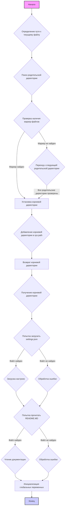

## Анализ кода `hypotez/src/endpoints/header.py`

### 1. <алгоритм>

**Функция `set_project_root`:**

1.  **Инициализация:**
    *   Получаем абсолютный путь к директории, содержащей текущий файл (`header.py`).
    *   Присваиваем этот путь переменной `__root__`.
2.  **Поиск родительской директории:**
    *   Итерируемся по всем родительским директориям, включая текущую директорию.
    *   Для каждой родительской директории проверяем наличие хотя бы одного из `marker_files` (например, `pyproject.toml`, `requirements.txt`, `.git`).
    *   Если маркер найден, то устанавливаем `__root__` в эту родительскую директорию и выходим из цикла.
3.  **Добавление в `sys.path`:**
    *   Если найденный `__root__` не присутствует в `sys.path`, добавляем его в начало списка, что позволит импортировать модули из этого каталога.
4.  **Возврат:** Возвращаем значение `__root__`.

**Основной поток программы:**

1.  **Настройка корневой директории:**
    *   Вызываем `set_project_root` для определения корневой директории проекта и сохраняем ее в переменной `__root__`.
2.  **Загрузка настроек из `settings.json`:**
    *   Пытаемся открыть и прочитать файл `settings.json`, находящийся в подкаталоге `src` относительно корневой директории.
    *   Загружаем содержимое JSON файла в переменную `settings`.
    *   Если файл не найден или JSON невалиден, игнорируем ошибку.
3. **Чтение документации из `README.MD`:**
    *   Пытаемся открыть и прочитать файл `README.MD`, находящийся в подкаталоге `src` относительно корневой директории.
    *   Сохраняем содержимое файла в переменную `doc_str`.
    *   Если файл не найден или возникла другая ошибка при чтении, игнорируем ее.
4.  **Инициализация глобальных переменных:**
    *   Инициализируем глобальные переменные, такие как `__project_name__`, `__version__`, `__doc__`, `__details__`, `__author__`, `__copyright__` и `__cofee__`, основываясь на данных из файла настроек `settings.json`. Если настройки не найдены, используются значения по умолчанию.

### 2. <mermaid>

**Описание зависимостей:**
* `os`, `sys`, `json`, `packaging.version`, `pathlib`: В данном коде импортируются модули `sys`, `json`, `Version` из `packaging.version`, `Path` из `pathlib` для работы с путями к файлам, чтения JSON и работы с версиями. Модуль `os` не используется явно, но может вызываться внутри `pathlib`.
* `src.gs`: `gs` импортируется для доступа к путям. `gs` вероятно является частью этого же проекта `src` и предоставляет доступ к глобальным настройкам путей.

### 3. <объяснение>

**Импорты:**

*   `sys`: Используется для работы с системными переменными, в частности, для добавления корневой директории проекта в `sys.path`, что позволяет импортировать модули из этой директории.
*   `json`: Используется для чтения файла `settings.json`, содержащего конфигурационные данные проекта.
*   `packaging.version`: Используется для сравнения и обработки версий пакетов (хотя в данном коде напрямую не используется).
*   `pathlib`: Используется для представления путей к файлам и директориям в виде объектов `Path`, что делает работу с файловой системой более удобной и кросс-платформенной.
*   `src.gs`: Кастомный модуль проекта, который предположительно содержит информацию о путях проекта.

**Функция `set_project_root`:**

*   **Аргументы:**
    *   `marker_files` (tuple, по умолчанию `('pyproject.toml', 'requirements.txt', '.git')`): Кортеж имен файлов или директорий, которые указывают на корневую директорию проекта.
*   **Возвращает:**
    *   `Path`: Объект `Path`, представляющий абсолютный путь к корневой директории проекта. Если маркерные файлы не найдены, возвращается путь к директории, в которой расположен текущий файл.
*   **Назначение:** Функция определяет корневую директорию проекта путем поиска родительских директорий до тех пор, пока не будет найдена директория, содержащая хотя бы один из заданных маркерных файлов. Это обеспечивает гибкость при запуске скрипта из разных мест.
*   **Пример:** Если `header.py` находится в `hypotez/src/endpoints/`, а `pyproject.toml` в `hypotez/`, то функция вернет `hypotez/`.

**Переменные:**

*   `MODE` (str): Глобальная переменная, определяющая режим работы (по умолчанию `dev`).
*   `__root__` (Path): Переменная, хранящая абсолютный путь к корневой директории проекта, определенный с помощью функции `set_project_root()`.
*   `settings` (dict): Словарь, содержащий настройки проекта, загруженные из файла `settings.json`. Может быть `None`, если файл не найден или возникла ошибка.
*   `doc_str` (str): Строка, содержащая текст документации, загруженный из файла `README.MD`. Может быть `None`, если файл не найден или возникла ошибка.
*   `__project_name__` (str): Название проекта, загруженное из `settings.json`, или по умолчанию `hypotez`.
*   `__version__` (str): Версия проекта, загруженная из `settings.json`, или пустая строка.
*   `__doc__` (str):  Содержимое файла `README.MD`, либо пустая строка, если файл не был найден.
*   `__details__` (str): Строка деталей проекта, пока пустая.
*   `__author__` (str): Автор проекта, загруженный из `settings.json`, или пустая строка.
*   `__copyright__` (str): Авторские права проекта, загруженные из `settings.json`, или пустая строка.
*   `__cofee__` (str): Сообщение о поддержке разработчика через кофе, загруженное из `settings.json`, или сообщение по умолчанию.

**Классы:**

*   В данном коде классы не определены.

**Потенциальные ошибки и области для улучшения:**

*   **Обработка ошибок:** Используется `try-except` для обработки ошибок при открытии и загрузке `settings.json` и `README.MD`, но в `except` блоке только `...`, что может затруднить отладку. Лучше добавить логирование ошибок, например, через `logging`.
*   **Жесткие пути:** Путь к файлам настроек (`'src' / 'settings.json'`) и `README.MD` жестко закодирован в скрипте. Можно сделать путь настраиваемым через конфигурацию.
*   **Использование `MODE`:** Переменная `MODE` не используется в данном коде, но объявлена.
*   **Отсутствие проверок:** Нет явных проверок корректности загруженных данных из JSON (`settings`).
*   **Документирование:**  `doc_str` - это переменная, содержащая содержимое файла `README.MD`, и это полезно в `src/endpoints`, поскольку они могут использовать эту переменную.
*   **Версионирование**:  Поле `__version__` в json файле не является обязательным.

**Взаимосвязи с другими частями проекта:**

*   Данный модуль `header.py` используется как общий модуль для всего проекта, так как он определяет корневую директорию и загружает общие настройки. 
*   Модуль `src.gs` предоставляет доступ к глобальным путям проекта. Модуль используется для загрузки файла настроек.
*   Глобальные переменные, такие как `__project_name__`, `__version__`, `__doc__`, и другие, могут использоваться в других модулях проекта для получения информации о проекте.
*   Этот модуль является частью пакета `src.endpoints`, который отвечает за обработку конечных точек (endpoints) приложения.