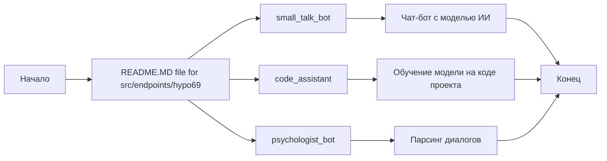
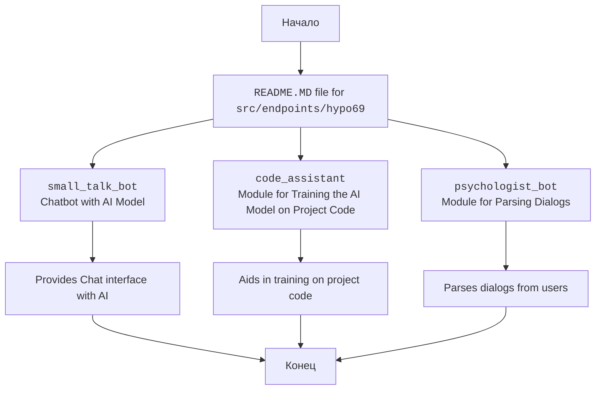

## Анализ README.MD для `src.endpoints.hypo69`

### 1. **<алгоритм>**

Этот README.MD файл представляет собой документацию для endpoints, разрабатываемых в рамках проекта `hypo69`, и расположен в директории `src/endpoints/hypo69`. Он содержит информацию о трех основных endpoint-ах:

1.  **small_talk_bot**: Бот для ведения разговоров, который использует модель искусственного интеллекта для общения.
2.  **code_assistant**: Модуль, предназначенный для обучения модели ИИ на коде текущего проекта.
3.  **psychologist_bot**: Модуль, находящийся на ранней стадии разработки, предназначенный для анализа диалогов.

**Блок-схема:**

**Примеры:**

*   **`small_talk_bot`**: Пользователь отправляет текстовое сообщение, бот анализирует его, генерирует ответ и отправляет его пользователю.
*   **`code_assistant`**: Модуль анализирует код в репозитории проекта, извлекает информацию о структуре, методах, классах и т.д., а затем использует эту информацию для обучения модели ИИ.
*   **`psychologist_bot`**: Пользователь (или другой бот) взаимодействует с модулем, предоставляя ему диалоги. Модуль анализирует текст диалогов для выявления закономерностей или ключевых моментов.

### 2. **<mermaid>**

**Объяснение:**

*   **`Start`**: Начальная точка.
*   **`Document`**: Представляет README.MD файл, который описывает содержимое директории `src/endpoints/hypo69`.
*   **`SmallTalkBot`**: Описывает endpoint `small_talk_bot` - чат-бота с моделью ИИ.
*   **`CodeAssistant`**: Описывает endpoint `code_assistant` - модуль обучения ИИ на коде проекта.
*   **`PsychologistBot`**: Описывает endpoint `psychologist_bot` - модуль анализа диалогов.
*   **`ChatBotDescription`**: Описывает функцию чат-бота с ИИ.
*   **`CodeTrainingDescription`**: Описывает функцию обучения ИИ на коде проекта.
*   **`DialogParsingDescription`**: Описывает функцию анализа диалогов.
*   **`End`**: Конечная точка.

**Зависимости:**

В данном конкретном коде (README.MD) прямых зависимостей от других модулей или библиотек нет. Однако, подразумевается, что каждый из описанных endpoint-ов будет иметь свои зависимости внутри проекта `hypo69` , которые не видны в этом файле.

### 3. **<объяснение>**

**Импорты:**

В данном файле импорты отсутствуют, т.к. это файл с разметкой `rst` и `md`, а не программный код на Python.

**Классы:**

В данном файле классы отсутствуют, т.к. это файл с разметкой `rst` и `md`. Однако, можно предположить что в `src/endpoints/hypo69` есть классы для каждого из модулей.

**Функции:**

В данном файле функции отсутствуют, т.к. это файл с разметкой `rst` и `md`. Однако, можно предположить что в `src/endpoints/hypo69` есть функции для каждого из модулей.

**Переменные:**

В данном файле переменные отсутствуют, т.к. это файл с разметкой `rst` и `md`.

**Объяснение:**

Этот файл README.MD предназначен для документирования endpoints, разрабатываемых внутри директории `src/endpoints/hypo69`. Он предоставляет краткое описание каждого endpoint-а, а именно:

*   **`small_talk_bot`**: Это endpoint, который будет предоставлять интерфейс чат-бота. Он будет использовать модель искусственного интеллекта для обработки и генерации ответов в диалоге. Скорее всего, он будет взаимодействовать с API или моделью, обученной для ведения разговоров.

*   **`code_assistant`**: Этот endpoint отвечает за обучение модели искусственного интеллекта на коде текущего проекта.  Он, вероятно, будет анализировать структуру проекта, классы, методы и другие элементы кода, а затем передавать эту информацию модели для обучения.  Это может включать в себя использование различных инструментов для анализа кода, таких как абстрактные синтаксические деревья (AST), и последующее представление кода в виде, удобном для обучения модели.

*   **`psychologist_bot`**: На ранних стадиях разработки,  этот endpoint задуман для парсинга диалогов.  Он может быть использован для анализа текстовых данных разговоров, возможно, с целью определения настроений, ключевых тем или других значимых элементов, для последующего улучшения пользовательского опыта.

**Потенциальные ошибки и области для улучшения:**

*   **Отсутствие конкретики**: Описания endpoints очень краткие и не дают полной картины их функциональности.  В будущем, имеет смысл добавить более детальные объяснения,  с примерами использования, параметрами API и т.п.
*   **Размытые цели**: Особенно касается `psychologist_bot`. Не совсем понятно, для каких целей будет использоваться парсинг диалогов.  В дальнейшем это нужно уточнить.
*   **Нет ссылок**:  Не хватает ссылок на код каждого endpoint-а. Было бы полезно добавить их для упрощения навигации.

**Цепочка взаимосвязей:**

Файл `README.MD` является частью документации проекта и связывает директорию `src/endpoints/hypo69` с общей структурой проекта. Он помогает разработчикам понять, какие endpoints доступны в данном модуле и как они могут быть использованы.