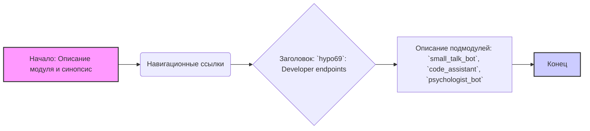

## Анализ кода `hypo69/README.MD`

### 1. <алгоритм>

Файл `README.MD` не содержит исполняемого кода, а является файлом документации. Его алгоритм можно описать следующим образом:

1. **Начало:** Файл начинается с определения модуля и синопсиса, описывающих его назначение.
    * Пример: `.. module:: src.endpoints.hypo69`
    * Пример: `.. synopsys: Endpoint for my code AI trainig`

2. **Навигационные ссылки:** Далее идет HTML-таблица с навигационными ссылками, которые помогают пользователю перемещаться между каталогами проекта.
    * Пример: `<A HREF = 'https://github.com/hypo69/hypo/blob/master/readme.ru.md'>[Root ↑]</A>`
    * Пример: `<A HREF = 'https://github.com/hypo69/hypo/blob/master/src/README.MD'>src</A>`

3. **Заголовок:** Заголовок `hypo69`: Developer endpoints` указывает на назначение данного модуля.

4. **Описание модулей:** Затем идет список подмодулей с кратким описанием.
    * Пример: `**small_talk_bot** - бот с чатом модели ии`
    * Пример: `**code_assistant** - модуль обучения модели коду проекта`
    * Пример: `**psychologist_bot** - ранняя разработка модуля парсинга диалогов`

### 2. <mermaid>

**Объяснение зависимостей Mermaid:**

-   `A` - Начало процесса, блок описывающий модуль и его синопсис. Это начало документа.
-   `B` - Навигационные ссылки: Этот блок содержит ссылки для навигации по структуре проекта.
-   `C` - Заголовок: Этот блок представляет основной заголовок модуля.
-   `D` - Описание подмодулей: Этот блок описывает конкретные подмодули, которые входят в `hypo69`.
-   `E` - Конец процесса.

### 3. <объяснение>

**Импорты:**

В данном файле импортов нет, так как это файл разметки (`.md`), а не код на Python. Здесь используются только теги и разметка Markdown, а также HTML для таблицы с навигационными ссылками.

**Классы:**

В файле нет определения классов, поскольку он является файлом документации.

**Функции:**

В файле нет функций, поскольку это файл документации.

**Переменные:**

В файле нет переменных, поскольку это файл документации.

**Детальное объяснение:**

-   Файл `README.MD` в директории `src/endpoints/hypo69` представляет собой описание модуля `hypo69`, который представляет собой набор разработческих endpoints (точек входа).
-   Строка `.. module:: src.endpoints.hypo69` сообщает системе документации, что этот файл относится к модулю `src.endpoints.hypo69`.
-   Строка `.. synopsys: Endpoint for my code AI trainig` описывает назначение модуля как endpoint для обучения AI.
-   HTML-таблица содержит ссылки для навигации по репозиторию.
    -   `[Root ↑]` - ссылка на корневой `README.MD` репозитория.
    -   `src` - ссылка на `README.MD` в директории `src`.
    -   `endpoints` - ссылка на `README.MD` в директории `src/endpoints`.
    -   `Русский` - ссылка на `readme.ru.md` в текущей директории.
-   Заголовок  `hypo69: Developer endpoints` указывает, что данный модуль содержит endpoints для разработчиков.
-   Следующий список описывает основные подмодули, которые входят в `hypo69`:
    -   `small_talk_bot` - бот, предназначенный для ведения разговора с помощью ИИ.
    -   `code_assistant` - модуль для обучения модели ИИ работе с кодом проекта.
    -   `psychologist_bot` - модуль, который занимается анализом диалогов, находится на ранней стадии разработки.

**Потенциальные ошибки и области для улучшения:**

-   В файле нет явных ошибок, так как это просто документ.
-   Можно добавить более подробное описание каждого из подмодулей, включая их функциональность и API, если они есть.
-   Добавление примеров использования для каждого подмодуля сделает файл более полезным для разработчиков.

**Взаимосвязь с другими частями проекта:**

-   Данный файл является частью модуля `src.endpoints`, что означает, что он связан с endpoint'ами проекта.
-   Взаимодействует с `src/` и корневой директорией проекта через навигационные ссылки, обеспечивая контекст расположения в общей структуре.
-  Описанные в этом файле подмодули (`small_talk_bot`, `code_assistant`, `psychologist_bot`) представляют собой функциональные блоки, которые, вероятно, взаимодействуют с другими частями проекта, такими как модели ИИ, базы данных и пользовательский интерфейс.