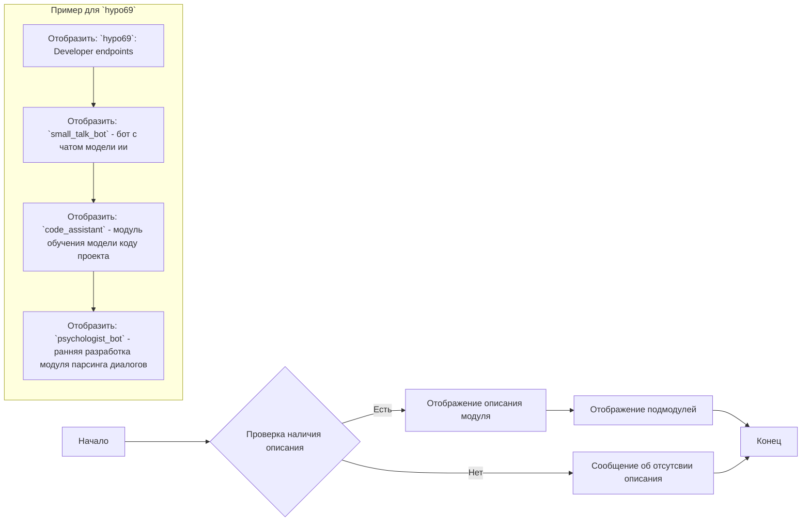

## Анализ кода `hypotez/src/endpoints/hypo69/README.MD`

### 1. <алгоритм>

Данный документ `README.MD` представляет собой описание модуля `hypo69` внутри проекта `hypotez`. Он не содержит исполняемого кода, а является документацией.  
  
Блок-схема работы, если бы это был исполняемый код, выглядела бы примерно так:



**Примеры:**

*   **`Начало`**:  Начало обработки документа.
*   **`Проверка наличия описания`**: Проверяется, есть ли описание для модуля `hypo69`.
*   **`Отображение описания модуля`**: Если описание есть (как в нашем случае), оно отображается.
*   **`Отображение подмодулей`**: Отображается информация о подмодулях (`small_talk_bot`, `code_assistant`, `psychologist_bot`).
*   **`Конец`**: Конец обработки документа.
*   **`Сообщение об отсутствии описания`**: Этот блок выполняется, если бы описания не было.

**Поток данных:**

В данном случае поток данных  — это  поток информации, отображаемой пользователю.  Информация,  описанная в файле, считывается (предположительно парсится markdown) и отображается.

### 2. <mermaid>

```mermaid
graph LR
    subgraph "README.MD"
        A[Start: Read README.MD] --> B(Module Description: `hypo69`: Developer endpoints);
        B --> C(Submodule: `small_talk_bot`);
        C --> D(Submodule: `code_assistant`);
        D --> E(Submodule: `psychologist_bot`);
        E --> F[End]
    end
    
    subgraph "Navigation Links"
        G[Root Link: `[Root ↑]`] --> H[Source Link: `src`];
        H --> I[Endpoints Link: `endpoints`];
        I --> J[Language Link: `Русский`]
    end
```

**Разбор зависимостей:**

*   **`README.MD`**: Основной документ, описывающий модуль `hypo69`.
*   **`Module Description`**:  Описание модуля `hypo69`,  определенное в документе.
*   **`Submodule`**: Описания  подмодулей `small_talk_bot`, `code_assistant` и `psychologist_bot` модуля `hypo69`.
*   **`Navigation Links`**: Ссылки для навигации по структуре проекта.

**Дополнительно: `header.py` не используется, поэтому блок `mermaid` для него не требуется.**

### 3. <объяснение>

**Импорты:**

В данном файле нет импортов, так как это файл документации (`README.MD`), а не Python-код.

**Классы:**

В данном файле классов нет. Это документ описания.

**Функции:**

В данном файле нет функций.

**Переменные:**

В данном файле нет переменных.

**Объяснение:**

Файл `README.MD` в директории `src/endpoints/hypo69`  предоставляет описание  модуля `hypo69`, который является частью  проекта `hypotez`.  

*   **Структура:** Файл организован в формате Markdown, что делает его читаемым для людей и  обрабатываемым инструментами.
*   **Описание модуля**:  Вводная строка `hypo69: Developer endpoints`  описывает назначение модуля как  набора инструментов для разработчиков.
*   **Подмодули:** Описаны  основные подмодули, такие как:
    *   `small_talk_bot`:  Бот для чата с  моделью ИИ.
    *   `code_assistant`:  Модуль для обучения модели на основе кода проекта.
    *   `psychologist_bot`:  Ранняя разработка модуля для анализа диалогов.
*   **Ссылки**:  Содержатся ссылки для навигации по репозиторию на GitHub:
    *   `[Root ↑]`: Ссылка на корень проекта.
    *   `src`: Ссылка на директорию `src`.
    *   `endpoints`: Ссылка на директорию `endpoints`.
    *   `Русский`: Ссылка на русскоязычную версию документа.

**Цепочка взаимосвязей:**

Файл `README.MD`  является частью структуры каталогов проекта. Он связан с:

1.  **Корнем проекта (`hypo69`)**:  Предоставляет информацию о модуле `hypo69`, который является его частью.
2.  **Директорией `src`**:  Указывает на то, что  этот модуль является частью исходного кода.
3.  **Директорией `endpoints`**: Показывает, что модуль `hypo69`  — это  эндпоинт проекта.

**Потенциальные ошибки и улучшения:**

*   **Отсутствие подробностей:** Описание подмодулей довольно краткое. Было бы полезно добавить больше информации о каждом подмодуле, включая их функциональность и взаимодействие.
*   **Неактуальность:** Описание `psychologist_bot` как "ранняя разработка" подразумевает, что  информация может быть неточной.
*   **Ограничения:** Документ не дает представления о том, как используются подмодули, что усложняет понимание их назначения.
*   **Использование Markdown:** Используются не все возможности Markdown,  например, можно было бы добавить заголовки  для лучшей читаемости.
*   **Цели:**  Слабо описаны цели проекта.

В целом, файл `README.MD` обеспечивает базовое понимание назначения модуля `hypo69`, но  требует доработки для более полного и понятного описания.