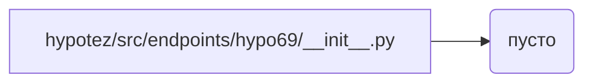

```MD
1. **<input code>**

```python
## \file hypotez/src/endpoints/hypo69/__init__.py
# -*- coding: utf-8 -*-
#! venv/Scripts/python.exe
#! venv/bin/python/python3.12

"""
.. module: src.endpoints.hypo69 
	:platform: Windows, Unix
	:synopsis:

"""
MODE = 'dev'


# from .code_assistant import CodeAssistant
# from .small_talk_bot import bot as small_talk_bot
```

2. **<algorithm>**

Код представляет собой пустой `__init__.py` файл в пакете `hypotez/src/endpoints/hypo69`.  Алгоритм отсутствует, так как нет выполняемых инструкций. Файл скорее всего служит для импортов подмодулей.  Никакие данные не обрабатываются.


3. **<mermaid>**



4. **<explanation>**

* **Импорты:** Код содержит закомментированные строки импорта: `from .code_assistant import CodeAssistant` и `from .small_talk_bot import bot as small_talk_bot`.  Это указывает на то, что в проекте существуют модули `code_assistant` и `small_talk_bot`, находящиеся в той же директории, и в будущем они будут импортированы для использования.  Символ `.` в импорте означает, что модули находятся внутри директории `hypotez/src/endpoints/hypo69`.  Без импорта эти модули недоступны.

* **Классы:** Нет определений классов.

* **Функции:** Нет определений функций.

* **Переменные:** Единственная переменная `MODE = 'dev'` определяет режим работы (вероятно, для разработки).


* **Возможные ошибки или области для улучшений:**

    * Закомментированные импорты в текущем виде не выполняют никакой функциональности.  Если эти модули нужны, комментарии необходимо убрать.
    * Отсутствие документации для переменной `MODE`.  Рекомендуется добавить docstring с описанием назначения и возможных значений.
    * Нет явного указания на то, какие модули будут импортированы и для чего они нужны.

* **Цепочка взаимосвязей:**

Файл `hypotez/src/endpoints/hypo69/__init__.py` является частью проекта `hypotez`.  Он предназначен для импорта других модулей из пакета `hypotez/src/endpoints/hypo69`, которые, вероятно, содержат логику взаимодействия с API или другими компонентами приложения.  Взаимодействие с другими частями проекта будет зависеть от реализации импортированных модулей `code_assistant` и `small_talk_bot`.

**Заключение:** Файл `__init__.py` в данной структуре проекта служит в качестве точки входа для импортов подмодулей и модулей проекта, которые будут обрабатывать логику приложения. В этом случае, это подготовленный шаблон, ожидающий реализации в соответствующих модулях.