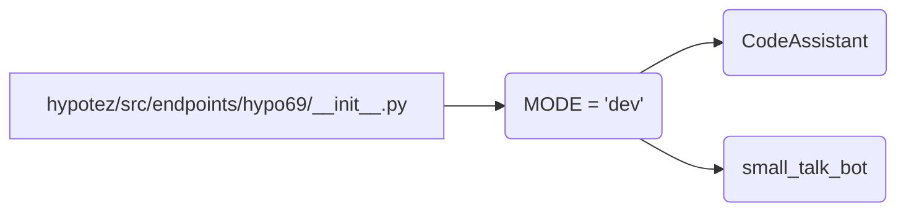

# <input code>

```python
## \file hypotez/src/endpoints/hypo69/__init__.py
# -*- coding: utf-8 -*-\
#! venv/Scripts/python.exe
#! venv/bin/python/python3.12

"""
.. module:: src.endpoints.hypo69 
	:platform: Windows, Unix
	:synopsis:

"""
MODE = 'dev'


# from .code_assistant import CodeAssistant
# from .small_talk_bot import bot as small_talk_bot
```

# <algorithm>

Этот код представляет собой инициализационный модуль для подсистемы `hypo69` в проекте.  Он не содержит логики выполнения, а скорее служит как импортер для других модулей.  Пошаговая блок-схема здесь невозможна, т.к. код содержит только константу и импорты, которые не выполняют действия.


# <mermaid>



# <explanation>

**Импорты:**

Код содержит закомментированные строки импорта.  `from .code_assistant import CodeAssistant` и `from .small_talk_bot import bot as small_talk_bot` предполагают существование модулей `code_assistant.py` и `small_talk_bot.py` в том же каталоге (`hypotez/src/endpoints/hypo69`).  Эти импорты, если их раскомментировать, позволят использовать классы или функции из этих модулей в текущем файле (`__init__.py`).   `.` в пути импорта означает, что импортируемые модули находятся в подкаталоге `hypotez/src/endpoints/hypo69`.

**Классы и Функции:**

Нет ни одного определенного класса или функции.  Сама инициализация файла не выполняет никакой работы без импортируемых компонентов.

**Переменные:**

`MODE = 'dev'`:  Это строковая константа, которая, вероятно, используется для определения режима работы приложения (например, `dev`, `prod`).  Значение `'dev'` указывает на то, что приложение работает в режиме разработки.


**Возможные ошибки и улучшения:**

* **Закомментированные импорты:**  Если код не предполагает использования `CodeAssistant` и `small_talk_bot`, то комментирование импортов - хорошая практика. Это предотвратит ошибки, связанные с отсутствием импортируемого модуля.
* **Документация:** В строке документации (`"""..."""`) отсутствует информация о назначении модуля. Документирование функциональности (`__init__.py`) может быть полезным для понимания цели и использования модуля.


**Взаимосвязь с другими частями проекта:**

Этот файл служит точкой входа в `hypo69`-подсистему.  `CodeAssistant` и `small_talk_bot` вероятно, содержат более сложные функции обработки данных, работы с языком, или другие бизнес-логики, которые затем будут вызываться из этого или других модулей проекта.  Например, `code_assistant.py` может содержать методы анализа кода, а `small_talk_bot.py` — методы для ведения диалога.