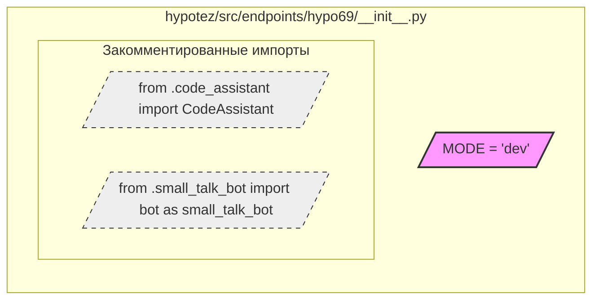

## Анализ кода `hypotez/src/endpoints/hypo69/__init__.py`

### <алгоритм>
1. **Объявление переменной `MODE`**: 
   - Инициализируется строковая переменная `MODE` со значением `'dev'`. 
   - **Пример**: `MODE = 'dev'` (Значение может быть изменено в зависимости от окружения).
2. **Импорт модулей (закомментировано)**:
   - Закомментированы импорты `CodeAssistant` и `small_talk_bot`. 
   - Эти импорты, если бы они были раскомментированы, вероятно, импортировали бы классы или объекты из модулей `code_assistant` и `small_talk_bot` соответственно.
   - **Пример**: `from .code_assistant import CodeAssistant` (Если раскомментировать, `CodeAssistant` стал бы доступен в этом модуле).

### <mermaid>

**Анализ `mermaid` диаграммы:**
*   Диаграмма отображает структуру модуля `__init__.py` внутри пакета `hypo69`.
*   `MODE_VAR` представляет переменную `MODE`, которая инициализируется значением `'dev'`. Она отмечена как важная переменная стилем заливки.
*   `CodeAssistant_import` и `small_talk_bot_import` представляют закомментированные импорты. Пунктирные линии и бледный цвет отображают, что эти импорты неактивны в текущей версии кода.

### <объяснение>

**Импорты:**
*   В данном коде, импорты закомментированы.
*   `from .code_assistant import CodeAssistant`: Эта строка предназначена для импорта класса `CodeAssistant` из модуля `code_assistant`, находящегося в том же пакете `hypo69`. Если бы импорт был раскомментирован, `CodeAssistant` мог бы использоваться для функциональности, связанной с помощью в кодировании.
*   `from .small_talk_bot import bot as small_talk_bot`: Эта строка предназначена для импорта объекта `bot` из модуля `small_talk_bot` (также в пакете `hypo69`) и переименования его в `small_talk_bot`. Если бы импорт был раскомментирован, `small_talk_bot` мог бы представлять собой объект, реализующий логику для неформального диалогового бота.
    *   Взаимосвязь с `src`: Оба импорта (`code_assistant` и `small_talk_bot`) подразумевают наличие других подпакетов/модулей в директории `src.endpoints.hypo69`, что предполагает, что они могут быть частью более широкой архитектуры системы.
    * **Почему закомментированы**: Вероятно, эти импорты были отключены для тестирования, отладки, или из-за того, что они еще не нужны в текущей реализации.

**Классы:**
*   В данном коде нет определения классов. Комментарий `# from .code_assistant import CodeAssistant` подразумевает, что класс `CodeAssistant` может быть определен в файле `code_assistant.py` в том же пакете. Аналогично, `small_talk_bot` может быть объектом, созданным в `small_talk_bot.py`.

**Функции:**
*   В данном коде нет определения функций.

**Переменные:**
*   `MODE`:
    *   Тип: Строка (`str`)
    *   Использование: Задаёт текущий режим работы приложения, в данном случае – `'dev'`, что, вероятно, означает "режим разработки". Это значение может влиять на поведение приложения (например, выводить более подробные сообщения об ошибках, использовать тестовые данные и т.д.).
    *   Потенциал: Эта переменная играет важную роль, так как от нее могут зависеть другие части программы. Возможно, необходимо предусмотреть механизм для переключения режима `dev`, `prod`, и т.д. через переменные окружения или конфигурационные файлы.

**Потенциальные ошибки и области для улучшения:**
*   **Отсутствие логики:** Сам по себе файл `__init__.py` с одной переменной и закомментированными импортами не выполняет никакой полезной работы, кроме как установить режим `dev`. Обычно, в `__init__.py` модуля также происходит импорт и инициализация важных компонентов для этого модуля.
*   **Зависимости:** Если `CodeAssistant` и `small_talk_bot` являются необходимыми частями пакета `hypo69`, то необходимо будет раскомментировать импорты и обеспечить их правильную работу.
*   **Управление режимом:** Желательно, чтобы значение `MODE` получалось из переменной окружения или файла конфигурации для более гибкого управления режимом работы приложения.
*   **Документация:**  Хотя есть docstring в начале файла, хорошо бы добавить пояснения о том, какие модули и классы должны быть импортированы (и почему они закомментированы) в этом пакете.

**Взаимосвязь с другими частями проекта:**
*   `hypo69`: Предположительно, пакет `hypo69` является частью более крупного проекта, где он отвечает за определенную функциональность.
*   `src.endpoints`: Пакет `src.endpoints` может содержать различные точки входа для приложения, а `hypo69` является одной из таких точек.
*   `src.endpoints.hypo69.code_assistant`: Данный модуль, если раскомментировать импорт, будет отвечать за код-ассистент в рамках данной точки входа.
*   `src.endpoints.hypo69.small_talk_bot`: Данный модуль, если раскомментировать импорт, будет отвечать за неформальный диалоговый бот в рамках данной точки входа.

В итоге, файл `hypotez/src/endpoints/hypo69/__init__.py` в текущем виде выполняет минимальную роль, но задает некоторые начальные параметры для данного модуля. В дальнейшей разработке, раскомментирование и реализация зависимостей, а также конфигурация режима работы станут ключевыми моментами.