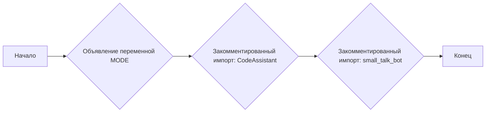
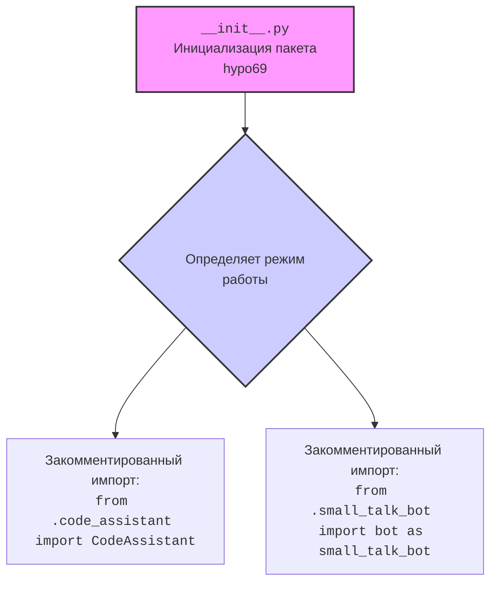

## АНАЛИЗ КОДА `hypotez/src/endpoints/hypo69/__init__.py`

### 1. <алгоритм>
Представленный код `hypotez/src/endpoints/hypo69/__init__.py` является файлом инициализации пакета Python. Он определяет переменную `MODE` и содержит закомментированный код, связанный с модулями `code_assistant` и `small_talk_bot`.

**Блок-схема:**

**Примеры для каждого логического блока:**
1. **Объявление переменной MODE**:
    - Инициализация: ``
    - Пример использования: Если в других модулях нужно проверить режим работы, можно сравнить `MODE == 'dev'` или `MODE == 'prod'` (в случае, если значение переменной будет изменено).

2. **Закомментированный импорт CodeAssistant**:
    - Пример: `from .code_assistant import CodeAssistant`
    - Фактически не выполняется, но в будущем может использоваться для импорта класса `CodeAssistant`.

3. **Закомментированный импорт small_talk_bot**:
    - Пример: `from .small_talk_bot import bot as small_talk_bot`
    - Фактически не выполняется, но в будущем может использоваться для импорта объекта `bot` как `small_talk_bot`.

### 2. <mermaid>

**Объяснение диаграммы:**

-   **A**: `__init__.py` представляет собой файл, который инициализирует пакет `hypo69`.
-   **B**: `` - объявление переменной, определяющей режим работы приложения.  Значение `dev` говорит о том, что это режим разработки.
-   **C**: Закомментированная строка импорта `code_assistant`. Этот модуль  `code_assistant` (если будет раскомментирован)  предназначен для помощи в работе с кодом.
-   **D**: Закомментированная строка импорта `small_talk_bot`. Этот модуль  `small_talk_bot` (если будет раскомментирован) отвечает за реализацию чат-бота.
-   Диаграмма показывает последовательность инициализации и импорта внутри файла `__init__.py`, а также зависимость от модулей `code_assistant` и `small_talk_bot`, хотя в данный момент они не активны.

### 3. <объяснение>

**Импорты:**

-   В данном коде импорты закомментированы, поэтому они в данный момент не используются.
-   Закомментированные импорты `from .code_assistant import CodeAssistant` и `from .small_talk_bot import bot as small_talk_bot` указывают на наличие модулей `code_assistant` и `small_talk_bot` в рамках того же пакета `hypo69`. В будущей разработке, раскомментировав эти строки, мы сможем получить доступ к их функционалу.
    - `code_assistant`: Модуль, предположительно, предоставляет функциональность для анализа и обработки кода.
    - `small_talk_bot`: Модуль, предназначенный для реализации функциональности чат-бота.
-   Использование относительного импорта `from .module import ...` показывает, что модули находятся в одной директории `hypo69` (внутри пакета).

**Классы:**

-   В текущем коде нет объявленных классов.
-   Закомментированный импорт `CodeAssistant` намекает на то, что в модуле `code_assistant` есть класс с именем `CodeAssistant`.

**Функции:**
-   В текущем файле нет функций.

**Переменные:**

-   ``:
    -   Тип: `str` (строка).
    -   Назначение: определяет режим работы приложения. Значение `'dev'` указывает на режим разработки. Эта переменная может использоваться для переключения поведения программы (например, вывод отладочной информации).

**Потенциальные ошибки и области для улучшения:**
-   **Отсутствие документации**: Отсутствие docstring для `__init__.py` может затруднить понимание цели пакета.
-   **Закомментированный код**:  Наличие закомментированного кода снижает читаемость и может свидетельствовать о том, что данный функционал еще не полностью реализован или находится в разработке.

**Взаимосвязь с другими частями проекта:**

-   Файл `__init__.py` находится в директории `hypotez/src/endpoints/hypo69`, что указывает на его принадлежность к пакетам, связанным с обработкой конечных точек (endpoints).
-   Закомментированные импорты `code_assistant` и `small_talk_bot` указывают на потенциальную связь с другими модулями, которые обрабатывают код и реализуют чат-бота.
-   Наличие переменной `MODE` предполагает, что она может использоваться в других частях приложения для определения режима работы (разработка, продакшн и т.д.).

**Цепочка взаимосвязей:**

1.  `hypotez`: Корневая директория проекта.
2.  `src`: Директория, содержащая исходный код проекта.
3.  `endpoints`: Директория, содержащая конечные точки API.
4.  `hypo69`: Пакет, содержащий функциональность для обработки запросов к конечной точке `hypo69`.
5.  `__init__.py`: Файл инициализации пакета `hypo69`.
6.  `code_assistant.py` (неактивный): Предполагаемый модуль для анализа кода.
7.  `small_talk_bot.py` (неактивный): Предполагаемый модуль для чат-бота.

Этот код является отправной точкой для разработки функциональности в рамках пакета `hypo69`.