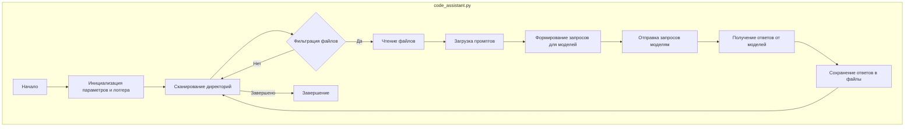
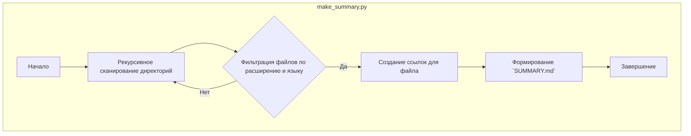
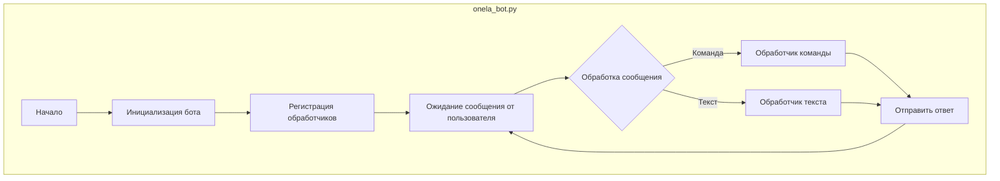
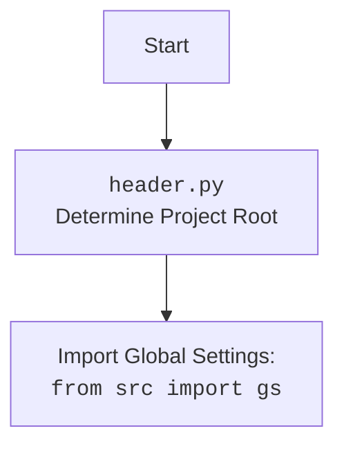

## АНАЛИЗ КОДА: `README.md` для модуля `code_assistant`

### 1. <алгоритм>

**Блок-схема работы модуля `code_assistant`:**

1.  **Начало**: Запуск скрипта `code_assistant.py` с параметрами командной строки или настройками из `settings.json`.
    *   **Пример**: `python code_assistant.py --role doc_writer --lang ru --models gemini openai --start_dirs /path/to/dir1 /path/to/dir2` или `python code_assistant.py --settings settings.json`

2.  **Инициализация**:
    *   Инициализация логгера для записи событий.
    *   Определение параметров: `role`, `lang`, `models`, `start_dirs`, `exclude_file_patterns`, `exclude_dirs`, `exclude_files`.
    *   **Пример**: `role` = `doc_writer`, `lang` = `ru`, `models` = `['gemini', 'openai']`, `start_dirs` = `['/path/to/dir1', '/path/to/dir2']`.

3.  **Обход директорий**: Рекурсивный обход директорий, указанных в `start_dirs`.
    *   **Пример**: Обход папок `/path/to/dir1` и `/path/to/dir2`.

4.  **Фильтрация файлов**: Проверка каждого файла на соответствие условиям фильтрации:
    *   Файлы `.py` и `README.MD`.
    *   Исключение файлов и директорий на основе `exclude_file_patterns`, `exclude_dirs`, `exclude_files`.
    *   **Пример**: Исключение файлов, которые соответствуют паттерну `.*test.*\.py$`.

5.  **Чтение файлов**: Чтение содержимого отфильтрованных файлов.
    *   **Пример**: Чтение содержимого файла `my_code.py` и `README.md`.

6.  **Загрузка промптов**: Загрузка системного промпта, соответствующего параметру `role` из `src/ai/prompts/developer/`.
    *   **Пример**: Загрузка `doc_writer_ru.md` для роли `doc_writer` и языка `ru`.

7.  **Формирование запросов**: Формирование запросов для каждой модели (`gemini`, `openai`) на основе прочитанного содержимого файлов и загруженных промптов.

8.  **Отправка запросов**: Отправка сформированных запросов к моделям API.

9.  **Получение ответов**: Получение ответов от моделей.

10. **Сохранение ответов**: Сохранение ответов моделей в директории, зависящей от роли и модели, например, в `docs/raw_rst_from_<model>/<lang>/`.
    *   **Пример**: Сохранение ответа Gemini в `docs/raw_rst_from_gemini/ru/`.

11. **Завершение**: Запись информации о завершении обработки в лог.

**Алгоритм `make_summary.py`**

1.  **Начало**: Запуск скрипта `make_summary.py` с указанием директории.

2.  **Рекурсивный обход**: Обход директории и поддиректорий.

3.  **Фильтрация файлов**: Проверка расширения файлов `.md` и соответствие языку (`ru` или `en`), если он указан.

4.  **Генерация ссылок**: Создание ссылок для каждого файла в формате Markdown.

5.  **Формирование `SUMMARY.md`**: Запись сгенерированных ссылок в файл `SUMMARY.md`.

6.  **Завершение**: Завершение генерации `SUMMARY.md`.

**Алгоритм `onela_bot.py` и `bot_handlers.py`**

1. **Инициализация**: Запуск Telegram-бота с использованием `onela_bot.py`.
   - Подключение к Telegram API.
2. **Обработчики**: Регистрация обработчиков команд и сообщений из `bot_handlers.py`.
   - Обработка команд, например, `/start`, `/help`.
   - Обработка текстовых сообщений.
3. **Взаимодействие с пользователем**: Отправка и получение сообщений от пользователя.
   - Получение запросов от пользователя.
   - Отправка ответов на запросы.
4. **Обработка кода**: Если получено сообщение с кодом, то отправка его на обработку в соответствии с логикой проекта.
5. **Завершение**: Ожидание новых сообщений.

### 2. <mermaid>

**Анализ зависимостей:**

*   Диаграмма `code_assistant.py` показывает последовательность основных операций: от инициализации до сохранения ответов. Важные этапы включают сканирование директорий, фильтрацию файлов, чтение их содержимого, загрузку промптов, отправку запросов к моделям и сохранение ответов.
*   Диаграмма `make_summary.py` показывает, как рекурсивно обходится директория, фильтруются файлы и формируется файл `SUMMARY.md`.
*   Диаграмма `onela_bot.py` показывает структуру работы Telegram-бота: инициализация, регистрация обработчиков, ожидание и обработка сообщений от пользователей.

### 3. <объяснение>

**Общее описание:**

Модуль `code_assistant` предоставляет набор скриптов для автоматизации работы с кодом с использованием AI-моделей. Он включает:

*   `code_assistant.py`: Основной скрипт для чтения файлов, загрузки промптов, отправки запросов к AI-моделям и сохранения ответов.
*   `make_summary.py`: Скрипт для автоматической генерации `SUMMARY.md` для документации.
*   `onela_bot.py` и `bot_handlers.py`: Скрипты для реализации Telegram-бота, который может взаимодействовать с пользователем по вопросам кода.

**Импорты:**

*   Из документа не видно конкретных импортов, но из контекста можно предположить, что используется стандартная библиотека Python (`os`, `json`, `re` и др.), а так же могут быть импорты из `src.ai` (модели, промпты), `src.utils` (логирование, обработка файлов), `src.telegram` (работа с Telegram API).

**Классы:**

*   В `README.md` нет описания классов, но исходя из функционала, можно предположить наличие классов для:
    *   `CodeProcessor` (в `code_assistant.py`): Обрабатывает файлы, загружает промпты и отправляет запросы к AI-моделям.
    *   `DirectoryScanner` (в `make_summary.py`):  Рекурсивно сканирует директории.
    *  `TelegramBot` (в `onela_bot.py`):  Обеспечивает взаимодействие с пользователем через Telegram.

**Функции:**

*   В `code_assistant.py`:
    *   Функция для парсинга аргументов командной строки или параметров из `settings.json`.
    *   Функции для чтения файлов.
    *   Функция для загрузки промптов из директории `src/ai/prompts/developer/`.
    *   Функции для формирования и отправки запросов к API моделей Gemini и OpenAI.
    *   Функции для сохранения ответов.
*   В `make_summary.py`:
    *   Функция для рекурсивного обхода директорий.
    *   Функция для фильтрации файлов.
    *   Функция для формирования ссылок в Markdown.
    *   Функция для записи содержимого в файл `SUMMARY.md`.
*   В `bot_handlers.py`:
    *   Обработчики команд бота, таких как `/start`, `/help`.
    *   Обработчики текстовых сообщений.

**Переменные:**

*   `role`: Строковая переменная, определяющая роль AI-модели (например, `doc_writer`, `code_checker`).
*   `lang`: Строковая переменная, определяющая язык (например, `ru`, `en`).
*   `models`: Список строк, определяющий список используемых моделей (например, `['gemini', 'openai']`).
*   `start_dirs`: Список строк, определяющий директории для обработки.
*   `exclude_file_patterns`, `exclude_dirs`, `exclude_files`: Списки или строки для определения исключений при обработке файлов.
*   `settings`: Словарь или объект JSON, содержащий настройки.

**Цепочка взаимосвязей:**

*   `code_assistant.py` вызывает API моделей (`src.ai.models`) для получения ответов.
*   `code_assistant.py` использует промпты из `src/ai/prompts/developer/`.
*   `make_summary.py` может использовать функции для обработки строк (например, `os.path`).
*   `onela_bot.py` и `bot_handlers.py` работают совместно для обеспечения интерактивности через Telegram.

**Потенциальные ошибки и области для улучшения:**

*   Отсутствие обработки ошибок при обращении к API моделей.
*   Возможность оптимизации обхода файлов и обработки текста.
*   Необходимо добавить валидацию входных параметров.
*   Необходимо добавить unit тесты.

Этот анализ предоставляет всестороннее понимание функциональности и структуры модуля `code_assistant`. Он описывает все компоненты и их взаимодействие, а также предоставляет информацию о том, как можно эффективно использовать эти скрипты.