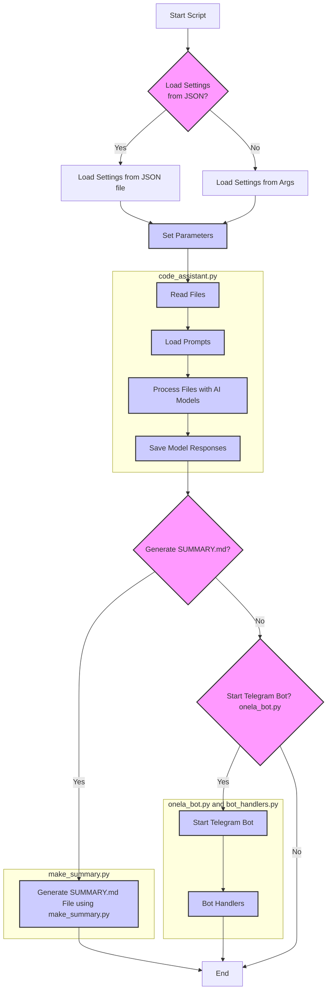

## ИНСТРУКЦИЯ:

Анализируй предоставленный код подробно и объясни его функциональность. Ответ должен включать три раздела:

1. **<алгоритм>**: Опиши рабочий процесс в виде пошаговой блок-схемы, включая примеры для каждого логического блока, и проиллюстрируй поток данных между функциями, классами или методами.
2. **<mermaid>**: Напиши код для диаграммы в формате `mermaid`, проанализируй и объясни все зависимости,
    которые импортируются при создании диаграммы.
    **ВАЖНО!** Убедитесь, что все имена переменных, используемые в диаграмме `mermaid`,
    имеют осмысленные и описательные имена. Имена переменных вроде `A`, `B`, `C`, и т.д., не допускаются!

    **Дополнительно**: Если в коде есть импорт `import header`, добавьте блок `mermaid` flowchart, объясняющий `header.py`:
    ```mermaid
    flowchart TD
        Start --> Header[<code>header.py</code><br> Determine Project Root]

        Header --> import[Import Global Settings: <br><code>from src import gs</code>]
    ```

3. **<объяснение>**: Предоставьте подробные объяснения:
   - **Импорты**: Их назначение и взаимосвязь с другими пакетами `src.`.
   - **Классы**: Их роль, атрибуты, методы и взаимодействие с другими компонентами проекта.
   - **Функции**: Их аргументы, возвращаемые значения, назначение и примеры.
   - **Переменные**: Их типы и использование.
   - Выделите потенциальные ошибки или области для улучшения.

Дополнительно, постройте цепочку взаимосвязей с другими частями проекта (если применимо).

Это обеспечивает всесторонний и структурированный анализ кода.
## Формат ответа: `.md` (markdown)
**КОНЕЦ ИНСТРУКЦИИ**

## <алгоритм>

Модуль `code_assistant` состоит из нескольких скриптов, предназначенных для автоматизации работы с кодом с использованием AI моделей. Вот пошаговое описание работы модуля:

1.  **Инициализация параметров (через `code_assistant.py`)**:
    *   Загружаются настройки из JSON файла, если указан аргумент `--settings`.
    *   Иначе, параметры (`--role`, `--lang`, `--models`, `--start_dirs`) передаются через командную строку.
    *   **Пример:**
        ```bash
        python code_assistant.py --settings settings.json
        ```
        Или:
        ```bash
        python code_assistant.py --role doc_writer --lang ru --models gemini openai --start_dirs /path/to/dir1 /path/to/dir2
        ```
2.  **Чтение файлов (в `code_assistant.py`)**:
    *   Функция `read_files` рекурсивно ищет файлы с расширением `.py` и `README.MD` в указанных директориях (`--start_dirs`).
    *   Исключает файлы и директории согласно настройкам (`exclude_file_patterns`, `exclude_dirs`, `exclude_files`).
    *   Сохраняет путь к файлу и его содержимое в структуру данных.
    *   **Пример:**
        *   Директория `/path/to/dir1` содержит `file1.py` и `README.MD`, которые будут прочитаны.
        *   Директория `/path/to/dir2` содержит `file2.py`, который также будет прочитан.
        *   Файлы, соответствующие `exclude_file_patterns`, `exclude_dirs`, `exclude_files` не будут прочитаны.
3. **Загрузка промптов (в `code_assistant.py`)**:
    *   Для каждой роли (например, `doc_writer`, `code_checker`) загружаются соответствующие промпты из директории `src/ai/prompts/developer/`.
    *   **Пример:** Если `--role` равен `doc_writer` и `--lang` равен `en`, загружается файл `src/ai/prompts/developer/doc_writer_en.md`.
4.  **Обработка файлов с помощью AI моделей (в `code_assistant.py`)**:
    *   Для каждого файла и каждой указанной модели (например, `gemini`, `openai`) генерируется запрос, основанный на промпте и содержимом файла.
    *   Запрос отправляется в соответствующую AI модель.
    *   Полученный ответ сохраняется в директорию, зависящую от роли, модели и языка (например, `docs/raw_rst_from_gemini/ru/` для `gemini`, `ru` и `doc_writer`).
    *   **Пример:**
        *   Для `file1.py` генерируется запрос для `gemini` и `openai`.
        *   Ответы от `gemini` сохраняются в `docs/raw_rst_from_gemini/<lang>/`
        *   Ответы от `openai` сохраняются в `docs/raw_rst_from_openai/<lang>/`
5.  **Генерация `SUMMARY.md` (в `make_summary.py`)**:
    *   Скрипт `make_summary.py` рекурсивно обходит указанную директорию.
    *   Создает структуру каталогов в формате Markdown для файла `SUMMARY.md`.
    *   Фильтрует файлы по языку, если указано.
    *   **Пример:**
        ```bash
        python make_summary.py --start_dir /path/to/docs --lang ru
        ```
        Результатом будет файл `SUMMARY.md` в директории `/path/to/docs`, содержащий ссылки на `.md` файлы на русском языке.
6.  **Работа Telegram бота (в `onela_bot.py` и `bot_handlers.py`)**:
    *   `onela_bot.py` инициализирует Telegram бота и регистрирует обработчики команд.
    *   `bot_handlers.py` содержит функции для обработки команд и сообщений от пользователя (например, отправка кода на ревью или генерацию документации).
    *   **Пример:**
        Пользователь в Telegram отправляет команду `/review <имя_файла>`.
        Бот отправляет содержимое файла на ревью AI модели.

## <mermaid>



**Анализ зависимостей `mermaid`:**

1.  **`Start`**: Начало выполнения скрипта.
2.  **`LoadSettings`**: Проверяет, нужно ли загружать настройки из JSON файла или из аргументов командной строки.
3.  **`LoadSettingsFromJson`**: Загружает настройки из JSON файла.
4.  **`LoadSettingsFromArgs`**: Загружает настройки из аргументов командной строки.
5.  **`SetParams`**: Устанавливает параметры для работы скрипта (роль, язык, модели, директории).
6.  **`ReadFiles`**: Читает файлы `.py` и `README.MD` из указанных директорий, исключая указанные в настройках.
7.  **`LoadPrompts`**: Загружает промпты из файлов `src/ai/prompts/developer/` в зависимости от роли и языка.
8.  **`ProcessFiles`**: Обрабатывает файлы с использованием AI моделей (Gemini, OpenAI).
9.  **`SaveResponses`**: Сохраняет ответы от AI моделей в соответствующие директории.
10. **`GenerateSummary`**: Проверяет необходимость генерации файла `SUMMARY.md`.
11. **`GenerateSummaryMD`**: Генерирует файл `SUMMARY.md` с использованием `make_summary.py`.
12. **`HandleTelegramBot`**: Проверяет необходимость запуска Telegram бота.
13. **`BotStart`**: Инициализирует и запускает Telegram бота.
14. **`BotHandlers`**: Управляет обработчиками команд и сообщений Telegram бота.
15. **`End`**: Завершение выполнения скрипта.

**Зависимости внутри подграфов:**
* **`code_assistant.py`**: включает чтение файлов, загрузку промптов, обработку файлов AI моделями и сохранение ответов.
* **`make_summary.py`**: отвечает за генерацию файла `SUMMARY.md`.
* **`onela_bot.py` и `bot_handlers.py`**: реализуют логику Telegram бота, включая запуск и обработку сообщений.

## <объяснение>

### Импорты

В предоставленном описании модуля отсутствуют явные импорты Python. Однако по описанию функциональности можно предположить, что используются следующие импорты, которые неявно упоминаются в тексте:

*   **`os`**: Для работы с файловой системой (чтение файлов, обход директорий).
*   **`json`**: Для работы с JSON файлами (загрузка настроек).
*   **`argparse`**: Для обработки аргументов командной строки.
*   **`re`**: Для работы с регулярными выражениями (фильтрация файлов по `exclude_file_patterns`).
*   **`logging`**: Для ведения логов.
*   **`src.ai.models.gemini`**: Модуль для работы с Gemini API (неявно из описания).
*   **`src.ai.models.openai`**: Модуль для работы с OpenAI API (неявно из описания).
*    **`telegram` и `telegram.ext`**: Библиотеки для работы с Telegram ботом.
*   **`src`**: Общий пакет проекта, из которого могут импортироваться другие модули (например, `gs`).

### Классы

В описании явно не указаны классы, но по описанию можно предположить использование:

*   **Класс для взаимодействия с Gemini API** (`src.ai.models.gemini`):
    *   **Атрибуты**: API key, настройки модели.
    *   **Методы**: `send_request` для отправки запроса и получения ответа.
*   **Класс для взаимодействия с OpenAI API** (`src.ai.models.openai`):
    *   **Атрибуты**: API key, настройки модели.
    *   **Методы**: `send_request` для отправки запроса и получения ответа.
*   **Класс для работы с Telegram ботом** (`telegram.Bot`):
    *   **Атрибуты**: API key.
    *   **Методы**: `send_message`, `register_handler`.

### Функции

*   **`read_files(start_dirs, exclude_file_patterns, exclude_dirs, exclude_files)` (`code_assistant.py`)**:
    *   **Аргументы**:
        *   `start_dirs`: Список директорий для поиска файлов.
        *   `exclude_file_patterns`: Список регулярных выражений для исключения файлов.
        *   `exclude_dirs`: Список директорий для исключения.
        *   `exclude_files`: Список файлов для исключения.
    *   **Возвращаемое значение**: Структура данных, содержащая пути к файлам и их содержимое.
    *   **Назначение**: Чтение файлов `.py` и `README.MD` из указанных директорий.
*   **`load_prompt(role, lang)` (`code_assistant.py`)**:
    *   **Аргументы**:
        *   `role`: Роль (например, `doc_writer`, `code_checker`).
        *   `lang`: Язык (`ru`, `en`).
    *   **Возвращаемое значение**: Текст промпта из файла.
    *   **Назначение**: Загрузка промпта из файла на основе роли и языка.
*   **`process_file(file_path, file_content, role, models, prompt, lang)` (`code_assistant.py`)**:
    *   **Аргументы**:
        *   `file_path`: Путь к файлу.
        *   `file_content`: Содержимое файла.
        *   `role`: Роль (например, `doc_writer`).
        *   `models`: Список моделей для обработки (например, `gemini`, `openai`).
        *   `prompt`: Текст промпта.
        *   `lang`: Язык.
    *   **Возвращаемое значение**: None
    *   **Назначение**: Обработка файла с использованием AI моделей.
*   **`generate_summary(start_dir, lang)` (`make_summary.py`)**:
    *   **Аргументы**:
        *   `start_dir`: Директория для обхода.
        *   `lang`: Язык (`ru`, `en`).
    *   **Возвращаемое значение**: None
    *   **Назначение**: Создание `SUMMARY.md` файла.
*   **Обработчики команд Telegram бота (в `bot_handlers.py`)**:
    *   **Аргументы**: Сообщения и команды от пользователя.
    *   **Возвращаемое значение**: None
    *   **Назначение**: Обработка команд и сообщений, отправка запросов AI моделям и ответы пользователю.

### Переменные

*   `settings`: JSON-объект с настройками.
*   `role`: Строка, представляющая роль (например, `doc_writer`, `code_checker`).
*   `lang`: Строка, представляющая язык (`ru`, `en`).
*   `models`: Список строк, представляющих модели (например, `gemini`, `openai`).
*   `start_dirs`: Список строк, представляющих директории для обработки.
*   `exclude_file_patterns`: Список регулярных выражений для исключения файлов.
*   `exclude_dirs`: Список директорий для исключения.
*   `exclude_files`: Список файлов для исключения.
*   `file_path`: Строка, представляющая путь к файлу.
*   `file_content`: Строка, представляющая содержимое файла.
*   `prompt`: Строка, представляющая текст промпта.
*   `model_response`: Строка, представляющая ответ от AI модели.

### Потенциальные ошибки и области для улучшения

*   **Обработка ошибок**: В описании не указаны явные механизмы обработки ошибок. Необходимо добавить обработку исключений при чтении файлов, обращении к AI моделям, и т.д.
*   **Асинхронная обработка**: Обработка файлов и запросов к моделям может быть выполнена асинхронно для ускорения работы.
*   **Кеширование ответов AI**: Для уменьшения количества запросов к моделям можно добавить кеширование ответов.
*   **Улучшение логгирования**: Добавить больше деталей в логгирование, например, время выполнения операций, ошибки.
*   **Гибкость настроек**: Возможность более гибкой настройки исключений (например, по маске файла).
*   **Модульность**: Разделить код на более мелкие модули и функции для улучшения читаемости и переиспользования.
*   **Параллельная обработка**: Использовать многопоточность или многопроцессорность для обработки нескольких файлов или моделей одновременно.

### Взаимосвязи с другими частями проекта

*   **`src/ai/prompts/developer/`**: Содержит промпты для AI моделей.
*   **`src/ai/models/`**: Содержит модули для взаимодействия с Gemini и OpenAI API.
*   **`src`**: Общий пакет проекта, откуда могут импортироваться глобальные настройки.

Этот анализ предоставляет подробное описание модуля `code_assistant` и его основных компонентов.