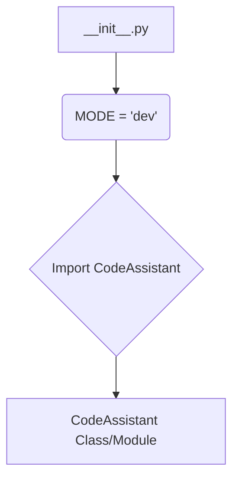
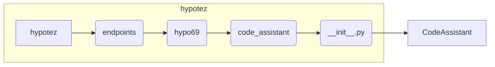

# <input code>

```python
## \file hypotez/src/endpoints/hypo69/code_assistant/__init__.py
# -*- coding: utf-8 -*-
#! venv/Scripts/python.exe
#! venv/bin/python/python3.12

"""
.. module: src.endpoints.hypo69.code_assistant 
	:platform: Windows, Unix
	:synopsis:

"""
MODE = 'dev'

from .code_assistant import CodeAssistant
```

# <algorithm>

Этот код является модулем `__init__.py` для пакета `code_assistant` внутри приложения `hypotez`.  Он, в основном, содержит импорт и константу.  Блок-схема упрощённая, так как подробности реализации `CodeAssistant` неизвестны:



Пример:
- `MODE` устанавливается в 'dev' для дальнейшего использования в приложении.
- Импортируется `CodeAssistant`, предположительно, класс или модуль, содержащий функциональность, связанную с помощником по коду.

# <mermaid>



**Объяснение диаграммы:**

Диаграмма представляет иерархическую структуру пакета `hypotez`.  `hypotez` - это главный пакет, содержащий подпакеты `endpoints`, `hypo69`, а последний содержит `code_assistant`.  Модуль `__init__.py` является частью пакета `code_assistant` и импортирует из него класс или модуль `CodeAssistant`.  Подразумевается, что `CodeAssistant` содержит функциональность, связанную с обработкой кода.

# <explanation>

**Импорты:**

- `from .code_assistant import CodeAssistant`:  Импортирует класс или функцию `CodeAssistant` из модуля `code_assistant` в текущем подпакете.  Символ `.` указывает, что `code_assistant` находится в том же каталоге, что и текущий модуль `__init__.py`.  Это стандартный способ импорта модулей внутри одного пакета.


**Классы:**

- `CodeAssistant` (по умолчанию):  Это класс (или модуль) из файла `code_assistant.py` (если он есть).  Без доступа к коду `code_assistant.py` неясно, что именно делает этот класс.  Возможно, он предоставляет методы для анализа, генерации или обработки кода.


**Функции:**

- Нет явно определенных функций в `__init__.py`.


**Переменные:**

- `MODE = 'dev'`:  Переменная глобального уровня, вероятно, используется для определения режима работы (разработка, производство и т.п.).  Это может влиять на поведение других частей приложения, например, на логику работы или вывод сообщений.


**Возможные ошибки или улучшения:**

- **Отсутствует документирование:**  Нет подробной документации в коде о `CodeAssistant` и его методах, что усложняет понимание его функциональности.
- **Отсутствие информации о `code_assistant.py`:**  Неизвестно, какие именно классы и методы есть в модуле `code_assistant` и их назначение.

**Взаимосвязь с другими частями проекта:**

Этот модуль является частью `hypotez`.  Он позволяет другим частям приложения (например, другим модулям или скриптам) использовать `CodeAssistant` для обработки кода.  Более подробную информацию можно получить только при просмотре кода `code_assistant.py`.  Возможно, `CodeAssistant` взаимодействует с другими модулями через функции или методы, передавая и принимая данные (например, объекты кода).