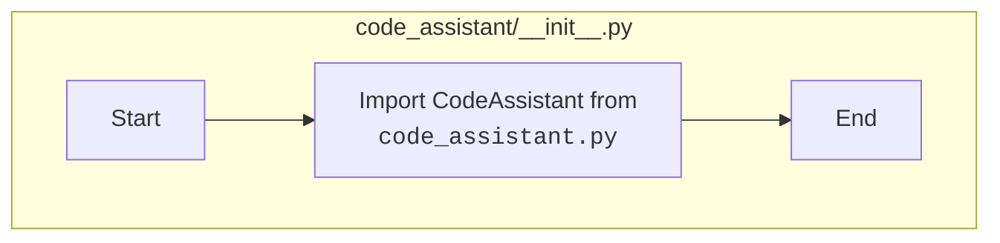

## Анализ кода `hypotez/src/endpoints/hypo69/code_assistant/__init__.py`

### 1. <алгоритм>

1.  **Импорт модуля:**
    *   Выполняется импорт `CodeAssistant` из локального модуля `code_assistant.py`.
    *   Пример: `from .code_assistant import CodeAssistant` импортирует класс `CodeAssistant` из файла `code_assistant.py`, находящегося в том же каталоге.

2.  **Использование:**
    *   После импорта, класс `CodeAssistant` может использоваться в других модулях, импортирующих данный `__init__.py`.

### 2. <mermaid>

### 3. <объяснение>

**Импорты:**

*   `from .code_assistant import CodeAssistant`:
    *   Этот импорт указывает, что из файла `code_assistant.py`, находящегося в том же каталоге, импортируется класс `CodeAssistant`.
    *   Точка `.` перед `code_assistant` означает относительный импорт, указывающий, что модуль находится в текущем пакете.
    *   `CodeAssistant` предположительно является классом, предоставляющим функционал ассистента по коду.

**Общая функциональность файла:**

*   `__init__.py` файл в Python обозначает, что директория `code_assistant` является пакетом.
*   Импорт класса `CodeAssistant` в `__init__.py` делает его доступным при импорте пакета. То есть, если другой модуль выполнит `from src.endpoints.hypo69.code_assistant import CodeAssistant`, он сможет использовать класс.
*   Этот файл служит точкой входа для модуля `code_assistant`, позволяя удобно импортировать `CodeAssistant` и другие компоненты, которые могут быть добавлены позже.

**Цепочка взаимосвязей с другими частями проекта:**

*   Данный файл является частью пакета `src.endpoints.hypo69.code_assistant`.
*   Обычно, класс `CodeAssistant` будет использоваться в других частях проекта, которые импортируют `src.endpoints.hypo69.code_assistant`.
*   Этот модуль, скорее всего, будет использоваться для создания функционала, связанного с ассистентом по коду, возможно для интеграции с каким-либо редактором или IDE.
*   Файл `code_assistant.py` (не показанный здесь) скорее всего содержит логику работы класса `CodeAssistant`.

**Потенциальные ошибки или области для улучшения:**

*   В текущем виде файл достаточно прост и не имеет очевидных проблем.
*   По мере развития проекта, в `__init__.py` могут быть добавлены другие импорты из данного пакета, делая их доступными через единую точку входа.
*   При необходимости можно добавить документацию к модулю прямо в `__init__.py` для ясности.