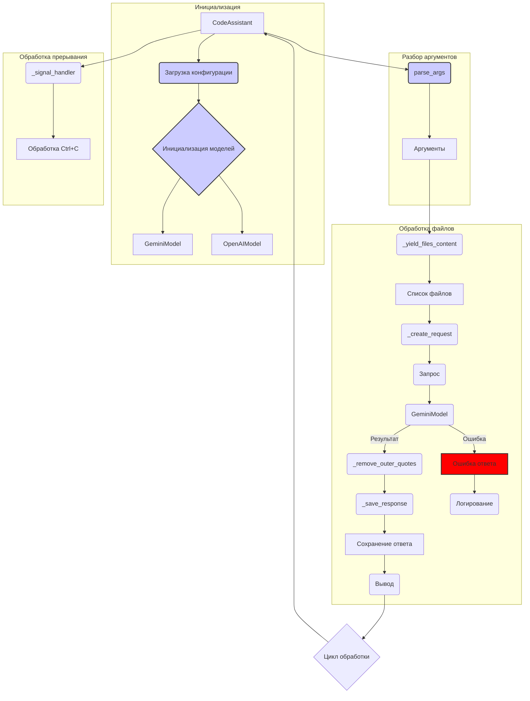

```MD
# Анализ кода

## <input code>

```%% module src.endpoints.hypo69.code_assistant.code_assistant
graph TD
    subgraph Инициализация
        A[CodeAssistant] --> B(Загрузка конфигурации)
        B --> C{Инициализация моделей}
        C --> D[GeminiModel]
        C --> E[OpenAIModel]
    end
    
    subgraph Разбор аргументов
        A --> F(parse_args)
        F --> G[Аргументы]
    end
    
    subgraph Обработка файлов
        G --> H(_yield_files_content)
        H --> I[Список файлов]
        I --> J(_create_request)
        J --> K(Запрос)
        K --> L(GeminiModel)
        L --> M(_remove_outer_quotes)
        M --> N(_save_response)
        N --> O[Сохранение ответа]
        O --> P(Вывод)
        
        subgraph alt [Ошибка]
            L --> Q[Ошибка ответа]
            Q --> R(Логирование)
        end
    end
    
    subgraph Обработка прерывания
        A --> S(_signal_handler)
        S --> T[Обработка Ctrl+C]
    end

    P --> U{Цикл обработки}
    U --> A

    style B fill:#11f,stroke:#333,stroke-width:2px
    style C fill:#11f,stroke:#333,stroke-width:2px
    style F fill:#11f,stroke:#333,stroke-width:2px
```

## <algorithm>

Блок-схема описывает алгоритм работы модуля `CodeAssistant`.  Процесс итеративен и состоит из следующих этапов:

1. **Инициализация:**
    * Объект `CodeAssistant` (A) запускает процесс инициализации (B).
    * Загружается конфигурация (B).
    * Инициализируются модели GeminiModel (D) и OpenAIModel (E) (C).


2. **Разбор аргументов:**
    * `CodeAssistant` (A) вызывает функцию `parse_args` (F).
    * Функция `parse_args` возвращает аргументы (G).

3. **Обработка файлов:**
    * Аргументы (G) используются для извлечения содержимого файлов с помощью `_yield_files_content` (H).
    * Полученный список файлов (I) передается в `_create_request` (J), где формируется запрос.
    * Запрос (K) подается в модель `GeminiModel` (L).
    * Если модель `GeminiModel` (L) возвращает ошибку (Q), происходит логирование (R).
    * В противном случае из результата удаляются внешние кавычки (M).
    * Полученный результат сохраняется (N).
    * Результат выводятся на экран (O)
    
4. **Обработка прерывания:**
    * `CodeAssistant` (A) регистрирует обработчик сигнала `Ctrl+C` (S).

5. **Цикл обработки:**
    * Результат обработки (P) инициирует цикл обработки (U), который повторяет все шаги с этапа 2.


## <mermaid>



## <explanation>

**Импорты:**

Код не содержит импортов, он описывает блок-схему.  Импорты (если они были бы) определяли бы используемые модули и классы из других частей проекта. Например, `src.endpoints.hypo69.code_assistant` предполагает, что это подпапка проекта `src` в папке `endpoints` проекта `hypo69`, и содержит модуль `code_assistant`.

**Классы:**

Классы `GeminiModel` и `OpenAIModel` - это потенциально классы из других частей проекта, ответственные за взаимодействие с соответствующими моделями.  Блок-схема указывает на их инициализацию (C), но не детализирует их внутреннюю реализацию.

**Функции:**

* `parse_args`:  Функция, принимающая и обрабатывающая аргументы командной строки (F).
* `_yield_files_content`: Функция, которая генерирует содержимое файлов (H).
* `_create_request`: Функция, формирующая запрос к модели (J).
* `_remove_outer_quotes`: Функция, удаляющая внешние кавычки из результата (M).
* `_save_response`: Функция, сохраняющая ответ модели (N).
* `_signal_handler`: Функция, обрабатывающая сигнал прерывания (S).

**Переменные:**

Переменные не явно представлены в блок-схеме, но подразумевается, что они содержат данные, передаваемые между функциями и классами (например, содержимое файлов, запрос и т. д.)

**Возможные ошибки или области для улучшений:**

* Не описана логика обработки ошибок, связанных с загрузкой конфигурации, отсутствием моделей или другими проблемами.  Указанная блок-схема не определяет, как именно `parse_args` и `_yield_files_content` обрабатывают возможные ошибки.
* Отсутствуют детали о структуре данных, которые передаются и обрабатываются.  Например, какие типы данных используются для "Аргументов" (G), "Списка файлов" (I), запроса (K) и ответа (O).


**Взаимосвязи с другими частями проекта:**

* Модуль `src.endpoints.hypo69.code_assistant.code_assistant` взаимодействует с моделями `GeminiModel` и `OpenAIModel` , а также с компонентами, которые обеспечивают загрузку конфигурации и обработку файлов.


В целом, блок-схема хорошо иллюстрирует процесс обработки файлов и взаимодействия с моделями. Для более глубокого анализа необходимо изучить код функций и классов, которые она описывает, и детализацию обработки ошибок.