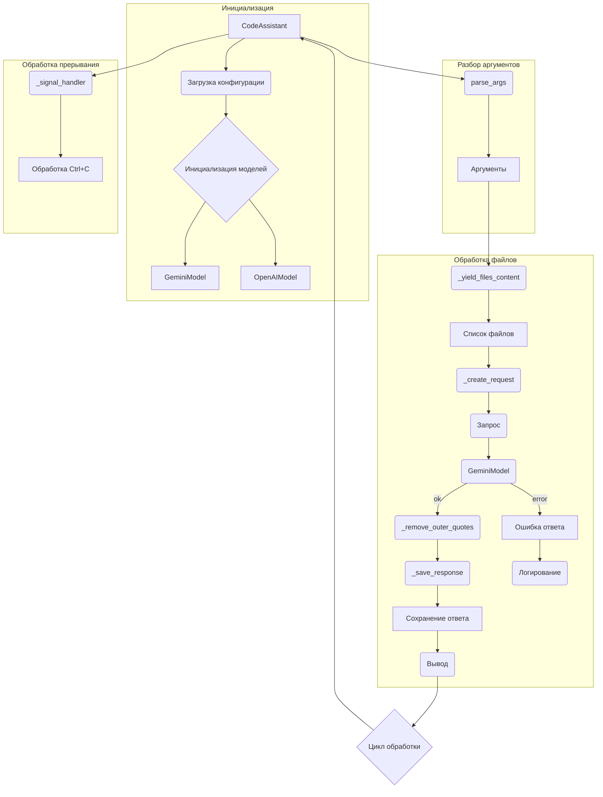

```MD
# Анализ кода

## <input code>

```%% module src.endpoints.hypo69.code_assistant.code_assistant
graph TD
    subgraph Инициализация
        A[CodeAssistant] --> B(Загрузка конфигурации)
        B --> C{Инициализация моделей}
        C --> D[GeminiModel]
        C --> E[OpenAIModel]
    end
    
    subgraph Разбор аргументов
        A --> F(parse_args)
        F --> G[Аргументы]
    end
    
    subgraph Обработка файлов
        G --> H(_yield_files_content)
        H --> I[Список файлов]
        I --> J(_create_request)
        J --> K(Запрос)
        K --> L(GeminiModel)
        L --> M(_remove_outer_quotes)
        M --> N(_save_response)
        N --> O[Сохранение ответа]
        O --> P(Вывод)
        
        subgraph alt [Ошибка]
            L --> Q[Ошибка ответа]
            Q --> R(Логирование)
        end
    end
    
    subgraph Обработка прерывания
        A --> S(_signal_handler)
        S --> T[Обработка Ctrl+C]
    end

    P --> U{Цикл обработки}
    U --> A

    style B fill:#11f,stroke:#333,stroke-width:2px
    style C fill:#11f,stroke:#333,stroke-width:2px
    style F fill:#11f,stroke:#333,stroke-width:2px
```

## <algorithm>

**Шаг 1: Инициализация:**

* `CodeAssistant` (объект класса) инициализируется.
* Загружается конфигурация.  Пример: `config.json` с настройками API-ключей, путями к файлам и др.
* Инициализируются модели: `GeminiModel` и `OpenAIModel`.  Пример: подключение к API, проверка работоспособности.

**Шаг 2: Разбор аргументов:**

* Получаются аргументы командной строки (`parse_args`).  Пример: `python script.py --input_file data.txt --output_file result.txt`.
* Сохраняются в переменной `G[Аргументы]`.


**Шаг 3: Обработка файлов:**

* Извлекаются данные из файлов, указанных в аргументах. `_yield_files_content`. Пример: из `data.txt`
* Формируется `Список файлов` (`I`).
* Создается `Запрос` (`J`) для модели на основе данных из файлов. Пример: формирование запроса к API с содержимым файлов.
* Обработка запроса `GeminiModel`.
* Обработка ответа `_remove_outer_quotes` если требуется.
* Сохранение ответа в файл `_save_response` (например, `result.txt`).
* Вывод результата (`P`).
* **Обработка ошибок:** Если `GeminiModel` возвращает ошибку, происходит запись в `Логирование` (например, в файл или в консоль).


**Шаг 4: Обработка прерывания:**

* Обработка сигнала Ctrl+C (`_signal_handler`) для корректного завершения программы.

**Шаг 5: Цикл обработки:**

* Цикл обработки (`U`) повторяет шаги 2-4 для всех необходимых файлов, пока не будет достигнут конец списка.


## <mermaid>



**Зависимости:**

* `src.endpoints.hypo69.code_assistant` - модуль с кодом.
* `GeminiModel`, `OpenAIModel` -  предполагаемые классы для взаимодействия с API Gemini и OpenAI.
* `parse_args` - вероятно, функция для парсинга аргументов командной строки (из `argparse` или аналогичной библиотеки).
* `_yield_files_content`, `_create_request`, `_remove_outer_quotes`, `_save_response`, `_signal_handler` - функции, написанные внутри модуля.
* `config.json` - файл конфигурации.
*  `logging`  - вероятно используется для записи логов.

## <explanation>

**Импорты:**

В коде нет явных импортов,  но предполагается использование библиотек (argparse, logging) для парсинга командной строки и работы с логами соответственно.

**Классы:**

* `CodeAssistant`:  Класс для обработки всей логики, инициализирует модели и цикл обработки.  Атрибуты: список моделей, конфигурация.  Методы: `parse_args`, `_signal_handler` и другие.

* `GeminiModel` и `OpenAIModel`: Классы, представляющие модели.  Методы: взаимодействие с API (например, отправка запроса). Атрибуты: API-ключи, настройки.


**Функции:**

* `parse_args`: Парсит аргументы командной строки.
* `_yield_files_content`: Возвращает содержимое файлов.
* `_create_request`: Формирует запрос для моделей.
* `_remove_outer_quotes`: Удаляет внешние кавычки (если необходимо).
* `_save_response`: Сохраняет ответ в файл.
* `_signal_handler`: Обрабатывает сигнал прерывания (Ctrl+C).

**Переменные:**

Переменные `G`, `I`, `O` -  временные переменные, хранят результаты функций.

**Возможные ошибки и улучшения:**

* Не указан способ обработки исключений. Добавьте обработку исключений при чтении файлов, взаимодействии с API и других операциях для повышения устойчивости.
* Отсутствует описание типов возвращаемых значений функций.
* Отсутствует документирование кода.  Добавьте docstrings для функций и классов.
*  Не описан механизм обработки ошибок при работе с GeminiModel, следует рассмотреть использование try-except блоков.

**Цепочка взаимосвязей:**

`src.endpoints.hypo69.code_assistant` зависит от внешних модулей (argparse, logging, API Gemini/OpenAI) и файлов конфигурации.