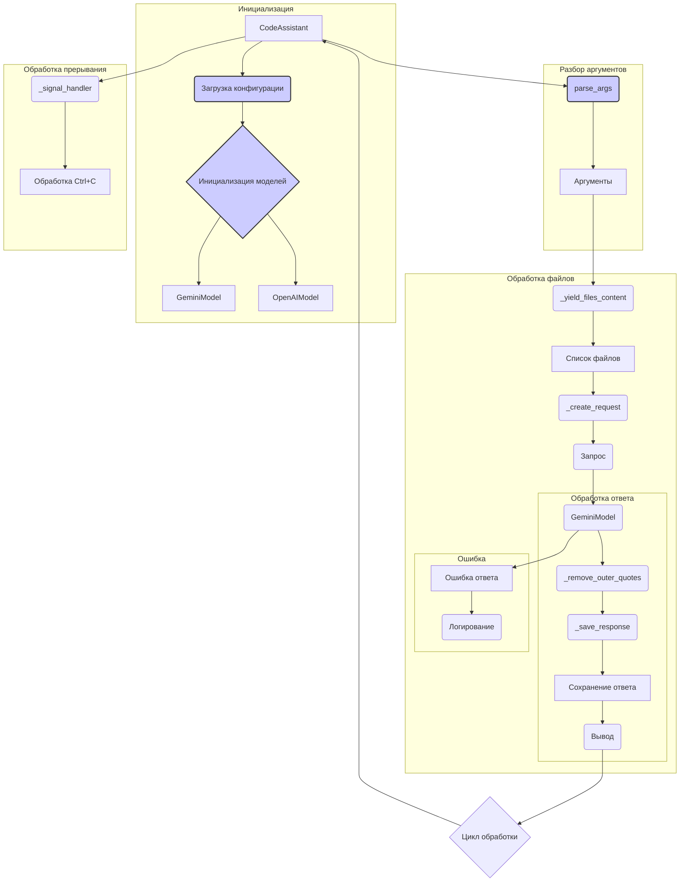

# Анализ кода

**1. <input code>**

```%% module src.endpoints.hypo69.code_assistant.code_assistant
graph TD
    subgraph Инициализация
        A[CodeAssistant] --> B(Загрузка конфигурации)
        B --> C{Инициализация моделей}
        C --> D[GeminiModel]
        C --> E[OpenAIModel]
    end
    
    subgraph Разбор аргументов
        A --> F(parse_args)
        F --> G[Аргументы]
    end
    
    subgraph Обработка файлов
        G --> H(_yield_files_content)
        H --> I[Список файлов]
        I --> J(_create_request)
        J --> K(Запрос)
        K --> L(GeminiModel)
        L --> M(_remove_outer_quotes)
        M --> N(_save_response)
        N --> O[Сохранение ответа]
        O --> P(Вывод)
        
        subgraph alt [Ошибка]
            L --> Q[Ошибка ответа]
            Q --> R(Логирование)
        end
    end
    
    subgraph Обработка прерывания
        A --> S(_signal_handler)
        S --> T[Обработка Ctrl+C]
    end

    P --> U{Цикл обработки}
    U --> A

    style B fill:#11f,stroke:#333,stroke-width:2px
    style C fill:#11f,stroke:#333,stroke-width:2px
    style F fill:#11f,stroke:#333,stroke-width:2px
```

**2. <algorithm>**

**Инициализация:**

* `CodeAssistant` (A) - точка входа.
* Загружает конфигурацию (B).  Пример:  загрузка настроек API-ключа, пути к файлам, параметров модели.
* Инициализирует модели (C): создает экземпляры `GeminiModel` (D) и `OpenAIModel` (E). Пример: устанавливает соединение с API, загружает необходимые ресурсы.

**Разбор аргументов:**

* `CodeAssistant` (A) получает аргументы (F) командной строки или из конфигурации. Пример: имена файлов для обработки.
* Полученные аргументы сохраняются в переменной `Аргументы` (G). Пример: список файлов `/path/to/file1.txt`, `/path/to/file2.txt`.


**Обработка файлов:**

* `Аргументы` (G) передаются в `_yield_files_content` (H).  Пример: передается список файлов.
* `_yield_files_content` возвращает список файлов (I).  Пример: `['/path/to/file1.txt', '/path/to/file2.txt']`.
* `_create_request` (J) создает запросы для модели на основе содержимого файлов (I).  Пример: строит запросы для GeminiModel.
* Модель (L) обрабатывает запросы (K). Пример: выполняет вычисления на данных.
* Результат обработки (L) обрабатывается (M): удаляются внешние кавычки, если они есть. Пример: `"some text"` -> `some text`.
* `_save_response` (N) сохраняет ответ (M). Пример: сохраняет результат в файл.
* Вывод (O): выводит результат в консоль или сохраняет в другой файл. Пример: отображает обработанный текст.
* Ошибка (alt): Если произошла ошибка обработки (Q), сохраняется ошибка и записывается в логи (R). Пример: `Ошибка: Не удалось обработать файл`.

**Обработка прерывания:**

* `CodeAssistant` (A) регистрирует обработчик сигналов `Ctrl+C` (S).
* При прерывании (`Ctrl+C`) выполняется `_signal_handler` (S).
* Обработка `Ctrl+C` (T).  Пример: завершение программы и закрытие ресурсов.


**Цикл обработки:**

* `Цикл обработки` (U) выполняет вышеописанные шаги обработки файлов по всем файлам из `Аргументы` (G).
* После завершения обработки, процесс возвращается к началу.

**3. <mermaid>**



**4. <explanation>**

* **Импорты:**  Код импортов не предоставлен, но по имени модуля `src.endpoints.hypo69.code_assistant` можно предположить, что он находится в структуре приложения и использует классы и функции из других модулей этого приложения.
* **Классы:**  `CodeAssistant` - главный класс для обработки. `GeminiModel` и `OpenAIModel` - классы для взаимодействия с моделями Gemini и OpenAI.  Необходимы детали реализации этих классов.
* **Функции:** `parse_args` — разбор аргументов командной строки. `_yield_files_content` — генератор содержимого файлов. `_create_request` — создание запроса к модели. `_remove_outer_quotes` — удаление внешних кавычек. `_save_response` — сохранение ответа. `_signal_handler` — обработчик сигналов (например, Ctrl+C).
* **Переменные:** `Аргументы`, `Список файлов` — хранят данные, используемые для обработки.
* **Возможные ошибки или улучшения:**
    * Отсутствуют детали реализации классов `GeminiModel` и `OpenAIModel`. Необходимо уточнить, как они взаимодействуют с API.
    * Не указано, как осуществляется логирование (модуль `logging`).
    * Отсутствует информация о типах данных (например, типы файлов, структуры данных для запросов).
    * Не описано, как обрабатываются ошибки при чтении файлов.


**Цепочка взаимосвязей:**

`src.endpoints.hypo69` -> `code_assistant` -> `CodeAssistant` (главный класс) -> `GeminiModel`/`OpenAIModel` (модели).  Модули, скорее всего, зависят от библиотек, необходимых для взаимодействия с API.  Наличие конфигурации подразумевает отдельный файл настроек или переменные окружения.