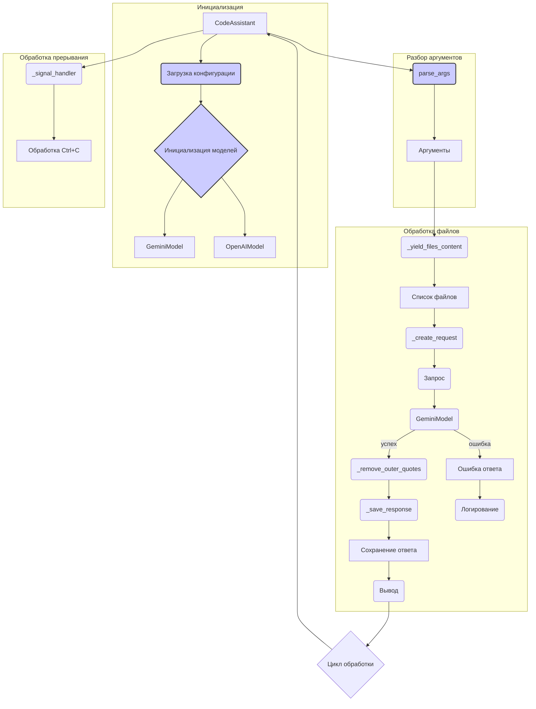

# Анализ кода

## <input code>

```%% module src.endpoints.hypo69.code_assistant.code_assistant
graph TD
    subgraph Инициализация
        A[CodeAssistant] --> B(Загрузка конфигурации)
        B --> C{Инициализация моделей}
        C --> D[GeminiModel]
        C --> E[OpenAIModel]
    end
    
    subgraph Разбор аргументов
        A --> F(parse_args)
        F --> G[Аргументы]
    end
    
    subgraph Обработка файлов
        G --> H(_yield_files_content)
        H --> I[Список файлов]
        I --> J(_create_request)
        J --> K(Запрос)
        K --> L(GeminiModel)
        L --> M(_remove_outer_quotes)
        M --> N(_save_response)
        N --> O[Сохранение ответа]
        O --> P(Вывод)
        
        subgraph alt [Ошибка]
            L --> Q[Ошибка ответа]
            Q --> R(Логирование)
        end
    end
    
    subgraph Обработка прерывания
        A --> S(_signal_handler)
        S --> T[Обработка Ctrl+C]
    end

    P --> U{Цикл обработки}
    U --> A

    style B fill:#11f,stroke:#333,stroke-width:2px
    style C fill:#11f,stroke:#333,stroke-width:2px
    style F fill:#11f,stroke:#333,stroke-width:2px
```

## <algorithm>

Блок-схема описывает процесс работы класса `CodeAssistant`.

**1. Инициализация:**

*   Объект `CodeAssistant` (A) инициирует загрузку конфигурации (B).
*   Затем происходит инициализация моделей GeminiModel (D) и OpenAIModel (E) (C).


**2. Разбор аргументов:**

*   Объект `CodeAssistant` (A) вызывает функцию `parse_args` (F) для получения входных аргументов.
*   Результат работы `parse_args` (аргументы) записывается в переменную `arguments` (G).


**3. Обработка файлов:**

*   Список аргументов (G) используется для получения содержимого файлов (H).
*   Полученные данные (файлы) составляют список файлов (I).
*   Функция `_create_request` (J) формирует запрос на основе списка файлов.
*   Полученный запрос передаётся в модель GeminiModel (L) для обработки.
*   Результат обработки от GeminiModel (L) передаётся в `_remove_outer_quotes` (M) для удаления внешних кавычек (например, из результата запроса).
*   Обработанный результат передаётся в `_save_response` (N) для сохранения ответа.
*   Ответом записывается в выходные данные (O) и выводится пользователю (P).
*   Если произошла ошибка (Alt), записывается сообщение об ошибке (Q) и производится логирование (R).


**4. Обработка прерывания:**

*   Объект `CodeAssistant` (A) регистрирует обработчик сигналов `_signal_handler` (S) для обработки Ctrl+C.
*   В случае прерывания выполняется обработка (T).


**5. Цикл обработки:**

*   Результат обработки (P) переходит в цикл обработки (U).
*   Цикл возвращает управление объекту `CodeAssistant` (A), запуская новый цикл обработки.


## <mermaid>



## <explanation>

**1. Импорты:**

Код не содержит импортов, но `%% module src.endpoints.hypo69.code_assistant.code_assistant` указывает на то, что данный код находится в модуле, который импортируется из пакета `src.endpoints.hypo69.code_assistant`.  Предполагается, что  `src.endpoints.hypo69.code_assistant` содержит необходимые функции и классы для работы с GeminiModel, OpenAIModel и обработкой файлов.

**2. Классы:**

*   `CodeAssistant`: Представляет класс, который отвечает за всю функциональность.  Диаграмма показывает его методы и взаимодействие с другими модулями.


**3. Функции:**

*   `parse_args`: Парсит аргументы командной строки, предполагается, что принимает аргументы и возвращает структуру данных (`G`).
*   `_yield_files_content`: Возвращает содержимое файлов (I).
*   `_create_request`: Создает запрос для моделей (K).
*   `GeminiModel`: Предполагается, что выполняет обработку запроса (L).
*   `_remove_outer_quotes`: Удаляет внешние кавычки из результата обработки (M).
*   `_save_response`: Сохраняет результат (N).
*   `_signal_handler`: Обрабатывает сигнал Ctrl+C (S).


**4. Переменные:**

Переменные представлены в схеме, например, `arguments` (G), `Список файлов` (I), и т.д.  Типы данных для переменных не определены, но они должны соответствовать потребностям функций.

**5. Возможные ошибки и улучшения:**

*   Нет указания на обработку ошибок в `GeminiModel`. Необходимо предусмотреть обработку исключений, чтобы программа не падала при сбоях.
*   Отсутствует детализация работы функций. Необходима более подробная информация о том, какие данные принимают и возвращают функции.
*   Нет указания на входные параметры для `GeminiModel` и `OpenAIModel`.
*   Отсутствует  подробный анализ того, как конфигурация загружается.


**Цепочка взаимосвязей с другими частями проекта:**

Модуль использует `GeminiModel` и `OpenAIModel`, предполагается, что эти классы расположены в тех же папках, или загружаются из других модулей.  `parse_args` принимает на вход аргументы, вероятно, из командной строки. Функции  `_yield_files_content`, `_create_request`, `_remove_outer_quotes`, `_save_response` представляют собой части логики обработки файла и ответа. `Вывод` (P) передает данные для дальнейшей обработки или отображения пользователю.  `Логирование` (R) используется для записи сообщений об ошибках.


**Заключение:**

Диаграмма дает общее представление о потоке данных и взаимодействии компонентов. Для более глубокого анализа необходим полный код с определениями функций и классов.